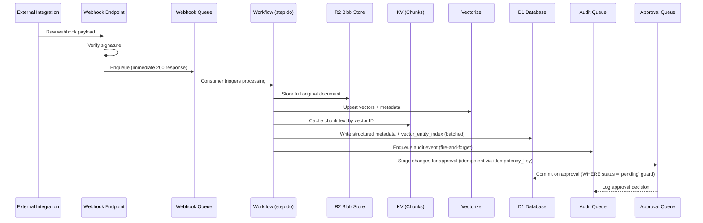

# Medina Ventures — Intelligence Platform
## Technical Requirements Document & System Architecture Blueprint
### Version 3.0 | Source of Truth for Lead Developer Execution

---

> **Execution Note:** This document is the sole authoritative source for the Medina Ventures platform build. It is fully self-contained — there are no references to prior versions or external documents. Every schema, flow, integration contract, LLM prompt, and implementation pattern needed to build this platform is defined here. Do not deviate from these specifications without explicit instruction. Build as a single-tenant deployment first; multi-tenant abstraction is Phase 4.

> **v2.8 Additions:** `callClaude` and `callClaudeStreaming` implementations (§18.5), `extractTextFromFile` with PDF/DOCX/CSV support (§18.6), missing helper functions — `getOrgSettings`, `getActiveUsersForOrg`, `getOrgDomains`, `encryptToken`/`decryptToken`, `getCurrentSyncJobId` (§18.7), `Env` interface updated with secret bindings (§2.3), Frontend Page Manifest (§21), Project File/Folder Structure (§22).

> **v2.9 Changes:** Removed NewsAPI (Claude web search handles all news intelligence), removed Google Sheets API (manual CSV upload), replaced SendGrid with Outlook Mail.Send via `CampaignSendWorkflow` (§12), removed PitchBook, replaced Proxycurl (defunct) with ReverseContact for LinkedIn enrichment (§6.6), removed Minutes.ai (manual transcript upload), removed Perplexity (Claude handles all enrichment search). Env interface renamed `MICROSOFT_*` → `AZURE_*` to match Azure app registration. Added `AZURE_REDIRECT_URI`, `SLACK_BOT_TOKEN`, `CLOUDFLARE_ACCOUNT_ID`. Fixed `callClaude` gateway URL to include account ID. Secrets reduced from 17 to 13. Integration count reduced from 12 to 6.

> **v3.0 Changes:** Email privacy infrastructure. Core principle: "Metadata is shared, content is private." The fact that an email happened (subject, participants, date, direction) is org-wide. The body, preview, sentiment, topics, and action items are private to participant users. LLM extraction still runs on all emails — extracted intelligence (job titles, deal signals, topics) populates CRM records as org-wide data, but the source email content remains private. Vectorize email chunks tagged `visibility: 'private'` with `participant_user_ids` — God Mode only retrieves email chunks the querying user participated in (owner role sees all). Contact/company timelines show restricted email entries for non-participants (subject + participants + date, no body). Approval queue hides evidence quotes from non-participant reviewers. Enrichment embeddings use sanitized summaries (no email body content). No infrastructure changes — wrangler.toml, .env.local, and all third-party integrations unchanged.
>
> **v3.0 Audit Fixes (14 findings, all resolved):** Cross-user Vectorize metadata re-upsert when participant added (P-1). Enrichment embedding sanitization via `sanitized_text` field to prevent email body leakage to admins (P-2). Campaign emails bypass privacy model via `is_campaign_email` flag (P-3). Manual conversations add creator as participant (P-4). CampaignSendWorkflow 429 handling separated from permanent failures with step-level retries (E-1). Audit consumer batched writes reduce D1 lock contention (S-1). Claude RPM configurable via `CLAUDE_MAX_RPM` env var (W-2). R2 key uses `sentAt` for deterministic replay (W-1). News fetch records 429s for exponential backoff (W-3). KV backfill entries have 90-day TTL (S-2). Compound index on `vector_entity_index(entity_id, source_table)` (S-3). Campaign "sent" status clarified as "accepted by Outlook" (E-2). Firefly reconciliation broadened with Phase 2 reschedule heuristic (E-3).

---

## Table of Contents

1. [System Architecture Overview](#1-system-architecture-overview)
2. [Technology Stack & Infrastructure Config](#2-technology-stack--infrastructure-config)
3. [Data Modeling & Schema Definitions](#3-data-modeling--schema-definitions)
4. [Vector Database & Embedding Strategy](#4-vector-database--embedding-strategy)
5. [API & Integration Map](#5-api--integration-map)
6. [External Integration Contracts](#6-external-integration-contracts)
7. [Core Logic & Workflows](#7-core-logic--workflows)
8. [The RAG Pipeline](#8-the-rag-pipeline)
9. [The God Mode Agent](#9-the-god-mode-agent)
10. [Auto-Sync Engine](#10-auto-sync-engine)
11. [CRM Module — Feature Logic](#11-crm-module--feature-logic)
12. [Email Blast Engine](#12-email-blast-engine)
13. [State Management](#13-state-management)
14. [Multi-Tenancy & Security](#14-multi-tenancy--security)
15. [Error Handling & Edge Cases](#15-error-handling--edge-cases)
16. [LLM Prompt Specifications](#16-llm-prompt-specifications)
17. [Implementation Roadmap](#17-implementation-roadmap)
18. [Appendix A: Shared Utilities](#18-appendix-a-shared-utilities)
19. [Appendix B: Migration Scripts](#19-appendix-b-migration-scripts)
20. [Appendix C: Schema Migration Order](#20-appendix-c-schema-migration-order)
21. [Appendix D: Frontend Page Manifest](#21-appendix-d-frontend-page-manifest)
22. [Appendix E: Project File & Folder Structure](#22-appendix-e-project-file--folder-structure)

---

## 1. System Architecture Overview

The platform is composed of three product modules — **Intelligent CRM**, **God Mode Agent**, and **Auto-Sync Engine** — all running on a unified Cloudflare-native infrastructure stack. The frontend communicates exclusively with Cloudflare Workers via REST API. No direct client-to-database communication is permitted.

### Dual-Workflow Architecture

The sync engine is decomposed into two independent **Cloudflare Workflows** (`WorkflowEntrypoint` API) on separate cron schedules. The original architecture used a single Worker for all sync operations, but this caused enrichment bottlenecks (LinkedIn/Claude web search API calls taking 30+ seconds per entity) to block core data ingestion. The decomposition ensures that slow enrichment never delays email/calendar/Slack sync.

- **Workflow A (Ingestion — every 20 min):** Parallel source fetch (Outlook, Slack, News) → classify → deduplicate → embed/cache → stage approvals. Uses the Cloudflare Workflows `step.do()` API for durable execution with automatic checkpointing. Each source fetch runs in parallel inside a single step via `Promise.allSettled()` — this is necessary because `step.do()` calls are sequential (checkpointed), but internal parallelism within a step is preserved.

- **Workflow B (Enrichment — every 60 min):** Multi-source enrichment (ReverseContact/LinkedIn + Claude web search, batched 10 entities per step) → LLM extraction from recent communications → enrichment embedding into Vectorize → event reconciliation and orphan cleanup. Entity enrichment uses batches of 10 (not per-entity steps) to avoid bloating the Workflow's durable execution log with 50+ steps and their serialized return values.

- **Daily Cron (standard Worker — not a Workflow):** News score decay, scheduled re-enrichment, vector index reconciliation, audit log archival, merge lock cleanup, CRM cache warming, webhook health checks. Each operation is independently try/catch'd so one failure doesn't skip the rest. This runs as a standard Worker (not a Workflow) because all operations are lightweight SQL updates that complete within the 30-second CPU limit.

> **Sync Latency Note:** The 20-minute ingestion cron means new emails/calendar events may take up to ~25 minutes to appear in God Mode (20 min worst-case cron gap + ~5 min processing). This is inherent to the polling architecture, not the Workflow overhead. The frontend should display "Last synced: {timestamp}" to set expectations. **Phase 2.5 backlog item:** Add Microsoft Graph webhook subscriptions for real-time push notifications, reducing the gap to ~30 seconds.

### Queue Architecture

Three Cloudflare Queues handle asynchronous processing:

| Queue | Purpose | Batch Size | Max Retries | DLQ |
|---|---|---|---|---|
| `audit-log-queue` | Decoupled audit log writes | 50 | 3 | `audit-log-dlq` |
| `webhook-intake-queue` | Durable webhook processing | 10 | 3 (exponential backoff) | `webhook-dlq` |

**Why audit writes are queued:** D1 uses SQLite's single-writer lock. Without decoupling, the `audit_log` table — written on every create, update, delete, merge, approve, and reject — would serialize against Workflow A, Workflow B, and live API requests, creating contention on the critical path. The queue consumer processes messages in batches using `db.batch()` — accumulating valid statements and writing them in a single transaction per consumer invocation. This reduces lock acquisitions from N (one per message) to 1 (one per batch of up to 50 messages). Schema validation catches invalid `action`/`entity_type` values before they hit D1's CHECK constraint — invalid events are logged and discarded, not retried.

**Why webhooks are queued:** Firefly and Slack send webhooks. If processing fails (D1 contention, embedding timeout, classification error), the payload would be lost without a queue. The webhook endpoint verifies the signature, enqueues the raw payload, and returns 200 immediately. Processing happens asynchronously with 3 retries and exponential backoff. After exhausting retries, payloads land in the DLQ with the raw JSON stored in R2 for manual replay.

**Idempotency:** Each webhook source has a documented idempotency key extraction pattern. Processed keys are stored in KV with a 24-hour TTL. This prevents duplicate processing after DLQ replay or provider-side retries.

### Data Flow Summary



---

## 2. Technology Stack & Infrastructure Config

### 2.1 Technology Stack

| Layer | Technology | Justification |
|---|---|---|
| Frontend | Next.js 14 (App Router) + TypeScript | SSR, file-based routing, API routes |
| Styling | Tailwind CSS + shadcn/ui | Utility-first, accessible components |
| Backend API | Cloudflare Workers (TypeScript) | Serverless, edge-deployed, native bindings |
| Relational DB | Cloudflare D1 (SQLite) | Native Workers binding. **Scaling trigger:** Migrate to Hyperdrive + Neon Postgres if write contention p95 > 200ms — measured, not estimated. |
| Blob Storage | Cloudflare R2 | S3-compatible, $0 egress |
| Vector DB | Cloudflare Vectorize | Co-located with Workers, HNSW index |
| KV Store | Cloudflare Workers KV | Sessions, chunk text cache, rate limiting. **Note:** Eventually consistent (up to 60s propagation). Do not use for cache invalidation — use D1 instead. |
| Queues | Cloudflare Queues | Audit log decoupling, webhook intake + DLQ |
| LLM | Anthropic Claude API (claude-sonnet-4-20250514) via Cloudflare AI Gateway | God Mode, enrichment, extraction, re-ranking. ZDR enforced via AI Gateway. |
| Embeddings | Cloudflare Workers AI (`@cf/baai/bge-base-en-v1.5`) | 768-dim, co-located with Workers. Called directly via `env.AI.run()`. |
| Auth | Cloudflare Access + JWT | Org-level SSO |
| Email Campaigns | Microsoft Graph Mail.Send | Sends via user's Outlook account, appears in Sent folder. No open/click/bounce tracking. |
| Cron | Cloudflare Cron Triggers | Three schedules: ingestion (20 min), enrichment (60 min), daily |
| Pipelines | Cloudflare Workflows | `WorkflowEntrypoint` API with `step.do()` for durable, checkpointed execution |
| Virtual Transcription | Firefly AI (webhook) | Auto-joins virtual meetings, delivers transcripts |
| In-Person Transcription | Manual upload (tool TBD) | Managing partner uploads transcripts via document upload flow. Granola under evaluation. |
| Contact Enrichment | ReverseContact (LinkedIn) | Profile and company data. Requires identity disambiguation when only name + company are known. |
| Company & Broad Enrichment | Claude web search (via AI Gateway) | Primary source for company data, news intelligence, and gap-filling for contacts |
| News Intelligence | Claude web search (via AI Gateway) | Company news monitoring using enrichment web search prompt. Replaces NewsAPI. |
| Messaging | Slack Events API | Org-wide message sync across public and private channels |
| Calendar/Email | Microsoft Graph API (Outlook 365) | Primary data source — delta query for incremental sync. Also used for Mail.Send campaigns. |
| Financial Files | CSV + Excel upload (manual) | Users export spreadsheets and upload via import flow |
| Legacy CRM | Four Degree CRM API | One-time Phase 0 bulk import |

> **LangChain Decision:** LangChain is **not used**. The entire RAG pipeline is implemented with direct Cloudflare API calls: `env.AI.run()` for embeddings, `env.VECTORIZE.query()` for retrieval, direct Claude API calls via AI Gateway for generation and re-ranking. This avoids LangChain's bundle size (~2-4 MB, which adds 100-300ms cold start on Workers), its debugging opacity (stack traces through 3+ abstraction layers), and its version instability (`@langchain/cloudflare` is pre-1.0). The only LangChain dependency is `@langchain/textsplitters` for the `RecursiveCharacterTextSplitter` class — which is a standalone text processing utility, not an orchestration framework.

### 2.2 Complete Wrangler Configuration

Every binding referenced in the code must be present here. Missing bindings cause `wrangler dev` to fail on first run.

```toml
name = "medina-ventures-api"
main = "src/index.ts"
compatibility_date = "2024-09-23"
compatibility_flags = ["nodejs_compat"]  # Required for pdf-parse (§18.6)

[vars]
ENVIRONMENT = "production"
CLOUDFLARE_ACCOUNT_ID = "ad54df3fe69483d2c0b69be1b72864e8"
CLOUDFLARE_AI_GATEWAY_SLUG = "medina-ventures"

# AI binding for embeddings via Workers AI
[ai]
binding = "AI"

# D1 Database — primary relational store
[[d1_databases]]
binding = "D1"
database_name = "medina-ventures-db"
database_id = ""  # Set per environment via wrangler.toml overrides or CI

# R2 Blob Storage — documents, transcripts, audit archives, DLQ payloads
# Single bucket with path-based separation (see §4.6 for key naming convention)
[[r2_buckets]]
binding = "R2"
bucket_name = "medina-ventures-storage"

# KV Namespace — chunk text cache, rate limiters, sessions, idempotency keys
# Single namespace for all KV uses
[[kv_namespaces]]
binding = "KV"
id = ""  # Set per environment

# Vectorize — vector similarity search
[[vectorize]]
binding = "VECTORIZE"
index_name = "medina-ventures-main"

# --- Workflows ---

[[workflows]]
name = "ingestion-workflow"
binding = "INGESTION_WORKFLOW"
class_name = "IngestionWorkflow"

[[workflows]]
name = "enrichment-workflow"
binding = "ENRICHMENT_WORKFLOW"
class_name = "EnrichmentWorkflow"

[[workflows]]
name = "campaign-send-workflow"
binding = "CAMPAIGN_WORKFLOW"
class_name = "CampaignSendWorkflow"

# --- Cron Triggers ---

[triggers]
crons = [
  "*/20 * * * *",    # Workflow A — Ingestion
  "5 * * * *",       # Workflow B — Enrichment (at :05 to avoid overlap with ingestion)
  "0 0 * * *",       # Daily cron — standard Worker
]

# --- Queues ---

# Audit log queue — decouples audit writes from critical path
[[queues.producers]]
queue = "audit-log-queue"
binding = "AUDIT_QUEUE"

[[queues.consumers]]
queue = "audit-log-queue"
max_batch_size = 50        # Up to 50 messages per consumer invocation
max_batch_timeout = 10     # Flush every 10s even if batch isn't full
max_retries = 3
dead_letter_queue = "audit-log-dlq"

# Audit DLQ — producer only, no consumer (persisted for manual review)
[[queues.producers]]
queue = "audit-log-dlq"
binding = "AUDIT_DLQ"

# Webhook intake queue — durable webhook processing with retry
[[queues.producers]]
queue = "webhook-intake-queue"
binding = "WEBHOOK_QUEUE"

[[queues.consumers]]
queue = "webhook-intake-queue"
max_batch_size = 10
max_batch_timeout = 5
max_retries = 3
dead_letter_queue = "webhook-dlq"
retry_delay = "exponential"  # 1 min, 5 min, 25 min

# Webhook DLQ — persists failed payloads to R2 + D1 for admin review
[[queues.producers]]
queue = "webhook-dlq"
binding = "WEBHOOK_DLQ"

[[queues.consumers]]
queue = "webhook-dlq"
max_batch_size = 10
max_batch_timeout = 30
max_retries = 0  # DLQ consumer persists to R2/D1, never retries
```

### 2.3 TypeScript Environment Interface

Every Worker, Workflow, and Queue consumer receives this typed environment. The `Env` interface is the contract between the wrangler config and the application code — if a binding is missing from `wrangler.toml`, the corresponding property will be undefined at runtime.

```typescript
// src/types/env.ts

import type { AuditEvent } from './audit';
import type { WebhookQueueMessage } from './webhooks';

export interface Env {
  // --- Storage ---
  D1: D1Database;
  R2: R2Bucket;
  KV: KVNamespace;

  // --- AI & Vector ---
  AI: Ai;                           // Workers AI for embedding generation
  VECTORIZE: VectorizeIndex;        // Vectorize similarity search

  // --- Queues ---
  AUDIT_QUEUE: Queue<AuditEvent>;         // Audit log writes (fire-and-forget)
  AUDIT_DLQ: Queue<AuditEvent>;           // Failed audit events
  WEBHOOK_QUEUE: Queue<WebhookQueueMessage>;  // Webhook intake
  WEBHOOK_DLQ: Queue<WebhookQueueMessage>;    // Failed webhook processing

  // --- Workflows ---
  INGESTION_WORKFLOW: Workflow;     // Dispatched by */20 cron
  ENRICHMENT_WORKFLOW: Workflow;    // Dispatched by 5 * cron
  CAMPAIGN_WORKFLOW: Workflow;      // Dispatched by campaign send endpoint

  // --- Vars (from wrangler.toml [vars]) ---
  ENVIRONMENT: string;
  CLOUDFLARE_ACCOUNT_ID: string;          // Cloudflare account ID (not a secret)
  CLOUDFLARE_AI_GATEWAY_SLUG: string;     // AI Gateway name (not a secret)

  // --- Secrets (via `wrangler secret put`) ---
  // Azure / Outlook (5 permissions: Mail.Read, Mail.Send, Calendars.Read, Contacts.Read, offline_access)
  AZURE_CLIENT_ID: string;
  AZURE_CLIENT_SECRET: string;
  AZURE_TENANT_ID: string;
  AZURE_REDIRECT_URI: string;             // OAuth callback URL

  // Anthropic
  ANTHROPIC_API_KEY: string;

  // Slack
  SLACK_CLIENT_ID: string;
  SLACK_CLIENT_SECRET: string;
  SLACK_SIGNING_SECRET: string;
  SLACK_BOT_TOKEN: string;                // Bot token (xoxb-...) for Slack API calls

  // LinkedIn Enrichment
  REVERSECONTACT_API_KEY: string;

  // Webhooks
  FIREFLY_WEBHOOK_SECRET: string;         // HMAC-SHA256 signing secret

  // Encryption & Auth
  TOKEN_ENCRYPTION_KEY: string;           // 32-byte hex for AES-256-GCM
  JWT_SECRET: string;
}
```

### 2.4 Required Environment Variables (`.env.local`)

These are NOT in `wrangler.toml` — they're secrets managed via `wrangler secret put` or the Cloudflare dashboard. The `CLOUDFLARE_ACCOUNT_ID` and `CLOUDFLARE_AI_GATEWAY_SLUG` are in `wrangler.toml` `[vars]` — they are not secrets but are listed here for completeness.

```env
# Azure / Outlook (5 delegated permissions: Mail.Read, Mail.Send, Calendars.Read, Contacts.Read, offline_access)
AZURE_CLIENT_ID=
AZURE_CLIENT_SECRET=
AZURE_TENANT_ID=
AZURE_REDIRECT_URI=http://localhost:3000/auth/outlook/callback  # Change to production URL at launch

# Anthropic
ANTHROPIC_API_KEY=

# Slack
SLACK_CLIENT_ID=
SLACK_CLIENT_SECRET=
SLACK_SIGNING_SECRET=
SLACK_BOT_TOKEN=                  # Bot token (xoxb-...) for API calls before OAuth flow is built

# LinkedIn Enrichment
REVERSECONTACT_API_KEY=

# Webhooks
FIREFLY_WEBHOOK_SECRET=           # HMAC-SHA256 signing secret for webhook verification

# Encryption & Auth
TOKEN_ENCRYPTION_KEY=             # 32-byte hex string for AES-256-GCM encryption of OAuth tokens
JWT_SECRET=                       # For JWT signing/verification
```

---

## 3. Data Modeling & Schema Definitions

> **D1/SQLite Types:** UUIDs as `TEXT` with `DEFAULT (lower(hex(randomblob(16))))`. This generates a 32-character lowercase hex string. JSON stored as `TEXT` with app-layer validation — D1/SQLite does not enforce JSON structure. Timestamps as ISO 8601 `TEXT` (e.g., `2024-01-15T14:30:00.000Z`). Booleans as `INTEGER` (0/1).

> **FK Cascade Strategy:** `ON DELETE RESTRICT` or `SET NULL` on soft-deletable tables — never `CASCADE`. Reason: CASCADE on a table with 10,000 rows could cause a single DELETE to trigger thousands of cascading deletes, which (a) creates massive write amplification on SQLite's single-writer lock, and (b) makes accidental data loss unrecoverable. Exception: tag junction tables (`contact_tags`, `company_tags`) use `CASCADE` on `tag_id` so deleting a tag cleanly removes all applications — this is intentional because tag deletion is an explicit user action, and junction rows have no independent value.

> **Migration FK Ordering:** Tables with foreign key references must be created AFTER the referenced table. Each migration file creates exactly one table with its indexes. See Appendix C for the full ordering.

### 3.1 `organizations`

The root entity. Every other table references `organizations.id` via `org_id`. The `settings` JSON column stores org-level configuration that controls sync behavior, enrichment, and RAG features.

```sql
CREATE TABLE organizations (
  id TEXT PRIMARY KEY DEFAULT (lower(hex(randomblob(16)))),
  name TEXT NOT NULL,
  domain TEXT NOT NULL UNIQUE,
  settings TEXT NOT NULL DEFAULT '{}',
  created_at TEXT NOT NULL DEFAULT (strftime('%Y-%m-%dT%H:%M:%fZ', 'now')),
  updated_at TEXT NOT NULL DEFAULT (strftime('%Y-%m-%dT%H:%M:%fZ', 'now')),
  deleted_at TEXT
);
CREATE INDEX idx_organizations_domain ON organizations(domain);
```

**`settings` JSON shape:**

```typescript
interface OrgSettings {
  auto_approve_sync: boolean;         // Default false — when true, low-risk sync items skip the approval queue
  sync_interval_minutes: number;      // Default 20 — cron interval for Workflow A
  linkedin_enrichment_enabled: boolean; // Default true
  news_feed_enabled: boolean;         // Default true
  max_enrichments_per_cycle: number;  // Default 50 — cap per Workflow B run
  outlook_backfill_days: number;      // Default 180 — how far back to sync on first connect
  reranker_enabled: boolean;          // Default true — toggleable for TTFT A/B testing
}
```

### 3.2 `users`

Internal team members. Each user has their own OAuth tokens for Outlook and Slack. The `outlook_delta_token` stores the Microsoft Graph delta link for incremental email/calendar sync — this is a full URL, not just a token string.

```sql
CREATE TABLE users (
  id TEXT PRIMARY KEY DEFAULT (lower(hex(randomblob(16)))),
  org_id TEXT NOT NULL REFERENCES organizations(id) ON DELETE RESTRICT,
  email TEXT NOT NULL UNIQUE,
  full_name TEXT NOT NULL,
  avatar_url TEXT,
  role TEXT NOT NULL DEFAULT 'member' CHECK(role IN ('owner','admin','member')),
  outlook_token TEXT,          -- AES-256-GCM encrypted JSON: {access_token, refresh_token, expires_at}
  slack_token TEXT,            -- AES-256-GCM encrypted
  outlook_delta_token TEXT,    -- Microsoft Graph deltaLink URL for incremental sync
  is_active INTEGER NOT NULL DEFAULT 1,
  created_at TEXT NOT NULL DEFAULT (strftime('%Y-%m-%dT%H:%M:%fZ', 'now')),
  updated_at TEXT NOT NULL DEFAULT (strftime('%Y-%m-%dT%H:%M:%fZ', 'now')),
  deleted_at TEXT
);
CREATE INDEX idx_users_org_id ON users(org_id);
CREATE INDEX idx_users_email ON users(email);
```

### 3.3 `companies`

> **Why companies before contacts:** The `contacts` table has a `company_id` FK referencing `companies(id)`. SQLite requires the referenced table to exist before the referencing table. This ordering is enforced in the migration sequence (Appendix C).

```sql
CREATE TABLE companies (
  id TEXT PRIMARY KEY DEFAULT (lower(hex(randomblob(16)))),
  org_id TEXT NOT NULL REFERENCES organizations(id) ON DELETE RESTRICT,
  name TEXT NOT NULL,
  website TEXT,
  logo_url TEXT,
  description TEXT,
  company_type TEXT NOT NULL DEFAULT 'startup'
    CHECK(company_type IN ('startup','vc_firm','family_office','portfolio','lp','other')),
  sector TEXT,                 -- Free-text: "fintech", "healthcare", "enterprise SaaS", etc.
  stage TEXT CHECK(stage IN ('pre_seed','seed','series_a','series_b','series_c','growth','public','acquired','other')),
  investment_status TEXT DEFAULT 'tracking'
    CHECK(investment_status IN ('tracking','prospect','due_diligence','term_sheet','invested','passed','exited')),
  investment_amount REAL,      -- Amount the firm has invested (USD)
  investment_date TEXT,
  ownership_pct REAL,          -- Percentage ownership
  last_known_valuation REAL,      -- Most recent known valuation (USD)
  currency TEXT DEFAULT 'USD',
  linkedin_url TEXT,
  linkedin_data_r2_key TEXT,   -- R2 key for cached ReverseContact/LinkedIn response
  web_enrichment_r2_key TEXT,  -- R2 key for cached Claude web search results
  enrichment_confidence REAL DEFAULT 0.0,  -- 0.0–1.0, aggregated across sources
  enrichment_last_run TEXT,    -- ISO 8601 timestamp of last enrichment
  news_relevance_score REAL DEFAULT 0.0,   -- Decays daily by 0.95x, boosted by news mentions
  news_score_updated_at TEXT,  -- When the score was last modified (for decay calculation)
  last_news_summary TEXT,      -- Most recent news summary (injected into God Mode context)
  custom_fields TEXT DEFAULT '{}',  -- Freeform JSON for user-defined fields
  vector_id TEXT,              -- Legacy — use vector_entity_index instead
  r2_key TEXT,                 -- R2 key for the company's profile document
  created_at TEXT NOT NULL DEFAULT (strftime('%Y-%m-%dT%H:%M:%fZ', 'now')),
  updated_at TEXT NOT NULL DEFAULT (strftime('%Y-%m-%dT%H:%M:%fZ', 'now')),
  deleted_at TEXT
);
CREATE INDEX idx_companies_org_id ON companies(org_id);
CREATE INDEX idx_companies_investment_status ON companies(investment_status);
CREATE INDEX idx_companies_stage ON companies(stage);
CREATE INDEX idx_companies_enrichment_last_run ON companies(enrichment_last_run);
```

### 3.4 `contacts`

The most complex table. Contacts are discovered from email addresses, meeting attendees, Slack messages, and manual entry. The `merged_into` column enables transitive merge resolution: if Contact A was merged into B, and B was later merged into C, following the `merged_into` chain from A leads to C.

```sql
CREATE TABLE contacts (
  id TEXT PRIMARY KEY DEFAULT (lower(hex(randomblob(16)))),
  org_id TEXT NOT NULL REFERENCES organizations(id) ON DELETE RESTRICT,
  full_name TEXT NOT NULL,
  email TEXT,                  -- May be NULL for contacts discovered from meeting attendee names
  phone TEXT,
  avatar_url TEXT,
  linkedin_url TEXT,
  twitter_url TEXT,
  contact_type TEXT NOT NULL DEFAULT 'individual'
    CHECK(contact_type IN ('individual','family','institutional_investor','company','other')),
  relationship_status TEXT
    CHECK(relationship_status IN ('lp','portfolio_founder','prospect','advisor','vendor','other')),
  company_id TEXT REFERENCES companies(id) ON DELETE SET NULL,
  job_title TEXT,

  -- Merge tracking: when this contact is merged into another, this points to the surviving contact.
  -- Campaign recipient resolution follows this chain to find the surviving contact.
  -- Maximum chain depth: 5 (enforced in merge resolution logic).
  merged_into TEXT REFERENCES contacts(id) ON DELETE SET NULL,

  -- Enrichment data pointers (raw API responses stored in R2, not D1)
  linkedin_data_r2_key TEXT,
  web_enrichment_r2_key TEXT,
  enrichment_confidence REAL DEFAULT 0.0,
  enrichment_last_run TEXT,

  -- AI-extracted signals (populated by LLM extraction from communications)
  topics_of_interest TEXT,       -- JSON array of topic strings
  pain_points TEXT,              -- JSON array
  investment_thesis_tags TEXT,   -- JSON array

  bio_summary TEXT,              -- Enrichment-generated biographical summary

  -- Engagement scoring
  news_relevance_score REAL DEFAULT 0.0,
  news_score_updated_at TEXT,
  last_contact_date TEXT,        -- Updated by sync engine on new email/meeting
  total_interactions INTEGER DEFAULT 0,  -- Lifetime count of emails + meetings
  meetings_last_30d INTEGER DEFAULT 0,   -- Rolling 30-day meeting count
  email_frequency_score REAL DEFAULT 0.0, -- Computed from recent email volume

  -- Follow-up tracking
  next_followup_date TEXT,
  next_followup_note TEXT,

  -- Financial (for LP contacts)
  investment_amount REAL,
  fund_commitment REAL,
  investment_currency TEXT DEFAULT 'USD',

  -- Provenance
  source TEXT NOT NULL DEFAULT 'manual'
    CHECK(source IN ('outlook','slack','firefly','linkedin','manual','four_degree','import')),
  source_confidence REAL DEFAULT 1.0,  -- 1.0 for manual, 0.6 for auto-discovered from email

  custom_fields TEXT DEFAULT '{}',
  vector_id TEXT,
  r2_key TEXT,
  created_at TEXT NOT NULL DEFAULT (strftime('%Y-%m-%dT%H:%M:%fZ', 'now')),
  updated_at TEXT NOT NULL DEFAULT (strftime('%Y-%m-%dT%H:%M:%fZ', 'now')),
  deleted_at TEXT
);
CREATE INDEX idx_contacts_org_id ON contacts(org_id);
CREATE INDEX idx_contacts_email ON contacts(email);
CREATE INDEX idx_contacts_company_id ON contacts(company_id);
CREATE INDEX idx_contacts_contact_type ON contacts(contact_type);
CREATE INDEX idx_contacts_last_contact_date ON contacts(last_contact_date);
CREATE INDEX idx_contacts_deleted_at ON contacts(deleted_at);
CREATE INDEX idx_contacts_enrichment_last_run ON contacts(enrichment_last_run);
CREATE INDEX idx_contacts_merged_into ON contacts(merged_into);
```

### 3.5 `contact_associations`

Tracks relationships between contacts. Created automatically when two contacts appear together in an email or meeting. The `CHECK(contact_id_a < contact_id_b)` constraint ensures canonical ordering — prevents both A↔B and B↔A from existing, which would cause double-counting in relationship queries.

```sql
CREATE TABLE contact_associations (
  id TEXT PRIMARY KEY DEFAULT (lower(hex(randomblob(16)))),
  org_id TEXT NOT NULL REFERENCES organizations(id) ON DELETE RESTRICT,
  contact_id_a TEXT NOT NULL REFERENCES contacts(id) ON DELETE RESTRICT,
  contact_id_b TEXT NOT NULL REFERENCES contacts(id) ON DELETE RESTRICT,
  relationship TEXT NOT NULL DEFAULT 'connected'
    CHECK(relationship IN ('co-meeting','co-email','colleague','family','introduced_by','other')),
  inferred_from TEXT,    -- JSON: {event_id: "...", conversation_id: "..."} — source of the inference
  confidence REAL DEFAULT 1.0,  -- Starts at 0.6 for co-email, 0.8 for co-meeting, increases with repetition
  created_at TEXT NOT NULL DEFAULT (strftime('%Y-%m-%dT%H:%M:%fZ', 'now')),
  UNIQUE(contact_id_a, contact_id_b),
  CHECK(contact_id_a < contact_id_b)  -- Canonical ordering: prevents duplicate pairs
);
CREATE INDEX idx_contact_assoc_a ON contact_associations(contact_id_a);
CREATE INDEX idx_contact_assoc_b ON contact_associations(contact_id_b);
```

### 3.6 `tags`

User-defined labels applied to contacts and companies. Tags are org-scoped — the `UNIQUE(org_id, name)` constraint prevents duplicate tag names within an org.

```sql
CREATE TABLE tags (
  id TEXT PRIMARY KEY DEFAULT (lower(hex(randomblob(16)))),
  org_id TEXT NOT NULL REFERENCES organizations(id) ON DELETE RESTRICT,
  name TEXT NOT NULL,
  color TEXT DEFAULT '#888888',  -- Hex color for UI rendering
  created_by TEXT REFERENCES users(id) ON DELETE SET NULL,
  created_at TEXT NOT NULL DEFAULT (strftime('%Y-%m-%dT%H:%M:%fZ', 'now')),
  UNIQUE(org_id, name)
);
CREATE INDEX idx_tags_org_id ON tags(org_id);
```

### 3.7 `contact_tags`

Junction table. Uses `CASCADE` on `tag_id` so deleting a tag cleanly removes all applications. Uses `RESTRICT` on `contact_id` so a contact can't be deleted while tagged (must untag first, or use soft delete).

```sql
CREATE TABLE contact_tags (
  contact_id TEXT NOT NULL REFERENCES contacts(id) ON DELETE RESTRICT,
  tag_id TEXT NOT NULL REFERENCES tags(id) ON DELETE CASCADE,
  applied_by TEXT REFERENCES users(id) ON DELETE SET NULL,
  applied_at TEXT NOT NULL DEFAULT (strftime('%Y-%m-%dT%H:%M:%fZ', 'now')),
  PRIMARY KEY (contact_id, tag_id)
);
```

### 3.8 `company_tags`

Same pattern as `contact_tags`.

```sql
CREATE TABLE company_tags (
  company_id TEXT NOT NULL REFERENCES companies(id) ON DELETE RESTRICT,
  tag_id TEXT NOT NULL REFERENCES tags(id) ON DELETE CASCADE,
  applied_by TEXT REFERENCES users(id) ON DELETE SET NULL,
  applied_at TEXT NOT NULL DEFAULT (strftime('%Y-%m-%dT%H:%M:%fZ', 'now')),
  PRIMARY KEY (company_id, tag_id)
);
CREATE INDEX idx_company_tags_company ON company_tags(company_id);
CREATE INDEX idx_company_tags_tag ON company_tags(tag_id);
```

### 3.9 `deals`

Investment pipeline tracking. Each deal is linked to a company and optionally to a team member (owner). The `stage` field tracks the deal through the VC investment lifecycle.

```sql
CREATE TABLE deals (
  id TEXT PRIMARY KEY DEFAULT (lower(hex(randomblob(16)))),
  org_id TEXT NOT NULL REFERENCES organizations(id) ON DELETE RESTRICT,
  company_id TEXT NOT NULL REFERENCES companies(id) ON DELETE RESTRICT,
  owner_id TEXT REFERENCES users(id) ON DELETE SET NULL,
  title TEXT NOT NULL,
  stage TEXT NOT NULL DEFAULT 'prospect'
    CHECK(stage IN ('prospect','first_contact','meeting_scheduled','due_diligence','term_sheet','closing','closed_won','closed_lost')),
  amount REAL,             -- Deal size in currency
  currency TEXT DEFAULT 'USD',
  probability REAL DEFAULT 0.0,  -- 0.0–1.0 likelihood of close
  expected_close TEXT,     -- Target close date
  notes TEXT,
  custom_fields TEXT DEFAULT '{}',
  created_at TEXT NOT NULL DEFAULT (strftime('%Y-%m-%dT%H:%M:%fZ', 'now')),
  updated_at TEXT NOT NULL DEFAULT (strftime('%Y-%m-%dT%H:%M:%fZ', 'now')),
  deleted_at TEXT
);
CREATE INDEX idx_deals_org_id ON deals(org_id);
CREATE INDEX idx_deals_company_id ON deals(company_id);
CREATE INDEX idx_deals_stage ON deals(stage);
```

### 3.10 `events`

Meetings, calls, and conferences. Events arrive from three sources with different reconciliation rules. The `reconciliation_status` field tracks whether an event from a non-authoritative source (Firefly) has been matched to an authoritative source (Outlook). Events with status `orphaned` are excluded from RAG retrieval; events with status `standalone` are confirmed independent events included in RAG.

```sql
CREATE TABLE events (
  id TEXT PRIMARY KEY DEFAULT (lower(hex(randomblob(16)))),
  org_id TEXT NOT NULL REFERENCES organizations(id) ON DELETE RESTRICT,
  title TEXT NOT NULL,
  event_type TEXT NOT NULL DEFAULT 'meeting'
    CHECK(event_type IN ('meeting','conference','call','email_thread','hosted_event','in_person','other')),
  start_time TEXT NOT NULL,
  end_time TEXT,
  location TEXT,
  description TEXT,
  source TEXT NOT NULL DEFAULT 'manual'
    CHECK(source IN ('outlook','firefly','manual')),

  -- External IDs for deduplication. Each is UNIQUE to prevent duplicate events from the same source.
  outlook_event_id TEXT UNIQUE,      -- Microsoft Graph event ID
  firefly_event_id TEXT UNIQUE,      -- Firefly meeting ID

  -- Reconciliation tracks whether non-Outlook events have been matched to their Outlook counterpart.
  -- 'reconciled': matched to Outlook, or source is Outlook/manual (authoritative)
  -- 'pending_reconciliation': Firefly event, no Outlook match yet
  -- 'standalone': confirmed independent event after timeout (included in RAG)
  -- 'orphaned': unmatched after 7 days (excluded from RAG, surfaced in admin dashboard)
  reconciliation_status TEXT NOT NULL DEFAULT 'reconciled'
    CHECK(reconciliation_status IN ('reconciled','pending_reconciliation','orphaned','standalone')),

  transcript_r2_key TEXT,            -- R2 key for the full transcript
  transcript_source TEXT CHECK(transcript_source IN ('firefly','manual')),

  -- AI-generated meeting intelligence
  summary TEXT,
  key_decisions TEXT,       -- JSON array
  action_items TEXT,        -- JSON array
  topics_discussed TEXT,    -- JSON array

  followup_status TEXT DEFAULT 'pending'
    CHECK(followup_status IN ('pending','in_progress','completed','not_required')),
  followup_due_date TEXT,
  vector_id TEXT,
  custom_fields TEXT DEFAULT '{}',
  created_at TEXT NOT NULL DEFAULT (strftime('%Y-%m-%dT%H:%M:%fZ', 'now')),
  updated_at TEXT NOT NULL DEFAULT (strftime('%Y-%m-%dT%H:%M:%fZ', 'now')),
  deleted_at TEXT
);
CREATE INDEX idx_events_org_id ON events(org_id);
CREATE INDEX idx_events_start_time ON events(start_time);
CREATE INDEX idx_events_source ON events(source);
CREATE INDEX idx_events_outlook_id ON events(outlook_event_id);
CREATE INDEX idx_events_reconciliation_status ON events(reconciliation_status);
```

### 3.11 `event_attendees`

Links events to contacts and internal users. The `is_internal` flag distinguishes firm team members from external attendees. A row can have `contact_id` (external) or `user_id` (internal) or both (if an internal user also has a contact record).

```sql
CREATE TABLE event_attendees (
  id TEXT PRIMARY KEY DEFAULT (lower(hex(randomblob(16)))),
  event_id TEXT NOT NULL REFERENCES events(id) ON DELETE RESTRICT,
  contact_id TEXT REFERENCES contacts(id) ON DELETE SET NULL,
  user_id TEXT REFERENCES users(id) ON DELETE SET NULL,
  email TEXT NOT NULL,
  display_name TEXT,
  role TEXT DEFAULT 'attendee' CHECK(role IN ('organizer','presenter','attendee','optional')),
  is_internal INTEGER DEFAULT 0,
  created_at TEXT NOT NULL DEFAULT (strftime('%Y-%m-%dT%H:%M:%fZ', 'now'))
);
CREATE INDEX idx_event_attendees_event_id ON event_attendees(event_id);
CREATE INDEX idx_event_attendees_contact_id ON event_attendees(contact_id);
```

### 3.12 `conversations`

Emails and Slack messages. The full body is stored in R2 (not D1) to keep the database lean — D1/SQLite performance degrades when rows contain large TEXT blobs. Only a 500-character preview is stored in D1 for list views.

> **Email Privacy Model (v3.0):** Email metadata (subject, participants, date, direction) is org-wide — visible to all users. Email content (body, preview, sentiment, topics, action items) is private to participant users. The `participant_user_ids` field stores which internal users were senders or recipients (To/CC). The API gates access: non-participants see metadata only. The `owner` role bypasses this restriction (fiduciary access).
>
> Slack messages remain `org_wide` — Slack channels are shared spaces by nature.
>
> LLM extraction (§7.8) still runs on all emails regardless of privacy. Extracted signals (job title changes, deal updates) populate CRM records as org-wide data. The source email content stays private. See §7.8 for the sanitization flow.

```sql
CREATE TABLE conversations (
  id TEXT PRIMARY KEY DEFAULT (lower(hex(randomblob(16)))),
  org_id TEXT NOT NULL REFERENCES organizations(id) ON DELETE RESTRICT,
  source TEXT NOT NULL CHECK(source IN ('outlook','slack','manual')),
  external_thread_id TEXT,       -- Outlook conversationId or Slack thread_ts (for grouping)
  external_message_id TEXT UNIQUE, -- Graph message ID or Slack channel:ts (dedup key)
  subject TEXT,
  body_r2_key TEXT NOT NULL,     -- R2 key for full message body (access gated by participant check)
  body_preview TEXT,             -- First 500 chars (access gated by participant check)
  direction TEXT CHECK(direction IN ('inbound','outbound','internal')),
  sent_at TEXT NOT NULL,
  from_email TEXT NOT NULL,
  from_contact_id TEXT REFERENCES contacts(id) ON DELETE SET NULL,
  to_emails TEXT NOT NULL,       -- JSON array of email strings
  cc_emails TEXT DEFAULT '[]',   -- JSON array

  -- Privacy: content fields are gated by participant_user_ids check at API layer.
  -- Non-participants see subject + participants + date only.
  sentiment TEXT CHECK(sentiment IN ('positive','neutral','negative','urgent')),
  topics TEXT,                   -- JSON array of topic strings (AI-extracted)
  action_items TEXT,             -- JSON array of action item strings (AI-extracted)

  -- Access control: which internal users are participants in this conversation.
  -- Populated during ingestion by matching from/to/cc emails against users.email.
  -- JSON array of user IDs: ["user_id_1", "user_id_2"]
  -- Slack messages: all active org users (org_wide access).
  -- Manual conversations: creator is added as sole participant during creation.
  participant_user_ids TEXT NOT NULL DEFAULT '[]',

  -- Campaign detection: set to 1 when the sync engine matches this email
  -- to a sent campaign recipient (subject + sent_at + from_email match).
  -- Campaign emails are org-wide regardless of participant_user_ids.
  is_campaign_email INTEGER NOT NULL DEFAULT 0,

  vector_id TEXT,
  event_id TEXT REFERENCES events(id) ON DELETE SET NULL,  -- Links email to related meeting
  created_at TEXT NOT NULL DEFAULT (strftime('%Y-%m-%dT%H:%M:%fZ', 'now')),
  updated_at TEXT NOT NULL DEFAULT (strftime('%Y-%m-%dT%H:%M:%fZ', 'now'))
);
CREATE INDEX idx_conversations_org_id ON conversations(org_id);
CREATE INDEX idx_conversations_sent_at ON conversations(sent_at);
CREATE INDEX idx_conversations_external_message_id ON conversations(external_message_id);
CREATE INDEX idx_conversations_from_contact ON conversations(from_contact_id);
```

**Content access check function (used by API handlers and timeline queries):**

```typescript
function canReadEmailContent(conversation: Conversation, requestingUserId: string, userRole: string): boolean {
  // Slack messages are org-wide — no content restriction
  if (conversation.source === 'slack') return true;

  // Campaign emails are org-wide — firm-authored outbound content.
  // Detected by checking if the conversation was generated by a CampaignSendWorkflow.
  // The ingestion pipeline sets is_campaign_email = true when it matches a
  // sent campaign recipient record (subject + sent_at + from_email match).
  if ((conversation as any).is_campaign_email) return true;

  // Owner role has fiduciary access to all email content
  if (userRole === 'owner') return true;

  // Check if requesting user is a participant
  const participants: string[] = JSON.parse(conversation.participant_user_ids || '[]');
  return participants.includes(requestingUserId);
}
```

### 3.13 `conversation_contacts`

Junction table linking conversations to all participating contacts (from, to, cc).

```sql
CREATE TABLE conversation_contacts (
  conversation_id TEXT NOT NULL REFERENCES conversations(id) ON DELETE RESTRICT,
  contact_id TEXT NOT NULL REFERENCES contacts(id) ON DELETE RESTRICT,
  role TEXT DEFAULT 'participant',  -- 'sender', 'recipient', 'cc', 'participant'
  PRIMARY KEY (conversation_id, contact_id)
);
CREATE INDEX idx_conv_contacts_contact ON conversation_contacts(contact_id);
```

### 3.14 `documents`

Uploaded files: pitch decks, financial models, legal docs, memos. The file content lives in R2; D1 stores metadata and processing status. Documents can be linked to contacts, companies, and/or deals.

```sql
CREATE TABLE documents (
  id TEXT PRIMARY KEY DEFAULT (lower(hex(randomblob(16)))),
  org_id TEXT NOT NULL REFERENCES organizations(id) ON DELETE RESTRICT,
  title TEXT NOT NULL,
  document_type TEXT NOT NULL DEFAULT 'other'
    CHECK(document_type IN ('pitch_deck','financials','legal','memo','report','spreadsheet','presentation','other')),
  source TEXT NOT NULL DEFAULT 'manual'
    CHECK(source IN ('upload','email_attachment','manual')),
  r2_key TEXT NOT NULL,          -- R2 storage key for the raw file
  file_name TEXT,                -- Original filename
  file_size INTEGER,             -- Bytes
  mime_type TEXT,
  contact_id TEXT REFERENCES contacts(id) ON DELETE SET NULL,
  company_id TEXT REFERENCES companies(id) ON DELETE SET NULL,
  deal_id TEXT REFERENCES deals(id) ON DELETE SET NULL,
  uploaded_by TEXT REFERENCES users(id) ON DELETE SET NULL,
  processing_status TEXT NOT NULL DEFAULT 'pending'
    CHECK(processing_status IN ('pending','processing','completed','failed')),
  extracted_text_preview TEXT,   -- First 500 chars of extracted text
  vector_id TEXT,
  custom_fields TEXT DEFAULT '{}',
  created_at TEXT NOT NULL DEFAULT (strftime('%Y-%m-%dT%H:%M:%fZ', 'now')),
  updated_at TEXT NOT NULL DEFAULT (strftime('%Y-%m-%dT%H:%M:%fZ', 'now')),
  deleted_at TEXT
);
CREATE INDEX idx_documents_org_id ON documents(org_id);
CREATE INDEX idx_documents_contact_id ON documents(contact_id);
CREATE INDEX idx_documents_company_id ON documents(company_id);
CREATE INDEX idx_documents_deal_id ON documents(deal_id);
CREATE INDEX idx_documents_processing_status ON documents(processing_status);
```

### 3.15 `sync_jobs`

Tracks the status of each Workflow execution. The `timeout_at` column is critical for recovery: if a Workflow crashes mid-execution and the `finalize` step never runs, `status` remains `'running'`. The next cron trigger checks `timeout_at` — if expired, it marks the job as `'failed'` and proceeds. Without this, a crashed Workflow permanently blocks all future syncs for that org.

```sql
CREATE TABLE sync_jobs (
  id TEXT PRIMARY KEY DEFAULT (lower(hex(randomblob(16)))),
  org_id TEXT NOT NULL REFERENCES organizations(id) ON DELETE RESTRICT,
  workflow_type TEXT NOT NULL CHECK(workflow_type IN ('ingestion','enrichment','daily')),
  status TEXT NOT NULL DEFAULT 'pending'
    CHECK(status IN ('pending','running','completed','partial','failed')),
  started_at TEXT,
  completed_at TEXT,
  timeout_at TEXT,           -- Ingestion: +30 min. Enrichment: +120 min. Jobs past this are auto-recovered.
  items_processed INTEGER DEFAULT 0,
  items_failed INTEGER DEFAULT 0,
  error_message TEXT,
  created_at TEXT NOT NULL DEFAULT (strftime('%Y-%m-%dT%H:%M:%fZ', 'now'))
);
CREATE INDEX idx_sync_jobs_org ON sync_jobs(org_id);
CREATE INDEX idx_sync_jobs_status ON sync_jobs(status, workflow_type);
```

### 3.16 `approval_queue`

Staged changes from the sync engine. Before any auto-discovered data is committed to the CRM, it's staged here for review (unless `auto_approve_sync` is enabled for low-risk changes).

The `idempotency_key` is critical: Cloudflare Workflows' `step.do()` can be replayed after infrastructure checkpoint failures. Without an idempotency guard, a replayed classification step would insert duplicate proposed changes. The key format is `{orgId}:{entityId}:{fieldName}:{hashShort(proposedValue)}:{syncJobId}`. The `syncJobId` component ensures that a genuinely new proposed change in a later sync cycle is treated as distinct from a replay of the current cycle.

```sql
CREATE TABLE approval_queue (
  id TEXT PRIMARY KEY DEFAULT (lower(hex(randomblob(16)))),
  org_id TEXT NOT NULL REFERENCES organizations(id) ON DELETE RESTRICT,
  idempotency_key TEXT,          -- Deterministic key for Workflow step replay protection
  entity_type TEXT NOT NULL,     -- 'contact', 'company', 'event', etc.
  entity_id TEXT NOT NULL,
  change_type TEXT NOT NULL,     -- 'new_contact', 'update_contact', 'new_association', etc.
  field_name TEXT,               -- Which field is being changed (for updates)
  proposed_value TEXT,           -- JSON-encoded proposed value
  source_communication_id TEXT,  -- Links to the conversation/event that triggered this change
  source_visibility TEXT DEFAULT 'org_wide'
    CHECK(source_visibility IN ('private','org_wide','confidential')),
  confidence REAL DEFAULT 1.0,
  status TEXT NOT NULL DEFAULT 'pending'
    CHECK(status IN ('pending','approved','rejected','auto_approved')),
  resolved_by TEXT REFERENCES users(id) ON DELETE SET NULL,
  resolved_at TEXT,
  created_at TEXT NOT NULL DEFAULT (strftime('%Y-%m-%dT%H:%M:%fZ', 'now'))
);
CREATE UNIQUE INDEX idx_approval_queue_idempotency ON approval_queue(idempotency_key);
CREATE INDEX idx_approval_queue_org ON approval_queue(org_id);
CREATE INDEX idx_approval_queue_status ON approval_queue(status);
CREATE INDEX idx_approval_queue_entity ON approval_queue(entity_type, entity_id);
```

### 3.17 `duplicate_candidates`

Detected potential duplicates from the blocking-key dedup algorithm. Presented in the admin UI for human review.

```sql
CREATE TABLE duplicate_candidates (
  id TEXT PRIMARY KEY DEFAULT (lower(hex(randomblob(16)))),
  org_id TEXT NOT NULL REFERENCES organizations(id) ON DELETE RESTRICT,
  entity_type TEXT NOT NULL DEFAULT 'contact' CHECK(entity_type IN ('contact','company')),
  entity_id_a TEXT NOT NULL,
  entity_id_b TEXT NOT NULL,
  similarity_score REAL NOT NULL,  -- 0.0–1.0. >= 0.7 flagged. >= 0.95 auto-merge.
  resolution TEXT DEFAULT 'pending' CHECK(resolution IN ('pending','merged','dismissed')),
  resolved_by TEXT REFERENCES users(id) ON DELETE SET NULL,
  resolved_at TEXT,
  created_at TEXT NOT NULL DEFAULT (strftime('%Y-%m-%dT%H:%M:%fZ', 'now')),
  UNIQUE(entity_id_a, entity_id_b)
);
CREATE INDEX idx_dup_candidates_org ON duplicate_candidates(org_id);
CREATE INDEX idx_dup_candidates_resolution ON duplicate_candidates(resolution);
```

### 3.18 `email_campaigns`

Email blast campaigns. The `filter_criteria` JSON stores a `ContactFilter` object (§11.1) that determines the recipient list. Campaigns are sent via Microsoft Graph `POST /me/sendMail` using the sender's OAuth token (see §12.2). Emails appear in the sender's Outlook Sent folder. No open/click/bounce tracking — Microsoft Graph does not provide delivery webhooks.

```sql
CREATE TABLE email_campaigns (
  id TEXT PRIMARY KEY DEFAULT (lower(hex(randomblob(16)))),
  org_id TEXT NOT NULL REFERENCES organizations(id) ON DELETE RESTRICT,
  created_by TEXT REFERENCES users(id) ON DELETE SET NULL,
  sender_user_id TEXT REFERENCES users(id) ON DELETE SET NULL,  -- Which user's Outlook sends the emails
  title TEXT NOT NULL,
  subject TEXT NOT NULL,
  body_template TEXT NOT NULL,     -- Supports {{full_name}}, {{company_name}}, {{job_title}}, etc.
  filter_criteria TEXT NOT NULL DEFAULT '{}',  -- JSON matching ContactFilter interface
  status TEXT NOT NULL DEFAULT 'draft'
    CHECK(status IN ('draft','scheduled','sending','sent','failed','cancelled')),
  scheduled_at TEXT,
  sent_at TEXT,
  total_recipients INTEGER DEFAULT 0,
  total_sent INTEGER DEFAULT 0,
  total_failed INTEGER DEFAULT 0,
  created_at TEXT NOT NULL DEFAULT (strftime('%Y-%m-%dT%H:%M:%fZ', 'now')),
  updated_at TEXT NOT NULL DEFAULT (strftime('%Y-%m-%dT%H:%M:%fZ', 'now')),
  deleted_at TEXT
);
CREATE INDEX idx_campaigns_org ON email_campaigns(org_id);
CREATE INDEX idx_campaigns_status ON email_campaigns(status);
```

### 3.19 `email_campaign_recipients`

Per-recipient send tracking. Status is simplified to `pending`, `sent`, or `failed` — Microsoft Graph Mail.Send does not provide delivery/open/click webhooks. **Important:** `status = 'sent'` means "Microsoft Graph returned HTTP 202 (accepted for delivery)" — it does NOT confirm the email reached the recipient's inbox. Emails silently blocked by recipient spam filters, Outlook content policies, or invalid addresses are indistinguishable from successfully delivered emails. The campaign detail page should display this status as "Accepted" or include a tooltip: "Accepted by Outlook for delivery. Actual delivery cannot be confirmed." The `UNIQUE(campaign_id, contact_id)` constraint prevents sending to the same contact twice in one campaign — important during contact merge.

```sql
CREATE TABLE email_campaign_recipients (
  id TEXT PRIMARY KEY DEFAULT (lower(hex(randomblob(16)))),
  campaign_id TEXT NOT NULL REFERENCES email_campaigns(id) ON DELETE RESTRICT,
  contact_id TEXT NOT NULL REFERENCES contacts(id) ON DELETE RESTRICT,
  email TEXT NOT NULL,
  status TEXT NOT NULL DEFAULT 'pending'
    CHECK(status IN ('pending','sent','failed')),
  sent_at TEXT,
  error_message TEXT,
  UNIQUE(campaign_id, contact_id)
);
CREATE INDEX idx_ecr_campaign ON email_campaign_recipients(campaign_id);
CREATE INDEX idx_ecr_contact ON email_campaign_recipients(contact_id);
```

### 3.20 `agent_sessions`

God Mode chat sessions. Each session can optionally be scoped to a specific entity — when scoped, RAG queries automatically bias toward that entity's data.

```sql
CREATE TABLE agent_sessions (
  id TEXT PRIMARY KEY DEFAULT (lower(hex(randomblob(16)))),
  org_id TEXT NOT NULL REFERENCES organizations(id) ON DELETE RESTRICT,
  user_id TEXT NOT NULL REFERENCES users(id) ON DELETE RESTRICT,
  title TEXT,                    -- Auto-generated from first query via LLM
  context_entity_type TEXT,      -- Optional: 'contact' or 'company' — scopes retrieval
  context_entity_id TEXT,        -- ID of the scoped entity
  turn_count INTEGER DEFAULT 0,
  last_activity_at TEXT NOT NULL DEFAULT (strftime('%Y-%m-%dT%H:%M:%fZ', 'now')),
  created_at TEXT NOT NULL DEFAULT (strftime('%Y-%m-%dT%H:%M:%fZ', 'now')),
  deleted_at TEXT
);
CREATE INDEX idx_agent_sessions_org ON agent_sessions(org_id);
CREATE INDEX idx_agent_sessions_user ON agent_sessions(user_id);
```

### 3.21 `agent_messages`

Individual messages within a session. The `attachments` JSON field tracks files uploaded during the session (ephemeral or persistent).

```sql
CREATE TABLE agent_messages (
  id TEXT PRIMARY KEY DEFAULT (lower(hex(randomblob(16)))),
  session_id TEXT NOT NULL REFERENCES agent_sessions(id) ON DELETE RESTRICT,
  turn_index INTEGER NOT NULL,
  role TEXT NOT NULL CHECK(role IN ('user','assistant')),
  content TEXT NOT NULL,
  attachments TEXT DEFAULT '[]',
    -- JSON array: [{file_name, r2_key, mime_type, processing_path: 'ephemeral'|'persistent'}]
    -- Ephemeral: text extracted and cached in KV for 2h. Not embedded permanently.
    -- Persistent: user explicitly chose "save to CRM" — triggers full embedding pipeline.
  token_count INTEGER,
  created_at TEXT NOT NULL DEFAULT (strftime('%Y-%m-%dT%H:%M:%fZ', 'now'))
);
CREATE INDEX idx_agent_messages_session ON agent_messages(session_id);
```

### 3.22 `rag_query_logs`

Observability table for debugging RAG quality. Logs every God Mode query with per-stage latencies, match counts, hydration sources, re-ranker status, and token usage. The full assembled context is stored in R2 (not D1) with a 30-day TTL to keep D1 lean.

```sql
CREATE TABLE rag_query_logs (
  id TEXT PRIMARY KEY DEFAULT (lower(hex(randomblob(16)))),
  org_id TEXT NOT NULL,
  user_id TEXT NOT NULL,
  session_id TEXT NOT NULL REFERENCES agent_sessions(id) ON DELETE RESTRICT,
  turn_index INTEGER NOT NULL,

  -- Query
  original_query TEXT NOT NULL,
  processed_query TEXT NOT NULL,     -- JSON: {extracted_entities, filters, query_hash}

  -- Retrieval metrics
  vectorize_internal_match_count INTEGER,
  vectorize_news_match_count INTEGER,
  post_filter_count INTEGER,         -- After visibility filter
  hydration_summary TEXT,            -- JSON: {kv: N, r2_rechunk: N, preview_fallback: N}

  -- Re-ranker
  reranker_input_count INTEGER,
  reranker_output_count INTEGER,
  reranker_status TEXT CHECK(reranker_status IN (
    'success',                       -- Re-ranker returned valid indices
    'fallback_rate_limited',         -- Claude rate limit → used cosine ranking
    'fallback_parse_error',          -- Claude returned invalid JSON → used cosine ranking
    'fallback_timeout',              -- Claude timed out → used cosine ranking
    'skipped_too_few'                -- ≤3 chunks, re-ranking skipped
  )),

  -- Context
  context_r2_key TEXT,               -- R2 key for full assembled context (30-day TTL)
  token_counts TEXT,                 -- JSON: {internal, uploaded_doc, news, session_history, total}
  uploaded_document_summary TEXT,

  -- LLM
  claude_model TEXT,
  claude_input_tokens INTEGER,
  claude_output_tokens INTEGER,

  -- Performance (milliseconds)
  latency_retrieval_ms INTEGER,
  latency_rerank_ms INTEGER,
  latency_hydration_ms INTEGER,
  latency_llm_ms INTEGER,
  latency_total_ms INTEGER,

  created_at TEXT NOT NULL DEFAULT (strftime('%Y-%m-%dT%H:%M:%fZ', 'now'))
);
CREATE INDEX idx_rag_logs_session ON rag_query_logs(session_id);
CREATE INDEX idx_rag_logs_org ON rag_query_logs(org_id);
CREATE INDEX idx_rag_logs_created ON rag_query_logs(created_at);
```

### 3.23 `tasks`

Follow-up tasks. Can be created manually, suggested by AI from meeting action items, or generated from meeting transcripts. Linked to contacts, companies, deals, and/or source events.

```sql
CREATE TABLE tasks (
  id TEXT PRIMARY KEY DEFAULT (lower(hex(randomblob(16)))),
  org_id TEXT NOT NULL REFERENCES organizations(id) ON DELETE RESTRICT,
  title TEXT NOT NULL,
  description TEXT,
  contact_id TEXT REFERENCES contacts(id) ON DELETE SET NULL,
  company_id TEXT REFERENCES companies(id) ON DELETE SET NULL,
  deal_id TEXT REFERENCES deals(id) ON DELETE SET NULL,
  assigned_to TEXT REFERENCES users(id) ON DELETE SET NULL,
  created_by TEXT REFERENCES users(id) ON DELETE SET NULL,
  status TEXT NOT NULL DEFAULT 'pending'
    CHECK(status IN ('pending','in_progress','completed','cancelled')),
  priority TEXT DEFAULT 'medium'
    CHECK(priority IN ('low','medium','high','urgent')),
  due_date TEXT,
  completed_at TEXT,
  source TEXT DEFAULT 'manual'
    CHECK(source IN ('manual','ai_suggested','meeting_action_item')),
  source_event_id TEXT REFERENCES events(id) ON DELETE SET NULL,
  custom_fields TEXT DEFAULT '{}',
  created_at TEXT NOT NULL DEFAULT (strftime('%Y-%m-%dT%H:%M:%fZ', 'now')),
  updated_at TEXT NOT NULL DEFAULT (strftime('%Y-%m-%dT%H:%M:%fZ', 'now')),
  deleted_at TEXT
);
CREATE INDEX idx_tasks_org_id ON tasks(org_id);
CREATE INDEX idx_tasks_contact_id ON tasks(contact_id);
CREATE INDEX idx_tasks_assigned_to ON tasks(assigned_to);
CREATE INDEX idx_tasks_status ON tasks(status);
CREATE INDEX idx_tasks_due_date ON tasks(due_date);
```

### 3.24 `import_jobs`

Tracks bulk import operations (CSV, Excel, Four Degree CRM export). The `column_mapping` JSON stores the user-confirmed mapping from source columns to CRM fields (assisted by LLM — see §16.7).

```sql
CREATE TABLE import_jobs (
  id TEXT PRIMARY KEY DEFAULT (lower(hex(randomblob(16)))),
  org_id TEXT NOT NULL REFERENCES organizations(id) ON DELETE RESTRICT,
  created_by TEXT REFERENCES users(id) ON DELETE SET NULL,
  source_type TEXT NOT NULL
    CHECK(source_type IN ('csv','xlsx','four_degree','zip')),
  source_r2_key TEXT NOT NULL,
  status TEXT NOT NULL DEFAULT 'pending'
    CHECK(status IN ('pending','mapping','preview','processing','completed','failed','cancelled')),
  column_mapping TEXT,         -- JSON: {sourceColumn: targetField, ...}
  preview_data TEXT,           -- JSON: first 10 rows for user confirmation before processing
  total_rows INTEGER DEFAULT 0,
  processed_rows INTEGER DEFAULT 0,
  created_rows INTEGER DEFAULT 0,
  updated_rows INTEGER DEFAULT 0,
  skipped_rows INTEGER DEFAULT 0,
  failed_rows INTEGER DEFAULT 0,
  error_log_r2_key TEXT,       -- R2 key for detailed per-row error log
  created_at TEXT NOT NULL DEFAULT (strftime('%Y-%m-%dT%H:%M:%fZ', 'now')),
  updated_at TEXT NOT NULL DEFAULT (strftime('%Y-%m-%dT%H:%M:%fZ', 'now'))
);
CREATE INDEX idx_import_jobs_org ON import_jobs(org_id);
CREATE INDEX idx_import_jobs_status ON import_jobs(status);
```

### 3.26 `audit_log`

Append-only audit trail. Never updated or deleted in production. Entries older than 90 days are archived to R2 as NDJSON by the daily cron. The R2 write is verified via HEAD before deleting from D1 — this prevents data loss if R2 write fails. Writes are decoupled from the critical path via the `audit-log-queue`.

```sql
CREATE TABLE audit_log (
  id TEXT PRIMARY KEY DEFAULT (lower(hex(randomblob(16)))),
  org_id TEXT NOT NULL,
  user_id TEXT,                -- NULL for system-generated events (sync, cron)
  action TEXT NOT NULL CHECK(action IN (
    'create','update','soft_delete','hard_delete',
    'merge','enrich',
    'tag_apply','tag_remove','tag_delete',
    'approve','reject','auto_approve',
    'campaign_send','import','login','token_refresh_failed'
  )),
  entity_type TEXT NOT NULL,   -- 'contact','company','deal','event', etc.
  entity_id TEXT,
  before_data TEXT,            -- JSON snapshot of entity state before the change
  after_data TEXT,             -- JSON snapshot after the change
  metadata TEXT DEFAULT '{}',  -- Additional context: {keep_id, discard_id} for merges, etc.
  created_at TEXT NOT NULL DEFAULT (strftime('%Y-%m-%dT%H:%M:%fZ', 'now'))
);
CREATE INDEX idx_audit_log_org ON audit_log(org_id);
CREATE INDEX idx_audit_log_entity ON audit_log(entity_type, entity_id);
CREATE INDEX idx_audit_log_created ON audit_log(created_at);
```

### 3.27 `vector_entity_index`

Atomic reverse index mapping vector IDs to their source entities. Used for two operations: (1) deterministic cleanup during contact merge — delete all vectors for the discarded contact, (2) daily orphan reconciliation — find vectors whose source entity has been soft-deleted.

This replaces an earlier KV-based reverse index which used a read-modify-write pattern (read array, append, write back). That pattern had a race condition: two concurrent embedding operations for the same entity could overwrite each other's appends, losing vector IDs. The D1 table uses `INSERT OR IGNORE` — atomic, no read-modify-write.

```sql
CREATE TABLE vector_entity_index (
  vector_id TEXT PRIMARY KEY,
  entity_id TEXT NOT NULL,
  source_table TEXT NOT NULL,  -- 'contacts','companies','events','conversations','documents','deals'
  org_id TEXT NOT NULL,
  created_at TEXT NOT NULL DEFAULT (strftime('%Y-%m-%dT%H:%M:%fZ', 'now'))
);
CREATE INDEX idx_vei_entity ON vector_entity_index(entity_id, source_table);  -- Optimized for cleanupVectorsForEntity(entityId, sourceTable) lookups
CREATE INDEX idx_vei_org ON vector_entity_index(org_id);
```

### 3.28 `merge_locks`

Short-lived locks acquired during contact merge. Prevents campaign sends from targeting contacts mid-merge. Auto-expire after 5 minutes to prevent deadlocks if the merge process crashes. Cleaned up by the daily cron.

The campaign recipient list builder (`buildCampaignRecipientList`) LEFT JOINs against this table and excludes any contact with a non-expired lock.

```sql
CREATE TABLE merge_locks (
  contact_id TEXT PRIMARY KEY REFERENCES contacts(id) ON DELETE RESTRICT,
  locked_by TEXT NOT NULL REFERENCES users(id) ON DELETE RESTRICT,
  locked_at TEXT NOT NULL DEFAULT (strftime('%Y-%m-%dT%H:%M:%fZ', 'now')),
  expires_at TEXT NOT NULL  -- Set to NOW + 5 minutes at lock acquisition
);
```

### 3.29 `dlq_entries`

Dead letter queue entries for failed webhook processing. After 3 retries in the webhook queue, the raw payload is stored in R2 and a reference is inserted here. Surfaced in the admin dashboard for manual replay or discard.

```sql
CREATE TABLE dlq_entries (
  id TEXT PRIMARY KEY DEFAULT (lower(hex(randomblob(16)))),
  org_id TEXT,
  source TEXT NOT NULL CHECK(source IN ('firefly','slack','outlook')),
  webhook_event_type TEXT,       -- e.g., 'meeting_completed', 'message', 'delivered'
  payload_r2_key TEXT NOT NULL,  -- R2 key for the raw JSON payload
  error_message TEXT,            -- Last error message from the consumer
  retry_count INTEGER NOT NULL DEFAULT 3,
  original_received_at TEXT NOT NULL,
  failed_at TEXT NOT NULL DEFAULT (strftime('%Y-%m-%dT%H:%M:%fZ', 'now')),
  resolution_status TEXT NOT NULL DEFAULT 'unresolved'
    CHECK(resolution_status IN ('unresolved','replayed','discarded')),
  resolved_by TEXT REFERENCES users(id) ON DELETE SET NULL,
  resolved_at TEXT,
  created_at TEXT NOT NULL DEFAULT (strftime('%Y-%m-%dT%H:%M:%fZ', 'now'))
);
CREATE INDEX idx_dlq_source ON dlq_entries(source);
CREATE INDEX idx_dlq_status ON dlq_entries(resolution_status);
CREATE INDEX idx_dlq_org ON dlq_entries(org_id);
```

### 3.30 `org_cache_state`

Single-row-per-org table for strongly consistent RAG cache invalidation. Updated on every data mutation (approval commit, manual CRUD, sync completion). The RAG pipeline reads this timestamp and compares it against the cache entry's timestamp — if the data is newer than the cache, the cache is bypassed.

This uses D1 (strongly consistent) instead of KV (eventually consistent) because the cache invalidation itself was the fix for stale data — using an eventually consistent mechanism to fix a consistency problem would reintroduce the problem.

```sql
CREATE TABLE org_cache_state (
  org_id TEXT PRIMARY KEY REFERENCES organizations(id) ON DELETE CASCADE,
  last_modified_at TEXT NOT NULL DEFAULT (strftime('%Y-%m-%dT%H:%M:%fZ', 'now'))
);
```

### 3.31 Soft-Delete Views

All queries against user-facing data should use these views (or include `WHERE deleted_at IS NULL`) to exclude soft-deleted records. The sync engine and merge logic use the base tables directly when they need to access deleted records.

```sql
CREATE VIEW active_contacts AS SELECT * FROM contacts WHERE deleted_at IS NULL;
CREATE VIEW active_companies AS SELECT * FROM companies WHERE deleted_at IS NULL;
CREATE VIEW active_events AS SELECT * FROM events WHERE deleted_at IS NULL;
CREATE VIEW active_documents AS SELECT * FROM documents WHERE deleted_at IS NULL;
CREATE VIEW active_deals AS SELECT * FROM deals WHERE deleted_at IS NULL;
CREATE VIEW active_tasks AS SELECT * FROM tasks WHERE deleted_at IS NULL;
```

---

## 4. Vector Database & Embedding Strategy

### 4.1 Embedding Model

| Parameter | Value |
|---|---|
| Model | `@cf/baai/bge-base-en-v1.5` (via Cloudflare Workers AI) |
| Dimensions | **768** |
| Distance Metric | **Cosine Similarity** |
| Index Type | **HNSW** |
| Namespace Strategy | Single index with `org_id` metadata filter |

> **Domain Precision Note:** VC-specific concepts may produce near-identical embeddings. For example, "Series A term sheet" and "Series A bridge note" are semantically close but operationally distinct — one is a primary funding document, the other is interim financing. Similarly, "LP commitment" vs "LP distribution" and "due diligence on a deal" vs "due diligence on a fund manager" are concepts the embedding model may conflate.
>
> **Mitigations:** (1) Metadata-prefixed chunks: before embedding, each chunk is prepended with `[Type: email] [Entity: Acme Corp] [Stage: series_a]` — this separates the embedding space by context. (2) Cross-encoder re-ranking on the full hydrated text (500 tokens), not just the 200-char preview — this catches semantic nuances the embedding missed. (3) Dual-query retrieval for entity-scoped queries — when the user asks about "Acme Corp," the system runs both an entity-filtered query AND a broad query, ensuring entity-relevant chunks aren't displaced by semantically similar but entity-irrelevant results.
>
> **Upgrade path:** If domain precision proves insufficient, evaluate `bge-m3` (multi-vector retrieval) or Cohere `embed-v3`. Migration process: create a new Vectorize index → backfill embeddings from R2 source documents → atomic swap via index name change → 30-day rollback window with the old index.

> **Embedding Versioning:** Every vector includes `embedding_model: 'bge-base-en-v1.5'` in its metadata. This enables safe model migration — the system can query only vectors with the current model version and ignore stale vectors from a previous model.

### 4.2 Chunking Strategy

| Document Type | Chunk Size | Overlap | Splitter | Rationale |
|---|---|---|---|---|
| Meeting transcript | 1024 tokens | 1–3 speaker turns (dynamic) | Custom speaker-turn-aware | Never breaks mid-speaker-turn. Preserves "who said what." |
| Email thread | 384 tokens | 50 tokens | RecursiveCharacter | Emails are short. Small chunks prevent diluting the signal. |
| PDF / Word doc | 768 tokens | 100 tokens | RecursiveCharacter | Balance between context and granularity for long documents. |
| Excel / CSV | 256 tokens | 25 tokens | RecursiveCharacter | Tabular data is dense. Small chunks keep row context together. |
| News article | 512 tokens | 50 tokens | RecursiveCharacter | Standard article length. Matches typical paragraph boundaries. |

**Chunk Config Registry:** Chunking configurations are versioned so the R2 fallback re-chunker can reproduce the exact chunking of older documents. When the embedding model or chunking strategy changes, increment the version — old vectors remain queryable while new vectors use the updated config.

```typescript
interface ChunkConfig {
  size: number;
  overlap?: number;
  overlapTurns?: number | 'dynamic';
  splitter: 'recursive' | 'speaker_turn';
}

const CHUNK_CONFIGS: Record<string, Record<string, ChunkConfig>> = {
  'v1': {
    email: { size: 384, overlap: 50, splitter: 'recursive' },
    transcript: { size: 1024, overlap: 150, splitter: 'recursive' },  // Legacy: character overlap
    pdf: { size: 768, overlap: 100, splitter: 'recursive' },
    csv: { size: 256, overlap: 25, splitter: 'recursive' },
    news: { size: 512, overlap: 50, splitter: 'recursive' },
  },
  'v2': {
    email: { size: 384, overlap: 50, splitter: 'recursive' },
    transcript: { size: 1024, overlapTurns: 'dynamic', splitter: 'speaker_turn' },  // Turn-based overlap
    pdf: { size: 768, overlap: 100, splitter: 'recursive' },
    csv: { size: 256, overlap: 25, splitter: 'recursive' },
    news: { size: 512, overlap: 50, splitter: 'recursive' },
  },
};
const CURRENT_CHUNK_VERSION = 'v2';
```

#### RecursiveCharacterTextSplitter (for non-transcript documents)

```typescript
import { RecursiveCharacterTextSplitter } from '@langchain/textsplitters';
// This is the ONLY LangChain dependency. Used as a standalone text processing utility.

function createSplitter(docType: string): RecursiveCharacterTextSplitter {
  const config = CHUNK_CONFIGS[CURRENT_CHUNK_VERSION][docType];
  return new RecursiveCharacterTextSplitter({
    chunkSize: config.size,
    chunkOverlap: config.overlap || 0,
    separators: ["\n\n", "\n", ". ", "! ", "? ", " ", ""],
  });
}
```

#### Speaker-Turn-Aware Transcript Chunking

The default `RecursiveCharacterTextSplitter` splits on character boundaries, which means chunk boundaries fall mid-sentence and mid-speaker-turn. In a VC partner meeting, a chunk might contain "...and I think the valuation is reasonable" without any indication of who said it — the speaker label was in the previous chunk. This makes the re-ranker and LLM unable to attribute statements to speakers, which is critical for deal decisions.

The custom speaker-turn chunker solves this by:
1. **Never breaking mid-turn.** A speaker's complete statement stays in one chunk (unless it exceeds the chunk size, in which case it's split at sentence boundaries with the speaker label repeated).
2. **Overlapping by turns, not characters.** The last 1–3 turns of the previous chunk are repeated at the start of the next chunk, ensuring context continuity.
3. **Dynamic overlap scaling.** Rapid discussion (>20 speaker changes per 10 minutes) gets 3-turn overlap. Moderate discussion gets 2-turn. Presentation-style gets 1-turn.

```typescript
interface SpeakerTurn {
  speaker: string;       // Display name from transcript
  affiliation: string;   // Resolved via event_attendees → contacts: "Acme Corp" or "Medina Ventures"
  text: string;          // The full text of what they said
  timestamp?: string;    // ISO 8601, from transcript if available
}

interface TranscriptChunk {
  text: string;          // Formatted with speaker labels: "[Alice | Acme Corp]: ..."
  speakers: string[];    // All speakers in this chunk
  primary_speaker: string; // Speaker with the most text (by token count)
  start_timestamp?: string;
  end_timestamp?: string;
}

/**
 * Determines overlap turns based on discussion intensity.
 * The intuition: rapid back-and-forth is where the most important deal points
 * are negotiated. Cutting a chunk between "I think $50M is too high" and
 * "OK, we can do $45M" loses the critical negotiation context.
 */
function determineOverlapTurns(turns: SpeakerTurn[]): number {
  if (turns.length === 0) return 1;

  const uniqueSpeakers = new Set(turns.map(t => t.speaker)).size;

  // If no timestamps available, use speaker count as a proxy for discussion intensity
  const totalDurationMs = turns[turns.length - 1].timestamp && turns[0].timestamp
    ? new Date(turns[turns.length - 1].timestamp!).getTime() - new Date(turns[0].timestamp!).getTime()
    : 0;

  if (totalDurationMs === 0) {
    return uniqueSpeakers > 4 ? 3 : uniqueSpeakers > 2 ? 2 : 1;
  }

  const durationMinutes = totalDurationMs / (1000 * 60);
  const changesPerTenMin = (turns.length / durationMinutes) * 10;

  if (changesPerTenMin > 20) return 3;  // Rapid back-and-forth — high-value context
  if (changesPerTenMin > 10) return 2;  // Moderate discussion
  return 1;                               // Presentation-style — one speaker dominates
}

function chunkTranscriptBySpeakerTurns(
  turns: SpeakerTurn[],
  maxChunkTokens: number = 1024,
  overlapTurns: number = 1
): TranscriptChunk[] {
  const chunks: TranscriptChunk[] = [];
  let currentTurns: SpeakerTurn[] = [];
  let currentTokens = 0;

  for (let i = 0; i < turns.length; i++) {
    const turn = turns[i];
    const turnPrefix = `[${turn.speaker} | ${turn.affiliation}]: `;
    const turnTokens = estimateTokens(turn.text) + estimateTokens(turnPrefix);

    // Edge case: a single turn exceeds the chunk budget.
    // This happens with long monologues (keynote speaker, detailed technical explanation).
    // Solution: split at sentence boundaries, repeating the speaker label on each fragment.
    if (turnTokens > maxChunkTokens) {
      // Flush the current buffer first
      if (currentTurns.length > 0) {
        chunks.push(buildChunkFromTurns(currentTurns));
        currentTurns = [];
        currentTokens = 0;
      }

      const sentences = turn.text.match(/[^.!?]+[.!?]+/g) || [turn.text];
      let sentenceBuffer = '';
      let sentenceTokens = 0;

      for (const sentence of sentences) {
        const sTokens = estimateTokens(sentence);
        if (sentenceTokens + sTokens + estimateTokens(turnPrefix) > maxChunkTokens && sentenceBuffer) {
          // Emit chunk with speaker label
          chunks.push({
            text: `${turnPrefix}${sentenceBuffer.trim()}`,
            speakers: [turn.speaker],
            primary_speaker: turn.speaker,
            start_timestamp: turn.timestamp,
          });
          sentenceBuffer = '';
          sentenceTokens = 0;
        }
        sentenceBuffer += sentence;
        sentenceTokens += sTokens;
      }

      // Remaining sentences become the start of the next chunk
      if (sentenceBuffer.trim()) {
        currentTurns = [{ ...turn, text: sentenceBuffer.trim() }];
        currentTokens = sentenceTokens + estimateTokens(turnPrefix);
      }
      continue;
    }

    // Normal case: check if adding this turn exceeds the budget
    if (currentTokens + turnTokens > maxChunkTokens && currentTurns.length > 0) {
      chunks.push(buildChunkFromTurns(currentTurns));

      // Overlap: carry forward the last N turns for context continuity
      const overlapStart = Math.max(0, currentTurns.length - overlapTurns);
      const overlapSlice = currentTurns.slice(overlapStart);
      currentTurns = [...overlapSlice];
      currentTokens = overlapSlice.reduce((sum, t) =>
        sum + estimateTokens(`[${t.speaker} | ${t.affiliation}]: ${t.text}`), 0);
    }

    currentTurns.push(turn);
    currentTokens += turnTokens;
  }

  // Flush remaining turns
  if (currentTurns.length > 0) {
    chunks.push(buildChunkFromTurns(currentTurns));
  }

  return chunks;
}

function buildChunkFromTurns(turns: SpeakerTurn[]): TranscriptChunk {
  // Format each turn with speaker label and affiliation
  const text = turns.map(t => `[${t.speaker} | ${t.affiliation}]: ${t.text}`).join('\n\n');

  // Determine primary speaker (the one who talked the most in this chunk)
  const speakerTokens = new Map<string, number>();
  for (const t of turns) {
    speakerTokens.set(t.speaker, (speakerTokens.get(t.speaker) || 0) + estimateTokens(t.text));
  }
  const primarySpeaker = [...speakerTokens.entries()].sort((a, b) => b[1] - a[1])[0][0];

  return {
    text,
    speakers: [...new Set(turns.map(t => t.speaker))],
    primary_speaker: primarySpeaker,
    start_timestamp: turns[0].timestamp,
    end_timestamp: turns[turns.length - 1].timestamp,
  };
}
```

**Speaker affiliation resolution:** Before chunking, the transcript's speaker names (e.g., "Alice Chen") are resolved to contact records via the `event_attendees` → `contacts` join. The affiliation (e.g., "Sequoia Capital") comes from `contacts.company_id` → `companies.name`. If no contact match is found, the affiliation defaults to "External" for unknown speakers or "Medina Ventures" for internal users matched via `event_attendees.user_id`.

### 4.3 Chunk Text Persistence — KV Chunk Store

Every chunk's full text is stored in Workers KV at embedding time, keyed by a deterministic vector ID. This enables instant hydration during RAG retrieval — without it, the system would have to re-fetch the full document from R2 and re-chunk it on every query.

The `vector_entity_index` D1 table provides an atomic reverse mapping (entity → vector IDs) for cleanup during merge and orphan reconciliation. This replaced an earlier KV-based reverse index that had a read-modify-write race condition.

**Write path:** The embedding function returns `VectorIndexEntry` objects instead of writing to D1 inline. The calling Workflow step collects all entries from a batch and writes them in a single `db.batch()` — reducing ~600 individual D1 writes to ~30 batch transactions per ingestion cycle.

```typescript
interface VectorIndexEntry {
  vectorId: string;
  entityId: string;
  sourceTable: string;
  orgId: string;
}

/**
 * Embeds a single chunk and writes to Vectorize + KV.
 * Returns a VectorIndexEntry for batched D1 write by the caller.
 *
 * Why VectorId is deterministic: {org}_{table}_{sourceId}_{chunkIndex}
 * This ensures Vectorize upserts are idempotent — re-embedding the same
 * document overwrites the same vectors rather than creating duplicates.
 */
async function chunkEmbedAndPersist(
  text: string, meta: ChunkMetadata, chunkIndex: number, totalChunks: number, env: Env
): Promise<VectorIndexEntry> {
  const prefixedChunk = prefixChunk(text, meta);
  const vectorId = `${meta.org_id}_${meta.source_table}_${meta.source_id}_${chunkIndex}`;

  // Generate embedding via Workers AI (co-located, low latency)
  const embedding = await env.AI.run('@cf/baai/bge-base-en-v1.5', {
    text: [prefixedChunk],
    pooling: 'cls',
  });

  // Write to Vectorize and KV in parallel.
  // D1 vector index write is NOT done here — it's deferred to the Workflow step
  // for batching (reduces ~20 individual D1 writes to 1 batch transaction).
  await Promise.all([
    env.VECTORIZE.upsert([{
      id: vectorId,
      values: embedding.data[0],
      metadata: {
        ...meta,
        chunk_index: chunkIndex,
        total_chunks: totalChunks,
        text_preview: prefixedChunk.substring(0, 200),
        embedding_model: 'bge-base-en-v1.5',
        chunk_config_version: CURRENT_CHUNK_VERSION,
      },
    }]),
    env.KV.put(`chunk:${vectorId}`, prefixedChunk),
  ]);

  return {
    vectorId,
    entityId: meta.primary_entity_id,
    sourceTable: meta.source_table,
    orgId: meta.org_id,
  };
}

/**
 * Prepends contextual metadata to the chunk text before embedding.
 * This separates the embedding space by entity type, deal stage, and time period —
 * reducing collisions between semantically similar but contextually different content.
 */
function prefixChunk(text: string, meta: ChunkMetadata): string {
  const parts = [`[Type: ${meta.document_type}]`];
  if (meta.entity_name) parts.push(`[Entity: ${meta.entity_name}]`);
  if (meta.deal_stage) parts.push(`[Stage: ${meta.deal_stage}]`);
  if (meta.date) parts.push(`[Date: ${meta.date}]`);
  return `${parts.join(' ')}\n${text}`;
}
```

**Batched D1 write in the Workflow step:**

```typescript
// Inside IngestionWorkflow, embed step:
await step.do(`embed-batch-${i}`, { retries: { limit: 3, delay: '10 seconds' } }, async () => {
  const indexEntries: VectorIndexEntry[] = [];

  for (const item of embeddingBatches[i]) {
    // chunkEmbedAndPersist writes to Vectorize + KV, returns index entries
    const entries = await chunkEmbedAndPersistAll(item.text, item.metadata, this.env);
    indexEntries.push(...entries);
  }

  // Single batch write for all vector index entries in this step.
  // INSERT OR IGNORE: idempotent against Workflow step replay.
  if (indexEntries.length > 0) {
    await this.env.D1.batch(indexEntries.map(e =>
      this.env.D1.prepare(
        'INSERT OR IGNORE INTO vector_entity_index (vector_id, entity_id, source_table, org_id) VALUES (?, ?, ?, ?)'
      ).bind(e.vectorId, e.entityId, e.sourceTable, e.orgId)
    ));
  }
});
```

**Read path (hydration):**

During RAG retrieval, vector matches need their full text for re-ranking and context assembly. The hydration pipeline tries three sources in order: KV (fast, exact chunk text), R2 re-chunking (slower, reconstructs from source document), and text_preview fallback (degraded, only 200 chars).

```typescript
interface HydrationSummary {
  kv: number;              // Chunks hydrated from KV (ideal path)
  r2_rechunk: number;      // Chunks reconstructed from R2 source document
  preview_fallback: number; // Chunks using 200-char preview (degraded quality)
}

async function hydrateChunks(
  chunks: VectorMatch[], env: Env
): Promise<{ chunks: HydratedChunk[]; summary: HydrationSummary }> {
  const summary: HydrationSummary = { kv: 0, r2_rechunk: 0, preview_fallback: 0 };

  const hydrated = await Promise.all(chunks.map(async (chunk) => {
    // Attempt 1: KV — fast, exact chunk text
    const kvText = await env.KV.get(`chunk:${chunk.id}`);
    if (kvText) {
      summary.kv++;
      return { ...chunk, hydrated_text: kvText, hydration_source: 'kv' as const };
    }

    // Attempt 2: R2 fallback — re-chunk the source document with versioned config.
    // This handles the case where KV hasn't propagated yet (eventual consistency)
    // or where the KV entry was evicted.
    try {
      const fullDoc = await env.R2.get(chunk.metadata.r2_key);
      if (fullDoc) {
        const configVersion = chunk.metadata.chunk_config_version || 'v1';
        const rechunked = rechunkWithConfig(
          await fullDoc.text(),
          chunk.metadata.document_type,
          configVersion
        );
        const target = rechunked[chunk.metadata.chunk_index];
        if (target) {
          // Backfill KV for future queries. TTL of 90 days prevents monotonic
          // storage growth from deleted entities, merged contacts, and re-chunked docs.
          await env.KV.put(`chunk:${chunk.id}`, target, { expirationTtl: 7776000 });
          summary.r2_rechunk++;
          return { ...chunk, hydrated_text: target, hydration_source: 'r2_rechunk' as const };
        }
      }
    } catch (e) {
      // R2 fetch failed — fall through to preview
    }

    // Attempt 3: text_preview fallback — only 200 chars, significantly degraded
    summary.preview_fallback++;
    return { ...chunk, hydrated_text: chunk.metadata.text_preview, hydration_source: 'preview_fallback' as const };
  }));

  // Alert if too many chunks fell back to preview (>20% is concerning)
  const total = hydrated.length;
  if (total > 0 && summary.preview_fallback / total > 0.2) {
    console.warn(`Hydration degraded: ${summary.preview_fallback}/${total} chunks used preview fallback. Check KV propagation and R2 availability.`);
  }

  return { chunks: hydrated, summary };
}

/**
 * Re-chunks a document using the config version stored in its metadata.
 * This ensures R2 fallback produces the same chunks as the original embedding,
 * so chunk_index still maps to the correct segment.
 */
function rechunkWithConfig(text: string, docType: string, configVersion: string): string[] {
  const config = CHUNK_CONFIGS[configVersion]?.[docType] || CHUNK_CONFIGS['v1'][docType];
  const splitter = new RecursiveCharacterTextSplitter({
    chunkSize: config.size,
    chunkOverlap: config.overlap || 0,
    separators: ["\n\n", "\n", ". ", "! ", "? ", " ", ""],
  });
  // splitText is synchronous — returns string[]
  return splitter.splitText(text);
}
```

### 4.4 Vector Metadata Schema

Every vector stored in Vectorize carries this metadata for filtering, attribution, and provenance tracking.

```typescript
interface VectorMetadata {
  // Tenant isolation — every query includes org_id filter
  org_id: string;
  user_id?: string;          // Set for private-visibility content (legacy — see participant_user_ids)

  // Access control — enforced in post-retrieval filter (§8.2)
  // Email chunks: 'private' with participant_user_ids for content gating.
  // Slack, transcripts, documents, enrichment: 'org_wide' or 'confidential'.
  visibility: 'private' | 'org_wide' | 'confidential';

  // Email privacy (v3.0): comma-separated user IDs who are participants (from/to/cc).
  // Only set when visibility = 'private' and document_type = 'email'.
  // The post-retrieval filter checks if the querying user is in this list.
  // Owner role bypasses this check.
  participant_user_ids?: string;   // Comma-separated user IDs, e.g., "uid1,uid2,uid3"

  // Content classification
  document_type: 'email' | 'transcript' | 'document' | 'conversation'
    | 'contact_bio' | 'company_profile' | 'news' | 'note' | 'enrichment';
  source_table: string;      // D1 table the source entity lives in
  source_id: string;         // ID of the source entity
  r2_key: string;            // R2 key for the full source document (for re-chunking fallback)

  // Chunk position — enables R2 re-chunking to find the right segment
  chunk_index: number;
  total_chunks: number;
  created_at: string;        // ISO 8601

  // Entity linking — for entity-scoped retrieval and merge cleanup
  primary_entity_id: string;      // The main entity this chunk is about
  secondary_entity_ids: string;   // Comma-separated IDs of other mentioned entities

  // Preview and versioning
  text_preview: string;           // First 200 chars (degraded fallback)
  embedding_model: string;        // 'bge-base-en-v1.5' — for migration safety
  chunk_config_version: string;   // 'v1' or 'v2' — for re-chunking fallback

  // Event reconciliation — determines RAG inclusion
  reconciliation_status?: string; // 'reconciled' | 'standalone' → included. 'orphaned' → excluded.

  // Transcript-specific
  speakers?: string;              // Comma-separated speaker names
  primary_speaker?: string;       // Speaker with the most text in this chunk

  // Prefix generation inputs
  entity_name?: string;
  deal_stage?: string;
  date?: string;
}
```

### 4.5 Vectorize Index Configuration

```typescript
// Created once during project setup
await env.VECTORIZE.createIndex({
  name: 'medina-ventures-main',
  dimensions: 768,
  metric: 'cosine',
});
```

### 4.6 R2 Key Naming Convention

Consistent key structure enables browsing, lifecycle policies, and disaster recovery.

```
# Source documents
{org_id}/{document_type}/{year}/{month}/{source_id}.{ext}

# Enrichment data (raw API responses)
{org_id}/enrichment/{source}/{entity_id}.json
{org_id}/enrichment/aggregated/{entity_id}.json

# Imports
{org_id}/imports/{year}/{month}/{import_job_id}.{ext}

# Audit archives (90-day rotation from D1)
{org_id}/audit_archive/{year}/{month}/{batch_id}.ndjson

# RAG traces (30-day TTL for debugging)
{org_id}/rag_traces/{year}/{month}/{session_id}_{turn_index}.txt

# DLQ payloads (for admin replay)
dlq/{source}/{year}-{month}/{uuid}.json
```
## 5. API & Integration Map

### 5.1 Internal REST API Endpoints

All endpoints require `Authorization: Bearer {jwt}`. All return `Content-Type: application/json`. All mutating endpoints call `invalidateRagCache(orgId, env)` after successful D1 write.

#### Contacts
| Method | Endpoint | Description |
|---|---|---|
| `GET` | `/api/contacts` | List with filter/sort/pagination (ContactFilter) |
| `POST` | `/api/contacts` | Create manually |
| `GET` | `/api/contacts/:id` | Full contact with company, tags, associations |
| `PATCH` | `/api/contacts/:id` | Update fields |
| `DELETE` | `/api/contacts/:id` | Soft delete |
| `POST` | `/api/contacts/:id/tags` | Apply tags `{tag_ids: string[]}` |
| `DELETE` | `/api/contacts/:id/tags/:tagId` | Remove tag |
| `POST` | `/api/contacts/merge` | Merge `{keep_id, discard_id}` — atomic db.batch |
| `GET` | `/api/contacts/:id/timeline` | Conversations + events + tasks + documents, merged/sorted |
| `GET` | `/api/contacts/:id/associations` | Linked contacts via contact_associations |
| `POST` | `/api/contacts/:id/enrich` | Trigger on-demand multi-source enrichment |

#### Companies
| Method | Endpoint | Description |
|---|---|---|
| `GET` | `/api/companies` | List with filters (CompanyFilter) |
| `POST` | `/api/companies` | Create + trigger enrichment |
| `GET` | `/api/companies/:id` | Full record with contacts, deals, tags |
| `PATCH` | `/api/companies/:id` | Update |
| `GET` | `/api/companies/:id/news` | News feed for company |
| `POST` | `/api/companies/:id/tags` | Apply tags |
| `DELETE` | `/api/companies/:id/tags/:tagId` | Remove tag |
| `POST` | `/api/companies/:id/enrich` | Trigger enrichment |

#### Deals
| Method | Endpoint | Description |
|---|---|---|
| `GET` | `/api/deals` | List with filters (stage, company, owner) |
| `POST` | `/api/deals` | Create |
| `GET` | `/api/deals/:id` | Full record |
| `PATCH` | `/api/deals/:id` | Update (stage changes logged to audit) |
| `DELETE` | `/api/deals/:id` | Soft delete |

#### Events
| Method | Endpoint | Description |
|---|---|---|
| `GET` | `/api/events` | List with date range, source, reconciliation status filters |
| `GET` | `/api/events/:id` | Full event with attendees, transcript link |
| `PATCH` | `/api/events/:id` | Update (manual events only) |
| `POST` | `/api/events/:id/link-outlook` | Manually link standalone/orphan to Outlook event |

#### Conversations
| Method | Endpoint | Description |
|---|---|---|
| `GET` | `/api/conversations` | List with date range, contact, source filters. Returns metadata for all conversations. Content fields (`body_preview`, `sentiment`, `topics`, `action_items`) only populated for conversations where the requesting user is a participant (or has `owner` role). Non-participant rows include `canReadContent: false`. |
| `GET` | `/api/conversations/:id` | Full conversation detail. If requesting user is a participant or `owner`: returns full body (fetched from R2), sentiment, topics, action items. If not a participant: returns metadata only (subject, participants, date, direction) with `canReadContent: false`. Does NOT return 403 — the conversation's existence and metadata are org-wide. |

#### Tags
| Method | Endpoint | Description |
|---|---|---|
| `GET` | `/api/tags` | List all with usage counts (contact + company) |
| `POST` | `/api/tags` | Create `{name, color}` |
| `PATCH` | `/api/tags/:id` | Rename/recolor |
| `DELETE` | `/api/tags/:id` | Delete (cascades to junctions) |

#### Tasks
| Method | Endpoint | Description |
|---|---|---|
| `GET` | `/api/tasks` | List with filters (status, assignee, contact, due date) |
| `POST` | `/api/tasks` | Create |
| `PATCH` | `/api/tasks/:id` | Update |
| `DELETE` | `/api/tasks/:id` | Soft delete |

#### Documents
| Method | Endpoint | Description |
|---|---|---|
| `GET` | `/api/documents` | List with filters (type, contact, company) |
| `POST` | `/api/documents` | Upload `multipart/form-data` → R2 + processing pipeline |
| `GET` | `/api/documents/:id` | Metadata + signed R2 URL for download |
| `DELETE` | `/api/documents/:id` | Soft delete |

#### Sync & Approval
| Method | Endpoint | Description |
|---|---|---|
| `GET` | `/api/sync/status` | Current sync job status per workflow type |
| `GET` | `/api/approval-queue` | List pending items (filterable by entity_type) |
| `POST` | `/api/approval-queue/:id/approve` | Approve — returns 409 if already resolved |
| `POST` | `/api/approval-queue/:id/reject` | Reject — returns 409 if already resolved |
| `POST` | `/api/approval-queue/bulk-approve` | Bulk — processes individually, returns `{resolved, conflicts}` |
| `POST` | `/api/approval-queue/bulk-reject` | Bulk reject |

#### God Mode Agent
| Method | Endpoint | Description |
|---|---|---|
| `POST` | `/api/agent/query` | `multipart/form-data` with optional file. Streaming SSE response. |
| `GET` | `/api/agent/sessions` | List sessions for current user |
| `GET` | `/api/agent/sessions/:id/messages` | Paginated messages |
| `GET` | `/api/agent/sessions/:id/trace` | Full RAG trace (admin + session owner) |
| `DELETE` | `/api/agent/sessions/:id` | Delete session + messages |

#### Audit Log
| Method | Endpoint | Description |
|---|---|---|
| `GET` | `/api/audit-log` | List entries. Dates >90 days query R2 archive. |
| `GET` | `/api/audit-log/:entity_type/:entity_id` | Full history for entity |

#### Admin
| Method | Endpoint | Description |
|---|---|---|
| `GET` | `/api/admin/dlq` | List unresolved DLQ entries |
| `POST` | `/api/admin/dlq/:id/replay` | Re-enqueue webhook payload |
| `POST` | `/api/admin/dlq/:id/discard` | Mark as discarded |
| `GET` | `/api/admin/enrichment-status` | Per-source rate limit status |
| `GET` | `/api/system/status` | System mode + cache freshness |
| `GET` | `/api/me/integration-status` | OAuth token health |

#### Bulk Import
| Method | Endpoint | Description |
|---|---|---|
| `POST` | `/api/imports` | Upload file → create import_job |
| `GET` | `/api/imports/:id` | Job status + preview data |
| `POST` | `/api/imports/:id/mapping` | Submit column mapping |
| `POST` | `/api/imports/:id/confirm` | Start processing |
| `POST` | `/api/imports/:id/cancel` | Cancel |

### 5.2 Webhook Endpoints

All webhooks enqueue to `webhook-intake-queue` after signature verification. Processing is async with 3 retries + DLQ.

| Endpoint | Source | Signature Verification | Idempotency Key |
|---|---|---|---|
| `POST /webhooks/firefly` | Firefly AI | HMAC-SHA256 via `X-Firefly-Signature` header | `firefly:{event_id \|\| meeting_id}` or null |
| `POST /webhooks/slack` | Slack Events API | Slack signing secret verification | `slack:{event_id}` |

```typescript
function extractIdempotencyKey(source: string, rawPayload: string): string | null {
  try {
    const data = JSON.parse(rawPayload);
    switch (source) {
      case 'firefly': return (data.event_id || data.meeting_id) ? `firefly:${data.event_id || data.meeting_id}` : null;
      case 'slack': return data.event_id ? `slack:${data.event_id}` : null;
      default: return null;
    }
  } catch { return null; }
}
```

### 5.3 Outbound Integration Auth

**OAuth2 Flows:**
- **Microsoft Graph:** Authorization Code flow with PKCE. Scopes: `Mail.Read`, `Mail.Send`, `Calendars.Read`, `Contacts.Read`, `offline_access`. Tokens stored AES-256-GCM encrypted in `users.outlook_token`. Delta tokens in `users.outlook_delta_token`. Redirect URI: `env.AZURE_REDIRECT_URI`. Single-tenant: `env.AZURE_TENANT_ID`.
- **Slack:** OAuth 2.0 bot token flow. Scopes: `channels:history`, `channels:read`, `users:read`, `users:read.email`. Bot token stored as `env.SLACK_BOT_TOKEN` (initial install). Per-user tokens stored encrypted in `users.slack_token` if per-user OAuth is implemented later.

**API Key Auth:**
- ReverseContact: API key in `Authorization: Bearer {key}` header. Used for LinkedIn contact and company enrichment.
- Firefly AI: HMAC-SHA256 webhook signing secret for verifying inbound webhooks.

**Claude API Rate Limiter:**

```typescript
async function checkClaudeRateLimit(env: Env, orgId: string, priority: 'high' | 'low'): Promise<boolean> {
  const key = `claude_rate:${orgId}`;
  const state = await env.KV.get(key, 'json') as { count: number; resets_at: string } | null;
  const now = new Date();
  if (!state || new Date(state.resets_at) < now) {
    await env.KV.put(key, JSON.stringify({ count: 1, resets_at: new Date(now.getTime() + 60000).toISOString() }), { expirationTtl: 120 });
    return true;
  }
  // MAX_RPM is configurable via wrangler.toml [vars] to match the Anthropic plan tier.
  // Default 60 is conservative — paid plans may support 1000+ RPM.
  const MAX_RPM = parseInt((env as any).CLAUDE_MAX_RPM || '60', 10);
  const RESERVE = Math.floor(MAX_RPM / 3);  // Reserve ~33% for high-priority (God Mode, re-ranker)
  const limit = priority === 'high' ? MAX_RPM : MAX_RPM - RESERVE;
  if (state.count < limit) { state.count++; await env.KV.put(key, JSON.stringify(state), { expirationTtl: 120 }); return true; }
  return false;
}
```

**Enrichment Source Cooldown:**

```typescript
const BASE_BACKOFF: Record<string, number> = { reversecontact: 1800, claude_enrichment: 600, claude_news: 600 };
const MAX_BACKOFF = 86400;

async function checkEnrichmentRateLimit(source: string, orgId: string, env: Env): Promise<boolean> {
  const state = await env.KV.get(`rate_limit:${source}:${orgId}`, 'json') as { blocked_until: string } | null;
  return !state || new Date(state.blocked_until) <= new Date();
}

async function recordEnrichmentRateLimit(source: string, orgId: string, env: Env): Promise<void> {
  const state = await env.KV.get(`rate_limit:${source}:${orgId}`, 'json') as { consecutive_429s: number } | null;
  const n = (state?.consecutive_429s || 0) + 1;
  const backoff = Math.min((BASE_BACKOFF[source] || 3600) * Math.pow(2, n - 1), MAX_BACKOFF);
  await env.KV.put(`rate_limit:${source}:${orgId}`, JSON.stringify({
    blocked_until: new Date(Date.now() + backoff * 1000).toISOString(), consecutive_429s: n, last_429_at: new Date().toISOString(),
  }), { expirationTtl: MAX_BACKOFF + 60 });
}

async function clearEnrichmentRateLimit(source: string, orgId: string, env: Env): Promise<void> {
  await env.KV.delete(`rate_limit:${source}:${orgId}`);
}
```

**OAuth Token Refresh with Failure Tracking:**

```typescript
async function refreshOutlookToken(userId: string, orgId: string, env: Env): Promise<{ success: boolean; consecutiveFailures?: number }> {
  const user = await env.D1.prepare('SELECT outlook_token FROM users WHERE id = ?').bind(userId).first();
  if (!user?.outlook_token) return { success: false };

  try {
    const decrypted = await decryptToken(user.outlook_token as string, env);
    const refreshed = await fetch('https://login.microsoftonline.com/common/oauth2/v2.0/token', {
      method: 'POST',
      headers: { 'Content-Type': 'application/x-www-form-urlencoded' },
      body: new URLSearchParams({
        client_id: env.AZURE_CLIENT_ID, client_secret: env.AZURE_CLIENT_SECRET,
        refresh_token: decrypted.refresh_token, grant_type: 'refresh_token',
        scope: 'https://graph.microsoft.com/.default offline_access',
      }),
    });
    if (!refreshed.ok) throw new Error(`Token refresh failed: ${refreshed.status}`);
    const tokens = await refreshed.json() as { access_token: string; refresh_token: string };
    const encrypted = await encryptToken(tokens, env);
    await env.D1.prepare('UPDATE users SET outlook_token = ?, updated_at = strftime(\'%Y-%m-%dT%H:%M:%fZ\',\'now\') WHERE id = ?').bind(encrypted, userId).run();
    await env.KV.delete(`token_failed:${userId}:outlook`);
    return { success: true };
  } catch (e) {
    const failKey = `token_failed:${userId}:outlook`;
    const state = await env.KV.get(failKey, 'json') as { count: number } | null;
    const count = (state?.count || 0) + 1;
    await env.KV.put(failKey, JSON.stringify({ count, last_failed: new Date().toISOString() }), { expirationTtl: 604800 });
    await emitAudit(env, { org_id: orgId, user_id: userId, action: 'token_refresh_failed', entity_type: 'user', entity_id: userId, metadata: { provider: 'outlook', consecutive_failures: count }, created_at: new Date().toISOString() });
    return { success: false, consecutiveFailures: count };
  }
}
```

---

## 6. External Integration Contracts

This section defines the exact API calls, response schemas, and data mapping for every external service. Each contract specifies enough detail for implementation without referencing external documentation.

### 6.1 Microsoft Graph API (Outlook 365)

**Base URL:** `https://graph.microsoft.com/v1.0`
**Auth:** Bearer token from OAuth2 refresh flow (§5.3).

#### 6.1.1 Email Delta Sync

**Why delta queries, not webhooks:** Microsoft Graph supports both webhook subscriptions (real-time push) and delta queries (incremental pull). The initial implementation uses delta queries because: (1) webhook subscriptions require a publicly accessible HTTPS endpoint with certificate validation — adding complexity to the Cloudflare Workers setup, (2) delta queries are simpler to implement and debug, (3) the 20-minute sync interval is acceptable for Phase 1. **Phase 2.5 adds webhook subscriptions for real-time sync.**

**How delta tokens work:** On the first sync, we query with a date filter to get the initial batch. Graph returns results in pages (`@odata.nextLink`) and eventually a final page with `@odata.deltaLink`. The `deltaLink` is a full URL that, when fetched, returns only items that changed since the last sync. We store this URL in `users.outlook_delta_token`. If the delta token expires (>30 days without use), Graph returns a 410 Gone — we fall back to a full re-sync.

**Stale delta tokens and duplicate events:** A known Graph API issue: if the delta token becomes stale (cached too long, or Graph's internal state drifts), the delta response may include items that were already synced. The original design used `INSERT OR IGNORE` for calendar events, which silently dropped duplicates without updating changed fields (title, time, location). The current design uses `ON CONFLICT(outlook_event_id) DO UPDATE` to upsert mutable fields — this handles both deduplication AND field updates from a single query.

#### 6.1.1 Email Delta Sync

Uses the [delta query pattern](https://learn.microsoft.com/en-us/graph/delta-query-messages) for incremental sync. The delta token is stored in `users.outlook_delta_token`.

```typescript
interface OutlookMessage {
  id: string;                      // Graph message ID — used as external_message_id
  subject: string;
  bodyPreview: string;
  body: { contentType: 'text' | 'html'; content: string };
  from: { emailAddress: { name: string; address: string } };
  toRecipients: Array<{ emailAddress: { name: string; address: string } }>;
  ccRecipients: Array<{ emailAddress: { name: string; address: string } }>;
  sentDateTime: string;            // ISO 8601
  receivedDateTime: string;
  conversationId: string;          // Thread grouping
  isRead: boolean;
  importance: 'low' | 'normal' | 'high';
  hasAttachments: boolean;
}

async function fetchOutlookDelta(orgId: string, env: Env): Promise<ClassifiableItem[]> {
  const users = await getActiveUsersForOrg(orgId, env);
  const allItems: ClassifiableItem[] = [];

  for (const user of users) {
    // Skip users with dead tokens
    const failState = await env.KV.get(`token_failed:${user.id}:outlook`, 'json') as { count: number } | null;
    if (failState && failState.count >= 3) continue;

    const refreshResult = await refreshOutlookToken(user.id, orgId, env);
    if (!refreshResult.success) continue;

    const token = await getDecryptedAccessToken(user.id, env);
    const deltaToken = user.outlook_delta_token;

    // First sync: use query with $filter for date range. Subsequent: use deltaLink.
    let url: string;
    if (deltaToken) {
      url = deltaToken;  // deltaLink IS the full URL including query params
    } else {
      const backfillDays = (await getOrgSettings(orgId, env)).outlook_backfill_days || 180;
      const since = new Date(Date.now() - backfillDays * 86400000).toISOString();
      url = `https://graph.microsoft.com/v1.0/me/mailFolders/inbox/messages/delta?$select=id,subject,bodyPreview,body,from,toRecipients,ccRecipients,sentDateTime,receivedDateTime,conversationId,importance,hasAttachments&$filter=receivedDateTime ge ${since}&$top=50`;
    }

    // Paginate through all results
    const messages: OutlookMessage[] = [];
    while (url) {
      const resp = await fetch(url, { headers: { Authorization: `Bearer ${token}` } });
      if (!resp.ok) {
        if (resp.status === 401) { await recordTokenFailure(user.id, 'outlook', env); break; }
        throw new Error(`Graph API error: ${resp.status}`);
      }
      const data = await resp.json() as { value: OutlookMessage[]; '@odata.nextLink'?: string; '@odata.deltaLink'?: string };
      messages.push(...data.value);

      if (data['@odata.nextLink']) {
        url = data['@odata.nextLink'];   // More pages in this batch
      } else {
        // Save deltaLink for next sync
        if (data['@odata.deltaLink']) {
          await env.D1.prepare('UPDATE users SET outlook_delta_token = ? WHERE id = ?')
            .bind(data['@odata.deltaLink'], user.id).run();
        }
        url = '';  // Done
      }
    }

    // Map to ClassifiableItem
    for (const msg of messages) {
      const allRecipients = [
        ...msg.toRecipients.map(r => r.emailAddress.address),
        ...msg.ccRecipients.map(r => r.emailAddress.address),
      ];
      const internalDomains = await getOrgDomains(orgId, env);
      const fromIsInternal = internalDomains.some(d => msg.from.emailAddress.address.endsWith(`@${d}`));
      const allRecipientsInternal = allRecipients.every(e => internalDomains.some(d => e.endsWith(`@${d}`)));

      let direction: 'inbound' | 'outbound' | 'internal';
      if (fromIsInternal && allRecipientsInternal) direction = 'internal';
      else if (fromIsInternal) direction = 'outbound';
      else direction = 'inbound';

      allItems.push({
        type: 'email',
        source: 'outlook',
        externalId: msg.id,
        threadId: msg.conversationId,
        subject: msg.subject,
        bodyText: msg.body.contentType === 'html' ? stripHtml(msg.body.content) : msg.body.content,
        bodyPreview: msg.bodyPreview.substring(0, 500),
        fromEmail: msg.from.emailAddress.address,
        fromName: msg.from.emailAddress.name,
        toEmails: msg.toRecipients.map(r => r.emailAddress.address),
        ccEmails: msg.ccRecipients.map(r => r.emailAddress.address),
        sentAt: msg.sentDateTime,
        direction,
        importance: msg.importance,
        userId: user.id,
        orgId,
        visibility: direction === 'internal' ? 'org_wide' : (fromIsInternal ? 'org_wide' : 'org_wide'),
      });
    }
  }
  return allItems;
}
```

#### 6.1.2 Calendar Delta Sync

```typescript
interface OutlookEvent {
  id: string;                      // outlook_event_id
  subject: string;
  start: { dateTime: string; timeZone: string };
  end: { dateTime: string; timeZone: string };
  location?: { displayName: string };
  body?: { content: string };
  attendees: Array<{
    emailAddress: { name: string; address: string };
    type: 'required' | 'optional' | 'resource';
    status: { response: 'none' | 'organizer' | 'tentativelyAccepted' | 'accepted' | 'declined' };
  }>;
  organizer: { emailAddress: { name: string; address: string } };
  isOnlineMeeting: boolean;
  onlineMeetingUrl?: string;
}

// Calendar sync uses the same delta pattern as email.
// URL: /me/calendarView/delta?startDateTime={start}&endDateTime={end}&$select=...
// Events are upserted via ON CONFLICT(outlook_event_id) DO UPDATE.
```

### 6.2 Slack Events API

**Auth:** Bot token from OAuth flow. Signing secret for webhook verification.

#### 6.2.1 Message Fetch

```typescript
// Uses conversations.history API for each synced channel
// URL: https://slack.com/api/conversations.history
// Params: channel, oldest (unix timestamp of last sync), limit=200
// Pagination: use response_metadata.next_cursor

interface SlackMessage {
  type: 'message';
  ts: string;              // Unique message ID (timestamp-based)
  user: string;            // Slack user ID — resolve via users.info
  text: string;
  thread_ts?: string;      // If present, this is a thread reply
  channel: string;
}

async function fetchSlackMessages(orgId: string, env: Env): Promise<ClassifiableItem[]> {
  const users = await getActiveUsersForOrg(orgId, env);
  const allItems: ClassifiableItem[] = [];

  // Get last sync timestamp from KV
  const lastSync = await env.KV.get(`slack_last_sync:${orgId}`) || '0';

  // Fetch channels the bot has access to
  const botToken = await getDecryptedSlackBotToken(orgId, env);
  const channelsResp = await fetch('https://slack.com/api/conversations.list?types=public_channel,private_channel&limit=200', {
    headers: { Authorization: `Bearer ${botToken}` },
  });
  const channels = (await channelsResp.json() as any).channels || [];

  for (const channel of channels) {
    let cursor: string | undefined;
    do {
      const params = new URLSearchParams({
        channel: channel.id, oldest: lastSync, limit: '200',
        ...(cursor ? { cursor } : {}),
      });
      const resp = await fetch(`https://slack.com/api/conversations.history?${params}`, {
        headers: { Authorization: `Bearer ${botToken}` },
      });
      const data = await resp.json() as any;
      if (!data.ok) break;

      for (const msg of data.messages || []) {
        if (msg.subtype) continue;  // Skip system messages (join, leave, etc.)

        // Resolve Slack user ID to email
        const userEmail = await resolveSlackUserEmail(msg.user, botToken, env);
        if (!userEmail) continue;

        allItems.push({
          type: 'slack_message',
          source: 'slack',
          externalId: `${channel.id}:${msg.ts}`,
          threadId: msg.thread_ts || msg.ts,
          subject: `#${channel.name}`,
          bodyText: msg.text,
          bodyPreview: msg.text.substring(0, 500),
          fromEmail: userEmail,
          fromName: msg.user,
          toEmails: [],
          ccEmails: [],
          sentAt: new Date(parseFloat(msg.ts) * 1000).toISOString(),
          direction: 'internal' as const,
          userId: null,  // Resolved during classification
          orgId,
          visibility: channel.is_private ? 'confidential' : 'org_wide',
        });
      }
      cursor = data.response_metadata?.next_cursor;
    } while (cursor);
  }

  // Update last sync timestamp
  await env.KV.put(`slack_last_sync:${orgId}`, (Date.now() / 1000).toString());
  return allItems;
}

// Slack user ID → email resolution (cached in KV)
async function resolveSlackUserEmail(slackUserId: string, botToken: string, env: Env): Promise<string | null> {
  const cacheKey = `slack_user:${slackUserId}`;
  const cached = await env.KV.get(cacheKey);
  if (cached) return cached;

  const resp = await fetch(`https://slack.com/api/users.info?user=${slackUserId}`, {
    headers: { Authorization: `Bearer ${botToken}` },
  });
  const data = await resp.json() as any;
  const email = data.user?.profile?.email;
  if (email) await env.KV.put(cacheKey, email, { expirationTtl: 86400 });
  return email || null;
}
```

### 6.3 Firefly AI Webhook

**Webhook payload (on meeting completion):**

```typescript
interface FireflyWebhookPayload {
  event_type: 'meeting_completed' | 'meeting_started' | 'transcript_ready';
  event_id?: string;           // May be null — secondary matching required
  meeting_id?: string;         // Alternative identifier
  meeting_title: string;
  start_time: string;          // ISO 8601
  end_time: string;
  duration_seconds: number;
  participants: Array<{
    name: string;
    email?: string;
  }>;
  transcript?: {
    format: 'text' | 'json';
    content: string;           // Plain text transcript with speaker labels
    // Format: "Speaker Name: text\nSpeaker Name: text\n..."
  };
  summary?: string;
  action_items?: string[];
  key_topics?: string[];
}
```

**Processing logic:** On `transcript_ready`, create/update event → store transcript in R2 → attempt Outlook reconciliation → embed transcript chunks with speaker-turn-aware chunking.

### 6.4 ReverseContact (LinkedIn Enrichment)

**Provider:** ReverseContact (formerly ScrapIn). REST API for LinkedIn profile and company data.
**Auth:** API key in `Authorization: Bearer {key}` header using `env.REVERSECONTACT_API_KEY`.

> **Why ReverseContact:** The original TRD specified Proxycurl, which was sued by LinkedIn in January 2025 for creating fake accounts to scrape profiles. Proxycurl shut down in July 2025. ReverseContact provides equivalent structured LinkedIn data via a subscription API with auto-renewing credits.

```typescript
// Person profile lookup by LinkedIn URL
// POST /enrichment or GET endpoint per ReverseContact docs
interface ReverseContactPersonProfile {
  firstName: string;
  lastName: string;
  fullName: string;
  headline: string;
  summary: string;
  location: string;
  industry: string;
  currentCompany?: string;
  currentTitle?: string;
  experiences: Array<{
    company: string;
    title: string;
    startDate?: string;
    endDate?: string | null;  // null = current position
    description?: string;
    location?: string;
  }>;
  education: Array<{
    school: string;
    degree?: string;
    fieldOfStudy?: string;
    startYear?: number;
    endYear?: number;
  }>;
  skills: string[];
  linkedinUrl: string;
}

// Company profile lookup
interface ReverseContactCompanyProfile {
  name: string;
  description: string;
  website: string;
  industry: string;
  companySize: string;        // e.g., "51-200 employees"
  headquarters: string;
  founded?: number;
  specialties: string[];
  linkedinUrl: string;
}
```

**Field mapping to CRM schema:**
- `fullName` → `contacts.full_name`
- `currentTitle` → `contacts.job_title`
- `currentCompany` → look up or create `companies` record
- `headline` + `summary` → `contacts.bio_summary`
- `skills` → `contacts.topics_of_interest` (as JSON array)
- Full response stored in R2 at `{org_id}/enrichment/reversecontact/{entity_id}.json`

**Identity Disambiguation:** When enriching a contact, we may only have a name and company. The system NEVER enriches from name alone — email domain is the anchor signal.

Composite scoring for identity verification:
- Email domain match: **+0.4** (strongest signal — if the contact's email domain matches the company domain in the LinkedIn profile, high confidence)
- Name match: **+0.3** (fuzzy match on first + last name)
- Job title match: **+0.2** (fuzzy match on title keywords)
- Company name match: **+0.3** (fuzzy match on company name)
- Location match: **+0.1** (city/region match)
- Mutual connections: **+0.1** (if other contacts at the same company are already in the CRM)

Decision rules:
- Score **>= 0.8**: Use the profile. Proceed with enrichment.
- Score **< 0.8**: Stage for human review with `LINKEDIN_IDENTITY_UNVERIFIED` status in the approval queue.
- **Multiple candidates with close scores** (within 0.1 of each other): All flagged for human review, none auto-selected.
- **Name-only contacts** (no email, no company): Skip enrichment entirely. Flag as "insufficient data for enrichment" in the admin dashboard. Do not guess.

**Rate limit:** Per ReverseContact plan limits. On 429: exponential backoff (§5.3).

### 6.5 News Intelligence via Claude Web Search

News monitoring uses Claude web search (via AI Gateway) instead of a dedicated news API. This is the same `callClaude` function (§18.5) used for enrichment, with a news-specific query template.

**Why Claude instead of NewsAPI:** Claude web search returns richer, more contextual summaries than NewsAPI's 200-character truncated articles. It eliminates a $449/month API dependency and a separate rate limit to manage. The same Claude rate limiter (§5.3) handles throttling.

```typescript
async function fetchNewsForActiveCompanies(orgId: string, env: Env): Promise<ClassifiableItem[]> {
  const settings = await getOrgSettings(orgId, env);
  if (!settings.news_feed_enabled) return [];

  // Get companies with active investment status, prioritized by news relevance
  const companies = await env.D1.prepare(`
    SELECT id, name, sector FROM companies
    WHERE org_id = ? AND deleted_at IS NULL
      AND investment_status NOT IN ('passed', 'exited')
    ORDER BY news_relevance_score DESC LIMIT 20
  `).bind(orgId).all();

  const items: ClassifiableItem[] = [];

  for (const company of companies.results) {
    if (!await checkClaudeRateLimit(env, orgId, 'low')) {
      // Claude RPM exhausted — record for exponential backoff so the next
      // ingestion cycle doesn't immediately hit the cap again.
      await recordEnrichmentRateLimit('claude_news', orgId, env);
      break;
    }
    // Check source-level cooldown (exponential backoff from previous 429s)
    if (!await checkEnrichmentRateLimit('claude_news', orgId, env)) break;

    try {
      // Use Claude web search to find recent news about this company
      const newsPrompt = `Search for recent news about "${company.name}"${company.sector ? ` in the ${company.sector} sector` : ''}. Find the top 3-5 most relevant articles from the past 30 days. For each article, provide:
- Title
- Source name
- Publication date (ISO 8601)
- A 2-sentence summary of the article's key points

Focus on: funding announcements, partnerships, product launches, leadership changes, acquisitions, regulatory developments, and market analysis. Ignore press releases that are purely promotional.

Return your response as a JSON array:
[{"title": "...", "source": "...", "date": "...", "summary": "..."}]

If no recent news is found, return an empty array: []`;

      const response = await callClaude({
        system: 'You are a financial news researcher. Return only valid JSON arrays. No preamble, no markdown.',
        user: newsPrompt,
        max_tokens: 1500,
      }, 'low', env);

      let articles: Array<{ title: string; source: string; date: string; summary: string }> = [];
      try {
        const cleaned = response.trim().replace(/```json\s*/g, '').replace(/```/g, '').trim();
        articles = JSON.parse(cleaned);
        if (!Array.isArray(articles)) articles = [];
      } catch { articles = []; }

      for (const article of articles) {
        items.push({
          type: 'news',
          source: 'claude_search',
          externalId: `news:${hashShort(article.title + article.date)}`,
          subject: article.title,
          bodyText: `${article.title}\n\n${article.summary}\n\nSource: ${article.source}\nPublished: ${article.date}`,
          bodyPreview: article.summary?.substring(0, 500) || '',
          sentAt: article.date || new Date().toISOString(),
          direction: 'inbound' as const,
          orgId,
          visibility: 'org_wide' as const,
          relatedCompanyId: company.id as string,
          relatedCompanyName: company.name as string,
        });
      }
    } catch (e) {
      console.error(`News search failed for ${company.name}:`, e);
    }
  }
  return items;
}
```

**Output format:** The function returns `ClassifiableItem[]` with `type: 'news'` — the same shape as the previous NewsAPI implementation. Downstream consumers (intake classification, embedding pipeline, God Mode news context, company News tab) are unaffected by the source change.

---

## 7. Core Logic & Workflows

### 7.1 Sync Cycle — Dual Workflow Architecture

Both workflows use the Cloudflare Workflows API (`WorkflowEntrypoint`, `step.do()`). Each step is durable with automatic checkpointing and configurable retry. All D1 writes inside `step.do()` must be idempotent against step replay.

**Wrangler Configuration:** See §2.2.

#### Workflow A — Ingestion (every 20 minutes)

```typescript
export class IngestionWorkflow extends WorkflowEntrypoint<Env, IngestionParams> {
  async run(event: WorkflowEvent<IngestionParams>, step: WorkflowStep) {
    const { org_id } = event.payload;
    let jobCreated = false;

    try {
      // Step 1: Concurrency guard with timeout recovery
      const canProceed = await step.do('check-concurrency', async () => {
        const running = await this.env.D1.prepare(
          `SELECT id FROM sync_jobs WHERE org_id = ? AND workflow_type = 'ingestion' AND status = 'running' AND timeout_at > strftime('%Y-%m-%dT%H:%M:%fZ','now')`
        ).bind(org_id).first();
        if (running) return false;
        await this.env.D1.prepare(
          `UPDATE sync_jobs SET status = 'failed', completed_at = strftime('%Y-%m-%dT%H:%M:%fZ','now') WHERE org_id = ? AND workflow_type = 'ingestion' AND status = 'running' AND (timeout_at IS NULL OR timeout_at <= strftime('%Y-%m-%dT%H:%M:%fZ','now'))`
        ).bind(org_id).run();
        await this.env.D1.prepare(
          `INSERT INTO sync_jobs (org_id, workflow_type, status, started_at, timeout_at) VALUES (?, 'ingestion', 'running', strftime('%Y-%m-%dT%H:%M:%fZ','now'), strftime('%Y-%m-%dT%H:%M:%fZ','now','+30 minutes'))`
        ).bind(org_id).run();
        return true;
      });
      if (!canProceed) return;
      jobCreated = true;

      // Step 2: Parallel source fetch (single durable step, internal Promise.allSettled)
      const sourceData = await step.do('fetch-all-sources', {
        retries: { limit: 2, delay: '10 seconds' }, timeout: '120 seconds',
      }, async () => {
        const results = await Promise.allSettled([
          fetchOutlookDelta(org_id, this.env),
          fetchSlackMessages(org_id, this.env),
          fetchNewsForActiveCompanies(org_id, this.env),
        ]);
        const names = ['outlook', 'slack', 'news'] as const;
        const failures: Array<{ source: string; error: string }> = [];
        const data: Record<string, ClassifiableItem[]> = { outlook: [], slack: [], news: [] };
        for (let i = 0; i < results.length; i++) {
          if (results[i].status === 'fulfilled') data[names[i]] = (results[i] as any).value;
          else failures.push({ source: names[i], error: (results[i] as any).reason?.message });
        }
        if (failures.length === 3) throw new Error('All source fetches failed');
        return { ...data, failures };
      });

      // Step 3: Classify + deduplicate (batched, 50 per step)
      const allItems = [...sourceData.outlook, ...sourceData.slack, ...sourceData.news];
      const classifiedItems: ClassifiedItem[] = [];
      const classifyBatches = chunkArray(allItems, 50);
      for (let i = 0; i < classifyBatches.length; i++) {
        const batch = await step.do(`classify-batch-${i}`, async () =>
          classifyAndDeduplicate(classifyBatches[i], org_id, this.env));
        classifiedItems.push(...batch);
      }

      // Step 4: Embed + cache (batched, 20 per step, batched D1 writes)
      const embedBatches = chunkArray(classifiedItems, 20);
      for (let i = 0; i < embedBatches.length; i++) {
        await step.do(`embed-batch-${i}`, { retries: { limit: 3, delay: '10 seconds' } }, async () => {
          const indexEntries: VectorIndexEntry[] = [];
          for (const item of embedBatches[i]) {
            const entries = await chunkEmbedAndPersistAll(item.text, item.metadata, this.env);
            indexEntries.push(...entries);
          }
          if (indexEntries.length > 0) {
            await this.env.D1.batch(indexEntries.map(e =>
              this.env.D1.prepare('INSERT OR IGNORE INTO vector_entity_index (vector_id, entity_id, source_table, org_id) VALUES (?,?,?,?)')
                .bind(e.vectorId, e.entityId, e.sourceTable, e.orgId)));
          }
        });
      }

      // Step 5: Stage approvals + commit auto-approved (idempotent via idempotency_key)
      await step.do('stage-approvals', async () => {
        const syncJobId = await getCurrentSyncJobId(org_id, 'ingestion', this.env);
        await stageAndCommitApprovals(classifiedItems, org_id, syncJobId, this.env);
      });

      // Step 6: Invalidate RAG cache
      await step.do('invalidate-cache', async () => invalidateRagCache(org_id, this.env));

      // Step 7: Finalize
      await step.do('finalize', async () => {
        await this.env.D1.prepare(`UPDATE sync_jobs SET status = 'completed', completed_at = strftime('%Y-%m-%dT%H:%M:%fZ','now') WHERE org_id = ? AND workflow_type = 'ingestion' AND status = 'running'`).bind(org_id).run();
      });

    } catch (e) {
      if (jobCreated) {
        try { await this.env.D1.prepare(`UPDATE sync_jobs SET status = 'failed', completed_at = strftime('%Y-%m-%dT%H:%M:%fZ','now') WHERE org_id = ? AND workflow_type = 'ingestion' AND status = 'running'`).bind(org_id).run(); } catch {}
      }
      await emitAudit(this.env, { org_id, action: 'update', entity_type: 'sync_job', metadata: { workflow: 'ingestion', error: (e as Error).message }, created_at: new Date().toISOString() });
      throw e;
    }
  }
}
```

#### Workflow B — Enrichment (every 60 minutes)

Same structure with these differences:
- Timeout: 120 minutes.
- Step 2: Identify entities pending enrichment.
- Step 3: Enrich in batches of 10. Returns lightweight status only (not payloads). If entire batch rate-limited, stop early.
- Step 4: LLM extraction from recent communications (§7.7).
- Step 5: Embed enrichment results into Vectorize (>200 char, visibility inherited).
- Step 6: Event reconciliation → standalone promotion → orphan flagging.
- Step 7: Cache invalidation + finalize.

#### Daily Cron (Standard Worker)

```typescript
async function runDailyCron(orgId: string, env: Env): Promise<void> {
  try { await applyNewsScoreDecay(orgId, env); } catch (e) { console.error('Score decay:', e); }
  try { await scheduleReEnrichment(orgId, env); } catch (e) { console.error('Re-enrichment:', e); }
  try { await reconcileVectorIndex(orgId, env); } catch (e) { console.error('Vector reconciliation:', e); }
  try { await archiveOldAuditLogs(orgId, env); } catch (e) { console.error('Audit archival:', e); }
  try { await cleanupExpiredMergeLocks(env); } catch (e) { console.error('Lock cleanup:', e); }
  try { await warmCrmCache(orgId, env); } catch (e) { console.error('Cache warming:', e); }
  try { await checkWebhookHealth(orgId, env); } catch (e) { console.error('Webhook health:', e); }
}
```

### 7.2 Intake Classification Logic

Every raw item from source fetch is classified into a category that determines how it's stored, embedded, and linked to entities.

```typescript
interface ClassifiableItem {
  type: 'email' | 'calendar_event' | 'slack_message' | 'news';
  source: 'outlook' | 'slack' | 'claude_search';
  externalId: string;
  threadId?: string;
  subject?: string;
  bodyText: string;
  bodyPreview: string;
  fromEmail?: string;
  fromName?: string;
  toEmails?: string[];
  ccEmails?: string[];
  sentAt: string;
  direction?: 'inbound' | 'outbound' | 'internal';
  importance?: string;
  userId?: string | null;
  orgId: string;
  visibility: 'private' | 'org_wide' | 'confidential';
  relatedCompanyId?: string;
  relatedCompanyName?: string;
  // Added during classification:
  metadata?: ChunkMetadata;
  text?: string;  // Final text to embed
}

interface ClassifiedItem extends ClassifiableItem {
  entityType: 'conversation' | 'event' | 'news';
  entityId: string;
  contactIds: string[];
  companyId?: string;
  metadata: ChunkMetadata;
  text: string;
}

async function classifyAndDeduplicate(
  items: ClassifiableItem[], orgId: string, env: Env
): Promise<ClassifiedItem[]> {
  const classified: ClassifiedItem[] = [];

  for (const item of items) {
    // --- DEDUPLICATION ---
    // Check if this external ID already exists
    if (item.externalId) {
      if (item.type === 'email' || item.type === 'slack_message') {
        const existing = await env.D1.prepare(
          'SELECT id FROM conversations WHERE external_message_id = ?'
        ).bind(item.externalId).first();
        if (existing) continue;  // Already ingested
      } else if (item.type === 'calendar_event') {
        // Calendar events use upsert (§7.4), so dedup is handled there
      } else if (item.type === 'news') {
        const existing = await env.D1.prepare(
          'SELECT id FROM conversations WHERE external_message_id = ?'
        ).bind(item.externalId).first();
        if (existing) continue;
      }
    }

    // --- CROSS-USER EMAIL DEDUP (v3.0) ---
    // When two connected users both have the same email (one sent, other received),
    // Graph assigns different message IDs to each copy. The external_message_id UNIQUE
    // check above won't catch this. Dedup using conversationId + sentAt + from_email.
    if (item.type === 'email' && item.threadId && item.fromEmail) {
      const crossUserDup = await env.D1.prepare(
        'SELECT id, participant_user_ids FROM conversations WHERE external_thread_id = ? AND sent_at = ? AND from_email = ? AND org_id = ?'
      ).bind(item.threadId, item.sentAt, item.fromEmail, orgId).first();
      if (crossUserDup) {
        // Email already ingested from another user's mailbox.
        // Add this user as a participant if not already listed.
        if (item.userId) {
          const existingParticipants: string[] = JSON.parse((crossUserDup.participant_user_ids as string) || '[]');
          if (!existingParticipants.includes(item.userId)) {
            existingParticipants.push(item.userId);
            // Update D1 participant list
            await env.D1.prepare('UPDATE conversations SET participant_user_ids = ? WHERE id = ?')
              .bind(JSON.stringify(existingParticipants), crossUserDup.id).run();

            // CRITICAL (P-1 fix): Also update Vectorize chunk metadata.
            // Vectorize metadata is immutable — must delete and re-upsert vectors
            // with the updated participant_user_ids string.
            // Without this, the new participant is visible in D1 (timeline shows
            // canReadContent: true) but invisible to the RAG pipeline (God Mode
            // filters out their chunks because the metadata still has old participants).
            const updatedParticipantStr = existingParticipants.join(',');
            const vectors = await env.D1.prepare(
              'SELECT vector_id FROM vector_entity_index WHERE entity_id = ? AND source_table = ?'
            ).bind(crossUserDup.id, 'conversations').all();

            for (const v of vectors.results) {
              const vectorId = v.vector_id as string;
              // Read existing chunk text from KV (or R2 fallback)
              const chunkText = await env.KV.get(`chunk:${vectorId}`);
              if (chunkText) {
                // Re-embed with updated metadata. The deterministic vector ID
                // ensures this is an upsert (overwrites the existing vector).
                const embedding = await env.AI.run('@cf/baai/bge-base-en-v1.5', {
                  text: [chunkText], pooling: 'cls',
                });
                // Fetch current metadata from Vectorize to preserve all fields
                const existing = await env.VECTORIZE.getByIds([vectorId]);
                if (existing.length > 0) {
                  const meta = { ...existing[0].metadata, participant_user_ids: updatedParticipantStr };
                  await env.VECTORIZE.upsert([{ id: vectorId, values: embedding.data[0], metadata: meta }]);
                }
              }
            }
          }
        }
        continue;  // Skip — don't create a duplicate conversation record
      }
    }

    // --- CONTACT RESOLUTION ---
    const contactIds: string[] = [];
    const allEmails = new Set<string>();
    if (item.fromEmail) allEmails.add(item.fromEmail.toLowerCase());
    for (const e of item.toEmails || []) allEmails.add(e.toLowerCase());
    for (const e of item.ccEmails || []) allEmails.add(e.toLowerCase());

    // Filter out internal user emails
    const internalEmails = new Set<string>();
    const orgUsers = await env.D1.prepare('SELECT email FROM users WHERE org_id = ? AND deleted_at IS NULL')
      .bind(orgId).all();
    for (const u of orgUsers.results) internalEmails.add((u.email as string).toLowerCase());

    for (const email of allEmails) {
      if (internalEmails.has(email)) continue;

      // Find existing contact by email
      let contact = await env.D1.prepare(
        'SELECT id FROM contacts WHERE org_id = ? AND email = ? AND deleted_at IS NULL'
      ).bind(orgId, email).first();

      if (!contact) {
        // New contact discovery — create with source confidence
        contact = await discoverNewContact(email, item, orgId, env);
      }

      if (contact) contactIds.push(contact.id as string);
    }

    // --- COMPANY RESOLUTION ---
    let companyId: string | undefined;
    if (item.relatedCompanyId) {
      companyId = item.relatedCompanyId;
    } else if (contactIds.length > 0) {
      // Inherit company from first resolved contact
      const firstContact = await env.D1.prepare(
        'SELECT company_id FROM contacts WHERE id = ?'
      ).bind(contactIds[0]).first();
      if (firstContact?.company_id) companyId = firstContact.company_id as string;
    }

    // --- STORE RAW BODY IN R2 ---
    // Use item.sentAt for the month component to ensure deterministic R2 keys on Workflow replay.
    // If we used new Date().toISOString(), a replay across a month boundary would generate a different key.
    const monthStr = item.sentAt ? item.sentAt.slice(0, 7) : new Date().toISOString().slice(0, 7);
    const r2Key = `${orgId}/${item.type}/${monthStr}/${item.externalId || crypto.randomUUID()}.txt`;
    await env.R2.put(r2Key, item.bodyText);

    // --- BUILD CLASSIFIED ITEM ---
    const entityId = crypto.randomUUID();

    // --- PARTICIPANT RESOLUTION (v3.0 email privacy) ---
    // Determine which internal users are participants in this email (from/to/cc).
    // This drives: (1) conversations.participant_user_ids, (2) Vectorize chunk visibility,
    // (3) API content gating, (4) God Mode retrieval filtering.
    let participantUserIds: string[] = [];
    if (item.type === 'email') {
      const orgUsers = await env.D1.prepare(
        'SELECT id, email FROM users WHERE org_id = ? AND is_active = 1 AND deleted_at IS NULL'
      ).bind(orgId).all();
      const emailToUserId = new Map<string, string>();
      for (const u of orgUsers.results) {
        emailToUserId.set((u.email as string).toLowerCase(), u.id as string);
      }
      // Check all email addresses (from, to, cc) against internal users
      for (const email of allEmails) {
        const uid = emailToUserId.get(email.toLowerCase());
        if (uid) participantUserIds.push(uid);
      }
      // Also include the syncing user if not already in the list
      if (item.userId && !participantUserIds.includes(item.userId)) {
        participantUserIds.push(item.userId);
      }
    } else if (item.type === 'slack_message') {
      // Slack messages are org-wide — all active users are "participants"
      // (no content restriction for shared channel messages)
      participantUserIds = [];  // Empty = org_wide, handled by visibility field
    }

    // Email visibility: 'private' (content gated by participant_user_ids)
    // Slack visibility: 'org_wide' (shared spaces)
    // News visibility: 'org_wide'
    const emailVisibility = item.type === 'email' ? 'private' : item.visibility;

    classified.push({
      ...item,
      entityType: item.type === 'calendar_event' ? 'event' : (item.type === 'news' ? 'news' : 'conversation'),
      entityId,
      contactIds,
      companyId,
      participantUserIds,  // Passed through to conversation record + vector metadata
      text: item.bodyText,
      metadata: {
        org_id: orgId,
        document_type: item.type === 'email' ? 'email' : (item.type === 'slack_message' ? 'conversation' : (item.type === 'news' ? 'news' : 'transcript')),
        source_table: item.type === 'calendar_event' ? 'events' : 'conversations',
        source_id: entityId,
        r2_key: r2Key,
        visibility: emailVisibility as 'private' | 'org_wide' | 'confidential',
        participant_user_ids: participantUserIds.join(','),  // For Vectorize metadata
        primary_entity_id: contactIds[0] || companyId || entityId,
        secondary_entity_ids: contactIds.slice(1).join(','),
        created_at: item.sentAt,
        entity_name: item.fromName || item.subject || '',
        date: item.sentAt,
      },
    });
  }

  return classified;
}
```

### 7.3 New Contact Discovery Flow

When an email address is encountered during ingestion that doesn't match any existing contact, create a new contact record with minimal data and flag it for enrichment.

```typescript
async function discoverNewContact(
  email: string, sourceItem: ClassifiableItem, orgId: string, env: Env
): Promise<{ id: string } | null> {
  // Don't create contacts for common no-reply/system addresses
  const excludePatterns = [/noreply@/i, /no-reply@/i, /notifications@/i, /mailer-daemon@/i, /postmaster@/i, /support@/i, /info@/i, /admin@/i];
  if (excludePatterns.some(p => p.test(email))) return null;

  // Extract name from email display name or email prefix
  const nameParts = (sourceItem.fromEmail?.toLowerCase() === email.toLowerCase() && sourceItem.fromName)
    ? sourceItem.fromName
    : email.split('@')[0].replace(/[._-]/g, ' ').replace(/\b\w/g, c => c.toUpperCase());

  const contactId = crypto.randomUUID();

  // Attempt to infer company from email domain
  const domain = email.split('@')[1]?.toLowerCase();
  let companyId: string | null = null;

  if (domain && !['gmail.com', 'yahoo.com', 'hotmail.com', 'outlook.com', 'icloud.com', 'aol.com'].includes(domain)) {
    // Check if company exists with matching website domain
    const company = await env.D1.prepare(
      'SELECT id FROM companies WHERE org_id = ? AND website LIKE ? AND deleted_at IS NULL'
    ).bind(orgId, `%${domain}%`).first();
    if (company) companyId = company.id as string;
  }

  await env.D1.prepare(`
    INSERT INTO contacts (id, org_id, full_name, email, company_id, source, source_confidence, contact_type)
    VALUES (?, ?, ?, ?, ?, ?, 0.6, 'individual')
  `).bind(contactId, orgId, nameParts, email, companyId, sourceItem.source).run();

  await emitAudit(env, {
    org_id: orgId, action: 'create', entity_type: 'contact', entity_id: contactId,
    metadata: { discovered_from: sourceItem.source, email },
    created_at: new Date().toISOString(),
  });

  return { id: contactId };
}
```

### 7.4 Event Deduplication & Reconciliation

**Priority rule:** `outlook > firefly > manual`

**Reconciliation status lifecycle:**
- Outlook/manual events → `reconciled`
- Firefly matching Outlook → `reconciled` (transcript attached)
- Firefly with no match → `pending_reconciliation`
- Firefly with valid `firefly_event_id` after 48h → `standalone`
- Firefly without `firefly_event_id` but WITH transcript after 72h → `standalone`
- Remaining `pending_reconciliation` after 7 days → `orphaned`

**Outlook Event Upsert:**

```typescript
async function upsertOutlookEvent(event: OutlookEvent, orgId: string, env: Env): Promise<void> {
  await env.D1.prepare(`
    INSERT INTO events (id, org_id, title, event_type, start_time, end_time, location, description,
      source, outlook_event_id, reconciliation_status, created_at, updated_at)
    VALUES (lower(hex(randomblob(16))), ?, ?, 'meeting', ?, ?, ?, ?, 'outlook', ?, 'reconciled',
      strftime('%Y-%m-%dT%H:%M:%fZ','now'), strftime('%Y-%m-%dT%H:%M:%fZ','now'))
    ON CONFLICT(outlook_event_id) DO UPDATE SET
      title = excluded.title, start_time = excluded.start_time, end_time = excluded.end_time,
      location = excluded.location, description = excluded.description,
      updated_at = strftime('%Y-%m-%dT%H:%M:%fZ','now')
  `).bind(orgId, event.subject, event.start.dateTime, event.end.dateTime,
    event.location?.displayName || null, event.body?.content || null, event.id).run();

  // Upsert attendees
  const eventRow = await env.D1.prepare('SELECT id FROM events WHERE outlook_event_id = ?').bind(event.id).first();
  if (!eventRow) return;

  for (const att of event.attendees) {
    const isOrganizer = event.organizer.emailAddress.address === att.emailAddress.address;
    const contact = await env.D1.prepare('SELECT id FROM contacts WHERE email = ? AND org_id = ? AND deleted_at IS NULL')
      .bind(att.emailAddress.address, orgId).first();
    const user = await env.D1.prepare('SELECT id FROM users WHERE email = ? AND org_id = ?')
      .bind(att.emailAddress.address, orgId).first();

    await env.D1.prepare(`
      INSERT OR IGNORE INTO event_attendees (event_id, contact_id, user_id, email, display_name, role, is_internal)
      VALUES (?, ?, ?, ?, ?, ?, ?)
    `).bind(
      eventRow.id, contact?.id || null, user?.id || null,
      att.emailAddress.address, att.emailAddress.name,
      isOrganizer ? 'organizer' : (att.type === 'optional' ? 'optional' : 'attendee'),
      user ? 1 : 0
    ).run();
  }
}
```

**Secondary matching for Firefly without event ID:** Two-phase heuristic.
- **Phase 1:** Matches on `start_time` ±15 min AND ≥2 overlapping attendee emails. Catches normal timing drift.
- **Phase 2 (reschedule fallback):** If Phase 1 fails, broaden the time window to ±24 hours but require ≥3 overlapping attendees AND the Outlook event must have been recently updated (suggesting a reschedule). This catches meetings that were moved to a different time after Firefly already processed the original.

```typescript
async function reconcileFireflyWithoutId(event: any, orgId: string, env: Env): Promise<boolean> {
  if (event.firefly_event_id) return false;

  const fireflyAttendees = await env.D1.prepare('SELECT email FROM event_attendees WHERE event_id = ?').bind(event.id).all();
  const fireflyEmails = new Set(fireflyAttendees.results.map(a => (a.email as string).toLowerCase()));

  // Phase 1: Standard time-window match (±15 min, ≥2 attendee overlap)
  const windowStart = new Date(new Date(event.start_time).getTime() - 15 * 60 * 1000).toISOString();
  const windowEnd = new Date(new Date(event.start_time).getTime() + 15 * 60 * 1000).toISOString();

  const candidates = await env.D1.prepare(`
    SELECT e.id FROM events e WHERE e.org_id = ? AND e.source = 'outlook'
      AND e.start_time BETWEEN ? AND ? AND e.deleted_at IS NULL AND e.reconciliation_status = 'reconciled'
  `).bind(orgId, windowStart, windowEnd).all();

  for (const candidate of candidates.results) {
    const outlookAtt = await env.D1.prepare('SELECT email FROM event_attendees WHERE event_id = ?').bind(candidate.id).all();
    const overlap = outlookAtt.results.filter(a => fireflyEmails.has((a.email as string).toLowerCase())).length;
    if (overlap >= 2) {
      await env.D1.batch([
        env.D1.prepare(`UPDATE events SET transcript_r2_key = ?, transcript_source = 'firefly', reconciliation_status = 'reconciled', updated_at = strftime('%Y-%m-%dT%H:%M:%fZ','now') WHERE id = ?`).bind(event.transcript_r2_key, candidate.id),
        env.D1.prepare(`UPDATE events SET reconciliation_status = 'reconciled', updated_at = strftime('%Y-%m-%dT%H:%M:%fZ','now') WHERE id = ?`).bind(event.id),
      ]);
      return true;
    }
  }

  // Phase 2: Reschedule fallback (±24 hours, ≥3 attendees, recently updated Outlook event)
  // Catches meetings rescheduled in Outlook after Firefly processed the original time.
  const wideWindowStart = new Date(new Date(event.start_time).getTime() - 24 * 60 * 60 * 1000).toISOString();
  const wideWindowEnd = new Date(new Date(event.start_time).getTime() + 24 * 60 * 60 * 1000).toISOString();
  const oneHourAfterCreate = `strftime('%Y-%m-%dT%H:%M:%fZ', e.created_at, '+1 hour')`;

  const rescheduleCandidates = await env.D1.prepare(`
    SELECT e.id FROM events e WHERE e.org_id = ? AND e.source = 'outlook'
      AND e.start_time BETWEEN ? AND ? AND e.deleted_at IS NULL AND e.reconciliation_status = 'reconciled'
      AND e.updated_at > ${oneHourAfterCreate}
  `).bind(orgId, wideWindowStart, wideWindowEnd).all();

  for (const candidate of rescheduleCandidates.results) {
    const outlookAtt = await env.D1.prepare('SELECT email FROM event_attendees WHERE event_id = ?').bind(candidate.id).all();
    const overlap = outlookAtt.results.filter(a => fireflyEmails.has((a.email as string).toLowerCase())).length;
    if (overlap >= 3) {  // Higher threshold for wider time window to prevent false positives
      await env.D1.batch([
        env.D1.prepare(`UPDATE events SET transcript_r2_key = ?, transcript_source = 'firefly', reconciliation_status = 'reconciled', updated_at = strftime('%Y-%m-%dT%H:%M:%fZ','now') WHERE id = ?`).bind(event.transcript_r2_key, candidate.id),
        env.D1.prepare(`UPDATE events SET reconciliation_status = 'reconciled', updated_at = strftime('%Y-%m-%dT%H:%M:%fZ','now') WHERE id = ?`).bind(event.id),
      ]);
      return true;
    }
  }

  return false;
}
```

**Standalone Promotion + Orphan Flagging:**

```typescript
async function promoteToStandalone(orgId: string, env: Env): Promise<void> {
  const oneDayAgo = new Date(Date.now() - 86400000).toISOString();
  const twoDaysAgo = new Date(Date.now() - 172800000).toISOString();
  const threeDaysAgo = new Date(Date.now() - 259200000).toISOString();

  // Firefly WITH valid ID → standalone after 48h
  await env.D1.prepare(`UPDATE events SET reconciliation_status = 'standalone', updated_at = strftime('%Y-%m-%dT%H:%M:%fZ','now') WHERE org_id = ? AND reconciliation_status = 'pending_reconciliation' AND source = 'firefly' AND firefly_event_id IS NOT NULL AND created_at < ? AND deleted_at IS NULL`).bind(orgId, twoDaysAgo).run();

  // Firefly WITHOUT ID but WITH transcript → standalone after 72h
  await env.D1.prepare(`UPDATE events SET reconciliation_status = 'standalone', updated_at = strftime('%Y-%m-%dT%H:%M:%fZ','now') WHERE org_id = ? AND reconciliation_status = 'pending_reconciliation' AND source = 'firefly' AND firefly_event_id IS NULL AND transcript_r2_key IS NOT NULL AND created_at < ? AND deleted_at IS NULL`).bind(orgId, threeDaysAgo).run();
}

async function flagStaleOrphanedEvents(orgId: string, env: Env): Promise<void> {
  const sevenDaysAgo = new Date(Date.now() - 604800000).toISOString();
  await env.D1.prepare(`UPDATE events SET reconciliation_status = 'orphaned', updated_at = strftime('%Y-%m-%dT%H:%M:%fZ','now') WHERE org_id = ? AND reconciliation_status = 'pending_reconciliation' AND created_at < ? AND deleted_at IS NULL`).bind(orgId, sevenDaysAgo).run();
}
```

### 7.5 Duplicate Detection Logic

**Blocking Keys:** (1) email domain, (2) first 4 chars normalized last name, (3) company_id, (4) phone last 7 digits, (5) LinkedIn URL handle. Only compare within same block. O(N × B) instead of O(N²).

```typescript
function generateBlockingKeys(contact: Contact): string[] {
  const keys: string[] = [];
  if (contact.email) { const d = contact.email.split('@')[1]?.toLowerCase(); if (d) keys.push(`domain:${d}`); }
  if (contact.full_name) {
    const norm = contact.full_name.toLowerCase().replace(/\b(de la|del|van der|von|di)\b/g, '').replace(/[^a-z]/g, '');
    if (norm.length >= 3) keys.push(`name:${norm.substring(0, 4)}`);
  }
  if (contact.company_id) keys.push(`company:${contact.company_id}`);
  if (contact.phone) { const d = contact.phone.replace(/\D/g, ''); if (d.length >= 7) keys.push(`phone:${d.slice(-7)}`); }
  if (contact.linkedin_url) {
    const h = contact.linkedin_url.replace(/^.*linkedin\.com\/in\//i, '').replace(/\/$/, '').toLowerCase();
    if (h) keys.push(`linkedin:${h}`);
  }
  return keys;
}

const SIMILARITY_WEIGHTS = { exact_email_match: 1.0, fuzzy_name_score: 0.4, same_domain: 0.3, same_phone: 0.8, same_company: 0.2 };
// Flagging threshold: >= 0.7. Auto-merge threshold: >= 0.95.
```

### 7.6 Contact Merge Logic

**Why atomicity matters:** The merge operation touches 12+ tables — campaign recipients, conversation contacts, event attendees, contact associations, contact tags, tasks, documents, and the contacts table itself. In earlier designs, these were individual UPDATE statements. If the process failed halfway (e.g., D1 timeout after reassigning event attendees but before soft-deleting the discard contact), the system entered a partial merge state: some FKs pointed to the keep contact, others still pointed to the discard, and neither was deleted. This was unrecoverable without manual SQL.

The current design uses `db.batch()` — all statements execute in a single SQLite transaction. If any fails, the entire batch rolls back.

**Why locks are released AFTER vector cleanup, not in `finally`:** An earlier design used `try/finally` to release locks. The `finally` block executes immediately after the function returns — but vector cleanup (Vectorize deletes, KV deletes) is async and may not have completed. A campaign could launch in the gap. The current design releases locks explicitly on the success path (after cleanup) and the failure path (immediately on batch failure). If vector cleanup fails, the daily reconciliation sweep catches orphaned vectors.

**The `merged_into` chain:** When Contact A is merged into B, `A.merged_into = B.id`. If B is later merged into C, `B.merged_into = C.id`. The campaign recipient resolver follows A → B → C (max depth 5). This replaced an earlier design that queried the audit log with `LIKE '%discard_id%'` — which was a full table scan on an async-written table that might not have the merge entry yet.

All D1 mutations in a single atomic `db.batch()`. Locks released only after vector cleanup. Campaign sends check merge locks.

```typescript
async function mergeContacts(keepId: string, discardId: string, userId: string, orgId: string, env: Env): Promise<MergeResult> {
  const lockExpiry = new Date(Date.now() + 300000).toISOString();
  try {
    await env.D1.batch([
      env.D1.prepare('INSERT INTO merge_locks (contact_id, locked_by, expires_at) VALUES (?,?,?)').bind(keepId, userId, lockExpiry),
      env.D1.prepare('INSERT INTO merge_locks (contact_id, locked_by, expires_at) VALUES (?,?,?)').bind(discardId, userId, lockExpiry),
    ]);
  } catch { return { success: false, error: 'MERGE_LOCK_CONFLICT' }; }

  const activeCampaign = await env.D1.prepare(`SELECT ecr.campaign_id FROM email_campaign_recipients ecr JOIN email_campaigns ec ON ecr.campaign_id = ec.id WHERE ecr.contact_id IN (?,?) AND ec.status IN ('sending','scheduled') AND ec.deleted_at IS NULL`).bind(keepId, discardId).first();
  if (activeCampaign) { await releaseMergeLocks(keepId, discardId, env); return { success: false, error: 'ACTIVE_CAMPAIGN' }; }

  const snapshot = await env.D1.prepare('SELECT * FROM contacts WHERE id = ?').bind(discardId).first();

  try {
    await env.D1.batch([
      env.D1.prepare('UPDATE OR IGNORE email_campaign_recipients SET contact_id = ? WHERE contact_id = ?').bind(keepId, discardId),
      env.D1.prepare('DELETE FROM email_campaign_recipients WHERE contact_id = ?').bind(discardId),
      env.D1.prepare('UPDATE OR IGNORE conversation_contacts SET contact_id = ? WHERE contact_id = ?').bind(keepId, discardId),
      env.D1.prepare('DELETE FROM conversation_contacts WHERE contact_id = ?').bind(discardId),
      env.D1.prepare('UPDATE event_attendees SET contact_id = ? WHERE contact_id = ?').bind(keepId, discardId),
      env.D1.prepare('UPDATE OR IGNORE contact_associations SET contact_id_a = ? WHERE contact_id_a = ?').bind(keepId, discardId),
      env.D1.prepare('UPDATE OR IGNORE contact_associations SET contact_id_b = ? WHERE contact_id_b = ?').bind(keepId, discardId),
      env.D1.prepare('DELETE FROM contact_associations WHERE contact_id_a = ? OR contact_id_b = ?').bind(discardId, discardId),
      env.D1.prepare('UPDATE OR IGNORE contact_tags SET contact_id = ? WHERE contact_id = ?').bind(keepId, discardId),
      env.D1.prepare('DELETE FROM contact_tags WHERE contact_id = ?').bind(discardId),
      env.D1.prepare('UPDATE tasks SET contact_id = ? WHERE contact_id = ?').bind(keepId, discardId),
      env.D1.prepare('UPDATE documents SET contact_id = ? WHERE contact_id = ?').bind(keepId, discardId),
      env.D1.prepare(`UPDATE contacts SET merged_into = ?, deleted_at = strftime('%Y-%m-%dT%H:%M:%fZ','now') WHERE id = ?`).bind(keepId, discardId),
      env.D1.prepare(`UPDATE contacts SET total_interactions = total_interactions + ?, updated_at = strftime('%Y-%m-%dT%H:%M:%fZ','now') WHERE id = ?`).bind(snapshot?.total_interactions || 0, keepId),
    ]);
  } catch (e) {
    await releaseMergeLocks(keepId, discardId, env);
    return { success: false, error: 'MERGE_FAILED', message: (e as Error).message };
  }

  try { await cleanupVectorsForEntity(discardId, 'contacts', env); }
  catch (e) { console.error('Vector cleanup failed, daily sweep will catch:', e); }

  await releaseMergeLocks(keepId, discardId, env);
  await emitAudit(env, { org_id: orgId, user_id: userId, action: 'merge', entity_type: 'contact', entity_id: keepId, before_data: snapshot, metadata: { keep_id: keepId, discard_id: discardId }, created_at: new Date().toISOString() });
  await invalidateRagCache(orgId, env);
  return { success: true };
}

async function resolveMergedContact(contactId: string, env: Env): Promise<string> {
  let id = contactId; let depth = 0;
  while (depth < 5) {
    const c = await env.D1.prepare('SELECT merged_into FROM contacts WHERE id = ?').bind(id).first();
    if (!c?.merged_into) break;
    id = c.merged_into as string; depth++;
  }
  return id;
}

async function releaseMergeLocks(keepId: string, discardId: string, env: Env): Promise<void> {
  try { await env.D1.batch([
    env.D1.prepare('DELETE FROM merge_locks WHERE contact_id = ?').bind(keepId),
    env.D1.prepare('DELETE FROM merge_locks WHERE contact_id = ?').bind(discardId),
  ]); } catch {}
}

async function cleanupVectorsForEntity(entityId: string, sourceTable: string, env: Env): Promise<void> {
  const vectors = await env.D1.prepare('SELECT vector_id FROM vector_entity_index WHERE entity_id = ? AND source_table = ?').bind(entityId, sourceTable).all();
  const ids = vectors.results.map(r => r.vector_id as string);
  if (ids.length === 0) return;
  const batches = chunkArray(ids, 50);
  for (const batch of batches) {
    await Promise.all([env.VECTORIZE.deleteByIds(batch), ...batch.map(id => env.KV.delete(`chunk:${id}`))]);
  }
  await env.D1.prepare('DELETE FROM vector_entity_index WHERE entity_id = ? AND source_table = ?').bind(entityId, sourceTable).run();
}
```

### 7.7 Multi-Source Enrichment Pipeline

Sources run in parallel within a single Workflow step. Per-source rate limits checked independently. Visibility tracked per contribution, aggregated (highest restriction wins).

**Source Priority (v2.9):**
- **Contacts:** ReverseContact/LinkedIn is primary. Claude web search fills gaps (missing fields, no LinkedIn URL available).
- **Companies:** Claude web search is primary (anchored by email domain, known contacts, industry context, location). ReverseContact company profile is secondary cross-reference.
- **News:** Claude web search exclusively (§6.5).

**Identity Anchoring Rule:** The enrichment pipeline NEVER enriches from name alone. Email domain is the anchor signal. All enrichment queries include known context (email domain, associated contacts, industry, location). Claude web search must confirm domain match before returning data. Contacts with no email and no LinkedIn URL → skip enrichment, flag as "insufficient data."

```typescript
interface EnrichmentSourceContribution {
  source: 'reversecontact' | 'claude_web_search' | 'llm_extraction';
  text: string;                    // Full enrichment text (for approval queue evidence)
  sanitized_text?: string;         // Sanitized summary (for Vectorize embedding) — no email body quotes
  visibility: 'private' | 'org_wide' | 'confidential';
  communication_id?: string;
}

/**
 * Aggregates enrichment contributions for Vectorize embedding.
 *
 * CRITICAL (P-2 fix): Uses sanitized_text for LLM extraction contributions
 * to prevent email body quotes from leaking into org_wide or confidential
 * embeddings. The raw `text` field (with evidence quotes) is only stored in
 * the approval queue record — never embedded.
 *
 * The sanitized_text for LLM extraction should be a field-level summary:
 * e.g., "Job title: Managing Director (source: email, March 2025)"
 * NOT a quote from the email body.
 */
function aggregateEnrichmentResult(contributions: EnrichmentSourceContribution[]): { text: string; visibility: 'org_wide' | 'confidential' } {
  const text = contributions.filter(c => c.text.length > 0).map(c => {
    // For LLM extraction from private emails, use sanitized_text to prevent
    // email body content from being embedded into Vectorize chunks.
    if (c.source === 'llm_extraction' && c.sanitized_text) {
      return `[Source: ${c.source}]\n${c.sanitized_text}`;
    }
    return `[Source: ${c.source}]\n${c.text}`;
  }).join('\n\n');
  const hasRestricted = contributions.some(c => c.visibility === 'private' || c.visibility === 'confidential');
  return { text, visibility: hasRestricted ? 'confidential' : 'org_wide' };
}
```

**Structured Field Safeguards:**

| Category | Fields | Threshold | Auto-Approve |
|---|---|---|---|
| Soft | `topics_of_interest`, `pain_points`, `investment_thesis_tags` | >= 0.8 | If org setting enabled |
| Structured | `job_title`, `company_id`, `stage`, `last_known_valuation` | >= 0.95 | Never auto-approve overwrites |
| Financial (from Claude web search) | `last_known_valuation`, `investment_amount`, `stage`, `ownership_pct` | >= 0.95 AND cited source URL from credible financial publication | Never auto-approve. No citation → discard signal entirely. |

### 7.8 LLM Extraction from Communications

After new communications are ingested, the enrichment workflow scans recent conversations for signals that should update contact/company records. Uses the LLM Extraction Prompt (§16.3).

> **Email Privacy & Extraction (v3.0):** The extraction pipeline runs on ALL emails regardless of participant privacy. This is intentional — the firm needs CRM intelligence from every communication. The privacy boundary works as follows:
>
> 1. **Extraction runs on private emails:** The enrichment Workflow reads the email body from R2 and sends it to Claude for signal extraction. This is a system-level operation, not a user-level query — the body is never exposed to a non-participant user.
> 2. **Extracted signals are org-wide:** When a signal is approved (e.g., `contacts.job_title = "Managing Director"`), the CRM field update is visible to all users. The intelligence becomes organizational knowledge.
> 3. **Evidence quotes are participant-restricted:** The `evidence` field in the extraction output contains a direct quote from the email. In the approval queue, this evidence is only visible to users who are participants in the source email (or have `owner` role). Non-participant admins see: "Source: private email (you are not a participant)" with the proposed change and confidence score — enough to approve/reject without reading the email content.
> 4. **Enrichment embeddings are sanitized:** When enrichment signals are embedded into Vectorize, the chunk text uses a sanitized summary — e.g., "Job title updated to Managing Director (source: email communication, March 2025)" — NOT a quote from the email body. This ensures enrichment chunks are `org_wide` and searchable in God Mode without leaking email content. The `aggregateEnrichmentResult()` function (§7.7) enforces this by using `sanitized_text` instead of raw extraction output for LLM extraction contributions.

```typescript
async function extractEnrichmentSignals(conversation: Conversation, orgId: string, env: Env): Promise<EnrichmentSourceContribution[]> {
  const body = await env.R2.get(conversation.body_r2_key);
  if (!body) return [];
  const text = await body.text();
  if (text.length < 50) return [];  // Skip trivially short messages

  const response = await callClaude({
    system: LLM_PROMPTS.EXTRACTION_SYSTEM,
    user: `${LLM_PROMPTS.EXTRACTION_USER_PREFIX}\n\n---\n\n${truncateToTokens(text, 3000)}`,
    max_tokens: 1000,
  }, 'low', env);

  const signals = parseExtractionResponse(response);
  const contributions: EnrichmentSourceContribution[] = [];

  for (const signal of signals) {
    const isStructured = ['job_title', 'company_id', 'stage', 'last_known_valuation'].includes(signal.field);
    const threshold = isStructured ? 0.95 : 0.8;
    if (signal.confidence < threshold) continue;

    const existing = await getEntityFieldValue(signal.entity_id, signal.field, env);
    const isOverwrite = existing !== null && existing !== undefined;

    const settings = await getOrgSettings(orgId, env);
    const autoApprove = !isOverwrite && !isStructured && settings.auto_approve_sync;

    const syncJobId = await getCurrentSyncJobId(orgId, 'enrichment', env);
    const idempotencyKey = `${orgId}:${signal.entity_id}:${signal.field}:${hashShort(JSON.stringify(signal.value))}:${syncJobId}`;

    await env.D1.prepare(`
      INSERT OR IGNORE INTO approval_queue (idempotency_key, org_id, entity_type, entity_id, change_type, field_name, proposed_value, source_communication_id, source_visibility, confidence, status)
      VALUES (?, ?, ?, ?, ?, ?, ?, ?, ?, ?, ?)
    `).bind(
      idempotencyKey, orgId, signal.entityType, signal.entity_id,
      isOverwrite ? 'update_contact' : 'new_association',
      signal.field, JSON.stringify(signal.value),
      conversation.id, conversation.source === 'outlook' ? 'private' : (conversation.visibility || 'org_wide'),
      signal.confidence, autoApprove ? 'auto_approved' : 'pending'
    ).run();

    // Build sanitized contribution for enrichment embedding.
    // The sanitized_text contains ONLY the field update summary — no email body quotes.
    // The raw evidence quote stays in the approval queue record, visible only to participants.
    const dateStr = conversation.sent_at ? new Date(conversation.sent_at).toISOString().slice(0, 7) : 'unknown date';
    contributions.push({
      source: 'llm_extraction',
      text: `${signal.field}: ${JSON.stringify(signal.value)} (evidence: ${signal.evidence || 'N/A'})`,
      sanitized_text: `${signal.field}: ${JSON.stringify(signal.value)} (source: email communication, ${dateStr}, confidence: ${signal.confidence})`,
      visibility: conversation.source === 'outlook' ? 'private' : 'org_wide',
      communication_id: conversation.id,
    });
  }

  return contributions;
}
```

### 7.9 Auto-Link Associated Contacts

When two contacts appear together in a conversation or event, create or strengthen their association.

```typescript
async function autoLinkAttendees(eventId: string, orgId: string, env: Env): Promise<void> {
  const attendees = await env.D1.prepare(
    'SELECT contact_id FROM event_attendees WHERE event_id = ? AND contact_id IS NOT NULL'
  ).bind(eventId).all();

  const contactIds = attendees.results.map(a => a.contact_id as string);
  if (contactIds.length < 2) return;

  // Create pairwise associations (canonical ordering: id_a < id_b)
  for (let i = 0; i < contactIds.length; i++) {
    for (let j = i + 1; j < contactIds.length; j++) {
      const [a, b] = contactIds[i] < contactIds[j] ? [contactIds[i], contactIds[j]] : [contactIds[j], contactIds[i]];

      await env.D1.prepare(`
        INSERT INTO contact_associations (org_id, contact_id_a, contact_id_b, relationship, inferred_from, confidence)
        VALUES (?, ?, ?, 'co-meeting', ?, 0.8)
        ON CONFLICT(contact_id_a, contact_id_b) DO UPDATE SET
          confidence = MIN(1.0, confidence + 0.1),
          inferred_from = json_set(COALESCE(inferred_from, '{}'), '$.last_event', ?)
      `).bind(orgId, a, b, JSON.stringify({ event_id: eventId }), eventId).run();
    }
  }
}

async function autoLinkConversationParticipants(conversationId: string, contactIds: string[], orgId: string, env: Env): Promise<void> {
  if (contactIds.length < 2) return;
  for (let i = 0; i < contactIds.length; i++) {
    for (let j = i + 1; j < contactIds.length; j++) {
      const [a, b] = contactIds[i] < contactIds[j] ? [contactIds[i], contactIds[j]] : [contactIds[j], contactIds[i]];
      await env.D1.prepare(`
        INSERT INTO contact_associations (org_id, contact_id_a, contact_id_b, relationship, inferred_from, confidence)
        VALUES (?, ?, ?, 'co-email', ?, 0.6)
        ON CONFLICT(contact_id_a, contact_id_b) DO UPDATE SET
          confidence = MIN(1.0, confidence + 0.05)
      `).bind(orgId, a, b, JSON.stringify({ conversation_id: conversationId })).run();
    }
  }
}
```

### 7.10 Scheduled Re-Enrichment

Daily cron. Re-enriches entities with `enrichment_last_run` >30 days ago. Capped at 100 contacts + 50 companies.

```typescript
async function scheduleReEnrichment(orgId: string, env: Env): Promise<void> {
  const thirtyDaysAgo = new Date(Date.now() - 2592000000).toISOString();
  const contacts = await env.D1.prepare(`SELECT id FROM contacts WHERE org_id = ? AND deleted_at IS NULL AND enrichment_last_run < ? AND total_interactions > 0 ORDER BY total_interactions DESC LIMIT 100`).bind(orgId, thirtyDaysAgo).all();
  const companies = await env.D1.prepare(`SELECT id FROM companies WHERE org_id = ? AND deleted_at IS NULL AND enrichment_last_run < ? AND investment_status NOT IN ('passed','exited') ORDER BY news_relevance_score DESC LIMIT 50`).bind(orgId, thirtyDaysAgo).all();
  for (const c of contacts.results) { if (!await checkClaudeRateLimit(env, orgId, 'low')) break; await triggerContactEnrichment(c.id as string, orgId, env); }
  for (const c of companies.results) { if (!await checkClaudeRateLimit(env, orgId, 'low')) break; await triggerCompanyEnrichment(c.id as string, orgId, env); }
}
```

---

## 8. The RAG Pipeline

### 8.1 Pipeline Architecture

**Why split retrieval:** The original design ran a single Vectorize query for all document types. This caused a critical problem: a highly relevant TechCrunch article about "Acme Corp Series B" could score higher than an internal email mentioning "Acme Corp Series B discussion" — because the news article is more keyword-dense and recent. When the user asks "What did we decide about Acme's Series B?", the re-ranker would see 5 news chunks and 5 internal chunks, and might rank the news higher. The answer would blend external news with internal decisions, violating the fundamental requirement that internal questions get internal answers.

The fix: two separate Vectorize queries (internal + news), re-ranked independently. News chunks are never in the same re-ranker input as internal chunks. They're assembled into separate context sections with explicit `[EXTERNAL - UNVERIFIED]` labels. The system prompt (§16.1) instructs Claude to never blend them.

**Why entity boosting:** When entity IDs are detected in the query (e.g., "Acme Corp" matches a company record), the system runs a dual-query strategy: one entity-scoped query (filtered to chunks where `primary_entity_id = acme_id`) and one broad query (no entity filter). Results are merged, with entity-scoped chunks prioritized. After re-ranking, entity-scoped chunks are boosted to the top of the result list. This prevents the common failure mode where "Tell me about Acme Corp" returns chunks about a different company that happened to use similar language.

> **Expected Time to First Token (TTFT):**
>
> | Stage | Latency | Notes |
> |---|---|---|
> | Query pre-processing (entity extraction, D1 lookups) | 50–100 ms | Scans contacts + companies for name matches |
> | Query embedding (Workers AI) | 100–200 ms | Co-located, low latency |
> | Cache freshness check (D1 PK lookup) | 5–15 ms | Single row on `org_cache_state` |
> | Vectorize queries (2–3 parallel) | 100–200 ms | Internal + news + optional entity-scoped |
> | Visibility post-filter | <5 ms | In-memory filtering |
> | KV hydration (20 parallel reads) | 200–400 ms | One KV.get() per chunk |
> | Re-ranker (Claude API call) | 800–2000 ms | ~10k input tokens, 200 output — **the bottleneck** |
> | Context assembly | <10 ms | In-memory string concatenation |
> | Claude main response (streaming TTFT) | 500–1500 ms | First token via AI Gateway |
> | **Total TTFT** | **1.8–4.5 seconds** | |
>
> The re-ranker accounts for 40–50% of total latency. If TTFT proves unacceptable in user testing, the re-ranker can be disabled per-org via `org.settings.reranker_enabled = false`, reducing TTFT to 1.0–2.5 seconds at the cost of less precise chunk ordering. The frontend must implement a loading state that appears immediately on query submission.

```mermaid
flowchart LR
    Q[Query + optional doc] --> PRE[Pre-process: entity extraction]
    PRE --> EMB[Embed query → 768-dim]
    EMB --> DUAL[Dual Vectorize queries]
    DUAL --> INT[Internal: topK 30]
    DUAL --> NEWS[News: topK 10]
    INT --> VIS[Visibility filter]
    VIS --> HYD[Hydrate: KV → R2 → preview]
    HYD --> RR[Re-rank with fallback]
    RR --> BOOST[Entity ID boost]
    BOOST --> CTX[Context: internal → doc → news]
    NEWS --> HN[News hydration]
    HN --> CTX
    CTX --> LLM[Claude streaming]
    LLM --> LOG[Trace → R2 + audit queue]
    LLM --> OUT[Stream to UI]
```



### 8.2 Query Pre-processing

```typescript
interface ProcessedQuery {
  originalQuery: string;
  embeddedQuery: number[];       // 768-dim
  entityIds: string[];           // Detected contact/company IDs
  filters: Record<string, any>;
  orgId: string;
  postRetrievalFilter: (chunk: VectorMatch) => boolean;
}

async function preprocessQuery(query: string, session: AgentSession, env: Env): Promise<ProcessedQuery> {
  // 1. Entity detection — look for known names in the query
  const entityIds: string[] = [];
  const words = query.toLowerCase().split(/\s+/);

  // Check contacts
  const contacts = await env.D1.prepare(
    'SELECT id, full_name FROM contacts WHERE org_id = ? AND deleted_at IS NULL'
  ).bind(session.org_id).all();
  for (const c of contacts.results) {
    if (query.toLowerCase().includes((c.full_name as string).toLowerCase())) {
      entityIds.push(c.id as string);
    }
  }

  // Check companies
  const companies = await env.D1.prepare(
    'SELECT id, name FROM companies WHERE org_id = ? AND deleted_at IS NULL'
  ).bind(session.org_id).all();
  for (const c of companies.results) {
    if (query.toLowerCase().includes((c.name as string).toLowerCase())) {
      entityIds.push(c.id as string);
    }
  }

  // 2. Embed the query
  const embedding = await env.AI.run('@cf/baai/bge-base-en-v1.5', { text: [query], pooling: 'cls' });

  // 3. Build visibility filter
  const userId = session.user_id;
  const userRole = session.user_role;

  const postRetrievalFilter = (chunk: VectorMatch): boolean => {
    // Email privacy (v3.0): email chunks are 'private' with participant_user_ids.
    // Only participants can retrieve email content through God Mode.
    // Owner role has fiduciary access to all email content.
    if (chunk.metadata.visibility === 'private') {
      if (userRole === 'owner') {
        // Owner bypasses email privacy — fiduciary access
      } else if (chunk.metadata.participant_user_ids) {
        // Check if querying user is a participant (from/to/cc)
        const participants = chunk.metadata.participant_user_ids.split(',');
        if (!participants.includes(userId)) return false;
      } else if (chunk.metadata.user_id && chunk.metadata.user_id !== userId) {
        // Legacy fallback for non-email private content
        return false;
      }
    }

    // Confidential content (e.g., enrichment from private sources) — admin+ only
    if (chunk.metadata.visibility === 'confidential' && userRole !== 'owner' && userRole !== 'admin') return false;

    // Orphaned events excluded from RAG
    if (chunk.metadata.reconciliation_status === 'orphaned') return false;

    return true;
  };

  return { originalQuery: query, embeddedQuery: embedding.data[0], entityIds, filters: {}, orgId: session.org_id, postRetrievalFilter };
}
```

### 8.3 Split Retrieval with Entity Boosting

```typescript
async function retrieveContext(pq: ProcessedQuery, env: Env): Promise<{ internal: HydratedChunk[]; news: HydratedChunk[] }> {
  const filter = { org_id: pq.orgId, document_type: { $nin: ['news'] } };
  let internalMatches: VectorMatch[];

  if (pq.entityIds.length > 0) {
    const [entityResults, broadResults] = await Promise.all([
      Promise.all(pq.entityIds.map(id => env.VECTORIZE.query(pq.embeddedQuery, { topK: 15, filter: { ...filter, primary_entity_id: id } }))),
      env.VECTORIZE.query(pq.embeddedQuery, { topK: 20, filter }),
    ]);
    const seen = new Set<string>();
    internalMatches = [];
    for (const r of entityResults) for (const m of r.matches) if (!seen.has(m.id)) { seen.add(m.id); internalMatches.push(m); }
    for (const m of broadResults.matches) if (!seen.has(m.id)) { seen.add(m.id); internalMatches.push(m); }
  } else {
    internalMatches = (await env.VECTORIZE.query(pq.embeddedQuery, { topK: 30, filter })).matches;
  }

  const filtered = internalMatches.filter(pq.postRetrievalFilter).filter(m => m.score >= 0.72);
  const { chunks: hydrated } = await hydrateChunks(filtered.slice(0, 20), env);
  let reranked = await crossEncoderRerank(hydrated, pq.originalQuery, pq.orgId, env);

  if (pq.entityIds.length > 0) {
    const entitySet = new Set(pq.entityIds);
    const scoped = reranked.filter(c => entitySet.has(c.metadata.primary_entity_id) || (c.metadata.secondary_entity_ids || '').split(',').some(id => entitySet.has(id)));
    const other = reranked.filter(c => !scoped.includes(c));
    reranked = [...scoped, ...other].slice(0, 10);
  }

  const newsResults = await env.VECTORIZE.query(pq.embeddedQuery, { topK: 10, filter: { org_id: pq.orgId, document_type: 'news' } });
  const { chunks: newsChunks } = await hydrateChunks(newsResults.matches.filter(m => m.score >= 0.72).slice(0, 5), env);

  return { internal: reranked, news: newsChunks };
}
```

### 8.4 Cross-Encoder Re-Ranker with Fallback

**Why re-rank at all:** Cosine similarity on 768-dim BGE embeddings is good for recall (finding relevant chunks) but imprecise for ranking. Two chunks can have nearly identical cosine scores (0.78 vs 0.77) even though one directly answers the question and the other is tangentially related. The re-ranker sends the actual query text and each chunk's hydrated text to Claude, which can perform semantic reasoning (e.g., "this chunk discusses the valuation the user is asking about" vs "this chunk mentions the company name but is about a different topic"). This consistently improves answer quality in testing.

**Why Claude instead of a dedicated cross-encoder model:** Dedicated cross-encoder models (e.g., `ms-marco-MiniLM`) are faster and cheaper, but aren't available on Cloudflare Workers AI. Claude is already available via AI Gateway. The latency cost (800-2000ms) is acceptable for a productivity tool.

**Failure modes and fallback:** Claude can return malformed JSON, hallucinate indices that don't exist, return fewer results than expected, time out, or be rate-limited. Every failure mode falls back to cosine similarity ranking — the chunks are already sorted by cosine score from Vectorize, so `chunks.slice(0, 10)` is a reasonable degraded result. If Claude returns fewer than 5 valid indices for 20 input chunks, the re-ranker supplements with cosine-ranked chunks to avoid dropping too much context.

Uses the Re-Ranker prompt from §16.2.

```typescript
async function crossEncoderRerank(chunks: HydratedChunk[], query: string, orgId: string, env: Env): Promise<HydratedChunk[]> {
  if (chunks.length <= 3) return chunks;

  const settings = await getOrgSettings(orgId, env);
  if (!settings.reranker_enabled) return chunks.slice(0, 10);

  try {
    if (!await checkClaudeRateLimit(env, orgId, 'high')) return chunks.slice(0, 10);
    const chunkText = chunks.map((c, i) => `[${i}] ${truncateToTokens(c.hydrated_text, 500)}`).join('\n');
    const response = await callClaude({ system: LLM_PROMPTS.RERANKER_SYSTEM, user: `Query: "${query}"\n\nChunks:\n${chunkText}`, max_tokens: 200 }, 'high', env);
    const cleaned = response.trim().replace(/```json\s*/g, '').replace(/```/g, '').trim();
    const parsed: unknown = JSON.parse(cleaned);
    if (!Array.isArray(parsed)) throw new Error('Non-array');
    const valid = (parsed as any[]).filter((i): i is number => typeof i === 'number' && Number.isInteger(i) && i >= 0 && i < chunks.length);
    if (valid.length < Math.min(5, chunks.length)) {
      const result = valid.map(i => chunks[i]); const used = new Set(valid);
      for (let i = 0; i < chunks.length && result.length < 10; i++) if (!used.has(i)) result.push(chunks[i]);
      return result;
    }
    return valid.map(i => chunks[i]).slice(0, 10);
  } catch (e) { console.error('Re-ranker fallback:', e); return chunks.slice(0, 10); }
}
```

### 8.5 Context Window Optimization

**Dynamic token budget:** When the user uploads a document, the uploaded text takes space from the retrieved context budget — not from a fixed 20k allocation. If the uploaded doc is only 2k tokens, the remaining 18k goes back to retrieved context. This maximizes the amount of internal data Claude can see.

**Context ordering:** Internal data comes first (highest priority, benefits from LLM positional bias), then uploaded documents, then news. News is always last and explicitly labeled `[EXTERNAL - UNVERIFIED]`. Individual chunks exceeding 2000 tokens are truncated at sentence boundaries to prevent one long document from consuming the entire budget.

```typescript
const TOKEN_BUDGET = { system_prompt: 2000, session_history: 8000, max_retrieved: 63000, max_upload: 20000, news: 2000, query: 1000, buffer: 4000 };

function assembleContext(internal: HydratedChunk[], news: HydratedChunk[], uploadedDoc?: string): string {
  const docTokens = uploadedDoc ? Math.min(estimateTokens(uploadedDoc), TOKEN_BUDGET.max_upload) : 0;
  const retrievedBudget = TOKEN_BUDGET.max_retrieved - docTokens;

  let ctx = ''; let tokens = 0;
  for (const chunk of internal) {
    const t = estimateTokens(chunk.hydrated_text);
    if (tokens + t > retrievedBudget) break;
    const text = t > 2000 ? truncateToTokens(chunk.hydrated_text, 2000) : chunk.hydrated_text;
    ctx += `\n\n[Source: ${chunk.metadata.document_type} | ${chunk.metadata.source_table} | ${chunk.metadata.created_at}]\n${text}`;
    tokens += estimateTokens(text);
  }

  if (uploadedDoc) {
    const truncated = docTokens >= TOKEN_BUDGET.max_upload ? truncateToTokens(uploadedDoc, TOKEN_BUDGET.max_upload) + '\n[DOCUMENT TRUNCATED]' : uploadedDoc;
    ctx += `\n\n--- UPLOADED DOCUMENT ---\n${truncated}`;
  }

  ctx += '\n\n--- EXTERNAL NEWS CONTEXT [UNVERIFIED] ---\n';
  let nt = 0;
  for (const n of news) {
    const t = estimateTokens(n.hydrated_text);
    if (nt + t > TOKEN_BUDGET.news) break;
    ctx += `\n[EXTERNAL - UNVERIFIED | ${n.metadata.created_at}]\n${n.hydrated_text}`;
    nt += t;
  }
  return ctx;
}
```

### 8.6 Cache Strategy

Invalidation uses `org_cache_state` D1 table (strongly consistent). Cache data in KV (fast reads).

```typescript
async function invalidateRagCache(orgId: string, env: Env): Promise<void> {
  await env.D1.prepare(`UPDATE org_cache_state SET last_modified_at = strftime('%Y-%m-%dT%H:%M:%fZ','now') WHERE org_id = ?`).bind(orgId).run();
}

async function getCachedRagResult(cacheKey: string, orgId: string, env: Env): Promise<HydratedChunk[] | null> {
  const cached = await env.KV.get(cacheKey, 'json') as { data: HydratedChunk[]; cached_at: string } | null;
  if (!cached) return null;
  const state = await env.D1.prepare('SELECT last_modified_at FROM org_cache_state WHERE org_id = ?').bind(orgId).first();
  if (state && (state.last_modified_at as string) > cached.cached_at) { await env.KV.delete(cacheKey); return null; }
  return cached.data;
}
```

### 8.7 RAG Observability

Every God Mode query logs to `rag_query_logs` via audit queue: original query, processed query, match counts, hydration summary, re-ranker status, token counts, per-stage latencies. Full context stored in R2 (30-day TTL). Trace API: `GET /api/agent/sessions/:id/trace`.

---

## 9. The God Mode Agent

### 9.1 Session Memory Architecture

Each God Mode session maintains a rolling conversation history. When the context window approaches capacity, older turns are summarized and compressed.

```typescript
async function getSessionContext(sessionId: string, env: Env): Promise<string> {
  const messages = await env.D1.prepare(
    'SELECT role, content, turn_index FROM agent_messages WHERE session_id = ? ORDER BY turn_index ASC'
  ).bind(sessionId).all();

  let history = '';
  let historyTokens = 0;

  // Build from most recent backward, stop when budget exceeded
  const reversed = [...messages.results].reverse();
  const included: typeof reversed = [];

  for (const msg of reversed) {
    const tokens = estimateTokens(msg.content as string);
    if (historyTokens + tokens > TOKEN_BUDGET.session_history) break;
    included.unshift(msg);
    historyTokens += tokens;
  }

  for (const msg of included) {
    history += `\n\n${(msg.role as string).toUpperCase()}: ${msg.content}`;
  }

  return history;
}
```

**Session title auto-generation:** After the first user query, call Claude with a short prompt: "Generate a 3-6 word title for this conversation: {query}". Store in `agent_sessions.title`.

**Context entity scoping:** If a session is scoped to a specific contact or company (`context_entity_type` + `context_entity_id`), all RAG queries automatically include that entity ID in the filter — biasing retrieval toward that entity's data.

### 9.2 Real-Time News Integration

When a God Mode query mentions a company name, the system checks for recent news in addition to the standard RAG retrieval.

```typescript
async function injectRecentNews(companyIds: string[], orgId: string, env: Env): Promise<string> {
  if (companyIds.length === 0) return '';

  let newsContext = '';
  for (const companyId of companyIds.slice(0, 3)) {
    const company = await env.D1.prepare('SELECT name, last_news_summary FROM companies WHERE id = ?').bind(companyId).first();
    if (company?.last_news_summary) {
      newsContext += `\n[Recent news for ${company.name}]: ${company.last_news_summary}`;
    }
  }
  return newsContext;
}
```

News chunks are also retrieved via the split Vectorize query (§8.3) with `document_type: 'news'`. The two sources are complementary: Vectorize retrieves semantically relevant news, while `last_news_summary` provides the most recent summary regardless of semantic relevance.

### 9.3 Inline Document Upload

Two processing paths:

**Ephemeral (default):** Document text extracted and stored in KV for the session duration. Re-injected into context on follow-up queries.

```typescript
// On upload:
const text = await extractTextFromFile(file);
await env.KV.put(`ephemeral_doc:${sessionId}:${turnIndex}`, text, { expirationTtl: 7200 });

// On subsequent turns:
async function getEphemeralDocs(sessionId: string, env: Env): Promise<string[]> {
  const msgs = await env.D1.prepare('SELECT turn_index, attachments FROM agent_messages WHERE session_id = ? ORDER BY turn_index').bind(sessionId).all();
  const docs: string[] = [];
  for (const msg of msgs.results) {
    const atts = JSON.parse((msg.attachments as string) || '[]');
    for (const att of atts) {
      if (att.processing_path === 'ephemeral') {
        const text = await env.KV.get(`ephemeral_doc:${sessionId}:${msg.turn_index}`);
        if (text) docs.push(text);
      }
    }
  }
  return docs;
}
```

**Persistent:** User explicitly chooses to "save to CRM." Triggers full document ingestion: R2 storage → embedding pipeline → link to contact/company/deal.

---

## 10. Auto-Sync Engine

### 10.1 Cron Schedules

See §2.2 wrangler.toml: `*/20 * * * *` (ingestion), `5 * * * *` (enrichment), `0 0 * * *` (daily).

### 10.2 Organization Settings

```json
{
  "auto_approve_sync": false,
  "sync_interval_minutes": 20,
  "linkedin_enrichment_enabled": true,
  "news_feed_enabled": true,
  "max_enrichments_per_cycle": 50,
  "outlook_backfill_days": 180,
  "reranker_enabled": true
}
```

### 10.3 Concurrency & Race Conditions

- **Sync:** Each workflow type checks independently with timeout recovery.
- **Approval:** `WHERE status = 'pending'` + `changes()` check. 409 on conflict.
- **Vectorize:** Deterministic IDs for idempotent upserts.
- **Webhooks:** `external_message_id` UNIQUE + KV idempotency keys.

### 10.4 News Score Decay

Daily cron: `news_relevance_score * 0.95` where score > 0.01.

### 10.5 Vector Index Reconciliation

Daily. Covers all 6 source tables. Batched deletes.

```sql
SELECT vei.vector_id FROM vector_entity_index vei WHERE vei.org_id = ?
  AND NOT EXISTS (
    SELECT 1 FROM contacts WHERE id = vei.entity_id AND vei.source_table = 'contacts' AND deleted_at IS NULL
    UNION ALL SELECT 1 FROM companies WHERE id = vei.entity_id AND vei.source_table = 'companies' AND deleted_at IS NULL
    UNION ALL SELECT 1 FROM events WHERE id = vei.entity_id AND vei.source_table = 'events' AND deleted_at IS NULL
    UNION ALL SELECT 1 FROM conversations WHERE id = vei.entity_id AND vei.source_table = 'conversations'
    UNION ALL SELECT 1 FROM documents WHERE id = vei.entity_id AND vei.source_table = 'documents' AND deleted_at IS NULL
    UNION ALL SELECT 1 FROM deals WHERE id = vei.entity_id AND vei.source_table = 'deals' AND deleted_at IS NULL
  ) LIMIT 200
```

### 10.6 Audit Log Archival

Daily. >90 days → R2 NDJSON. HEAD verify before D1 delete. Batched deletes (50/query).

### 10.7 CRM Cache Warming

Every 30 min. Top 500 contacts + companies in KV (4h TTL). On D1 failure: extends existing cache 2h, sets `cache:stale:{orgId}`.

---

## 11. CRM Module — Feature Logic

### 11.1 Contact Filtering

```typescript
interface ContactFilter {
  contact_types?: string[];
  tags?: string[]; tag_logic?: 'and' | 'or';
  company_tags?: string[]; company_id?: string;
  investment_status?: string;
  last_contact_before?: string; last_contact_after?: string;
  meetings_last_30d_min?: number; keyword?: string;
  deal_stage?: string; has_followup_overdue?: boolean;
  sector?: string[];
  sort_by?: 'last_contact_date' | 'total_interactions' | 'name' | 'created_at';
  sort_dir?: 'asc' | 'desc'; limit?: number; offset?: number;
}
```

**Tag AND optimization:** `GROUP BY / HAVING COUNT(DISTINCT tag_id) = N` instead of self-joins.

### 11.2 Contact Timeline

4 parallel D1 queries (events via attendees, conversations via junction, tasks, documents) → merge + sort in app code.

> **Email Privacy in Timelines (v3.0):** The conversations query returns all emails involving the contact — but the API response includes a `canReadContent` boolean per email entry, computed using `canReadEmailContent(conversation, requestingUserId, userRole)` (§3.12). The frontend uses this flag to decide whether to show the body preview, sentiment, and topics, or to show a restricted entry (subject + participants + date + lock icon). Non-email entries (events, tasks, documents) are always fully visible.

```typescript
async function getContactTimeline(contactId: string, orgId: string, limit: number, requestingUserId: string, userRole: string, env: Env): Promise<TimelineEntry[]> {
  const [events, conversations, tasks, documents] = await Promise.all([
    env.D1.prepare('SELECT e.id, e.title, e.start_time as timestamp, \'event\' as type, e.event_type as subtype FROM events e JOIN event_attendees ea ON e.id = ea.event_id WHERE ea.contact_id = ? AND e.org_id = ? AND e.deleted_at IS NULL ORDER BY e.start_time DESC LIMIT ?').bind(contactId, orgId, limit).all(),
    env.D1.prepare('SELECT c.id, c.subject as title, c.sent_at as timestamp, \'conversation\' as type, c.source as subtype, c.body_preview, c.participant_user_ids, c.source as conv_source FROM conversations c JOIN conversation_contacts cc ON c.id = cc.conversation_id WHERE cc.contact_id = ? AND c.org_id = ? ORDER BY c.sent_at DESC LIMIT ?').bind(contactId, orgId, limit).all(),
    env.D1.prepare('SELECT id, title, due_date as timestamp, \'task\' as type, status as subtype FROM tasks WHERE contact_id = ? AND org_id = ? AND deleted_at IS NULL ORDER BY due_date DESC LIMIT ?').bind(contactId, orgId, limit).all(),
    env.D1.prepare('SELECT id, title, created_at as timestamp, \'document\' as type, document_type as subtype FROM documents WHERE contact_id = ? AND org_id = ? AND deleted_at IS NULL ORDER BY created_at DESC LIMIT ?').bind(contactId, orgId, limit).all(),
  ]);

  // Add canReadContent flag to conversation entries
  const conversationsWithAccess = conversations.results.map(c => ({
    ...c,
    canReadContent: canReadEmailContent(
      { source: c.conv_source as string, participant_user_ids: c.participant_user_ids as string } as any,
      requestingUserId, userRole
    ),
    // Strip body_preview if user cannot read content
    body_preview: canReadEmailContent(
      { source: c.conv_source as string, participant_user_ids: c.participant_user_ids as string } as any,
      requestingUserId, userRole
    ) ? c.body_preview : null,
  }));

  return [...events.results, ...conversationsWithAccess, ...tasks.results, ...documents.results]
    .sort((a, b) => (b.timestamp as string).localeCompare(a.timestamp as string)).slice(0, limit);
}
```

### 11.3 Company Filtering

```typescript
interface CompanyFilter {
  company_types?: string[]; tags?: string[]; tag_logic?: 'and' | 'or';
  investment_status?: string[]; stage?: string[]; sector?: string[];
  keyword?: string;
  sort_by?: 'name' | 'investment_status' | 'stage' | 'last_known_valuation' | 'created_at';
  sort_dir?: 'asc' | 'desc'; limit?: number; offset?: number;
}
```

---

## 12. Email Blast Engine

### 12.1 Variable Resolution

Campaign templates support merge variables that resolve at send time:

| Variable | Source |
|---|---|
| `{{full_name}}` | `contacts.full_name` |
| `{{first_name}}` | First word of `contacts.full_name` |
| `{{company_name}}` | `companies.name` via `contacts.company_id` |
| `{{job_title}}` | `contacts.job_title` |
| `{{custom.field_name}}` | `contacts.custom_fields.field_name` |

```typescript
function resolveVariables(template: string, contact: Contact, company?: Company): string {
  return template
    .replace(/\{\{full_name\}\}/g, contact.full_name)
    .replace(/\{\{first_name\}\}/g, contact.full_name.split(' ')[0])
    .replace(/\{\{company_name\}\}/g, company?.name || '')
    .replace(/\{\{job_title\}\}/g, contact.job_title || '')
    .replace(/\{\{custom\.(\w+)\}\}/g, (_, field) => {
      const custom = JSON.parse(contact.custom_fields || '{}');
      return custom[field] || '';
    });
}
```

### 12.2 Send Flow — Outlook Mail.Send

Campaigns are sent via Microsoft Graph `POST /me/sendMail` using the sender's OAuth token. Each email is sent individually with a 1-second delay between sends. Emails appear in the sender's Outlook Sent folder and are indexed by the sync engine on the next ingestion cycle. There is no delivery tracking (open/click/bounce) — Microsoft Graph does not provide delivery webhooks.

**Why a Workflow:** A campaign to 200 recipients takes ~200 seconds (1-second delay per email). This exceeds the Cloudflare Workers 30-second CPU limit. The `CampaignSendWorkflow` (`WorkflowEntrypoint`) uses `step.do()` per recipient for durable, checkpoint-safe execution. If the Workflow crashes mid-send, it resumes from the last `pending` recipient — already-sent recipients have status `sent` and are skipped.

**Send sequence:**

1. Campaign status → `sending`. Validate sender's OAuth token.
2. Build recipient list from `filter_criteria`, excluding merge-locked contacts.
3. Resolve template variables per recipient (§12.1 — unchanged).
4. For each recipient (as individual `step.do()`):
   a. Get sender's access token: `getDecryptedAccessToken(campaign.sender_user_id, env)`
   b. Send via Graph API: `POST https://graph.microsoft.com/v1.0/me/sendMail`
   c. On success: mark recipient `sent`, increment `total_sent`.
   d. On 429: read `Retry-After` header, `step.sleep()` for that duration, retry.
   e. On failure: mark recipient `failed`, log error, increment `total_failed`, continue to next.
   f. `step.sleep('1 second')` between sends.
5. After all recipients: campaign status → `sent`. Log to `audit_log` via queue.

**Token failure:** If the sender's OAuth token is expired AND refresh fails, the campaign transitions to `failed` before any emails are sent. The user must reconnect Outlook in Settings → Integrations before retrying.

```typescript
// src/workflows/campaign-send.ts
export class CampaignSendWorkflow extends WorkflowEntrypoint<Env, { campaign_id: string; org_id: string }> {
  async run(event: WorkflowEvent<{ campaign_id: string; org_id: string }>, step: WorkflowStep) {
    const { campaign_id, org_id } = event.payload;

    // Step 1: Load campaign and validate sender token
    const campaign = await step.do('load-campaign', async () => {
      const c = await this.env.D1.prepare('SELECT * FROM email_campaigns WHERE id = ? AND org_id = ?')
        .bind(campaign_id, org_id).first();
      if (!c) throw new Error('Campaign not found');
      if (!c.sender_user_id) throw new Error('No sender configured');

      // Validate token
      const refreshResult = await refreshOutlookToken(c.sender_user_id as string, org_id, this.env);
      if (!refreshResult.success) throw new Error('AUTH_TOKEN_INVALID: sender Outlook token expired');

      // Set campaign to sending
      await this.env.D1.prepare(`UPDATE email_campaigns SET status = 'sending', updated_at = strftime('%Y-%m-%dT%H:%M:%fZ','now') WHERE id = ?`)
        .bind(campaign_id).run();

      return c;
    });

    // Step 2: Load pending recipients
    const recipients = await step.do('load-recipients', async () => {
      return (await this.env.D1.prepare(`
        SELECT ecr.id, ecr.contact_id, ecr.email, c.full_name, c.job_title, c.company_id,
               comp.name as company_name
        FROM email_campaign_recipients ecr
        JOIN contacts c ON ecr.contact_id = c.id
        LEFT JOIN companies comp ON c.company_id = comp.id
        LEFT JOIN merge_locks ml ON c.id = ml.contact_id
          AND ml.expires_at > strftime('%Y-%m-%dT%H:%M:%fZ','now')
        WHERE ecr.campaign_id = ? AND ecr.status = 'pending'
          AND c.deleted_at IS NULL AND ml.contact_id IS NULL
      `).bind(campaign_id).all()).results;
    });

    // Step 3: Send to each recipient
    let totalSent = 0;
    let totalFailed = 0;

    for (let i = 0; i < recipients.length; i++) {
      const recipient = recipients[i];

      await step.do(`send-${recipient.id}`, {
        retries: { limit: 3, delay: '30 seconds' },  // Retries handle 429 rate limits
      }, async () => {
        const token = await getDecryptedAccessToken(campaign.sender_user_id as string, this.env);

        // Resolve template variables
        const body = resolveVariables(campaign.body_template as string, {
          full_name: recipient.full_name as string,
          job_title: recipient.job_title as string || '',
          company_name: recipient.company_name as string || '',
        });

        // Send via Microsoft Graph
        const resp = await fetch('https://graph.microsoft.com/v1.0/me/sendMail', {
          method: 'POST',
          headers: {
            'Authorization': `Bearer ${token}`,
            'Content-Type': 'application/json',
          },
          body: JSON.stringify({
            message: {
              subject: campaign.subject,
              body: { contentType: 'HTML', content: body },
              toRecipients: [{ emailAddress: { address: recipient.email } }],
            },
            saveToSentItems: true,  // Email appears in sender's Sent folder
          }),
        });

        // 429: Rate limited — throw to trigger step retry (up to 3 retries).
        // Do NOT mark as failed — the step.do retry mechanism handles this.
        // The step sleeps for Retry-After duration, then the Workflow replays the step.
        if (resp.status === 429) {
          const retryAfter = parseInt(resp.headers.get('Retry-After') || '60', 10);
          await step.sleep(`${retryAfter} seconds`);
          throw new Error(`OUTLOOK_SEND_RATE_LIMITED: retry after ${retryAfter}s`);
        }

        // Non-retryable failure: mark recipient as permanently failed, do NOT throw.
        // Returning without throwing lets the Workflow continue to the next recipient.
        if (!resp.ok) {
          const err = await resp.text();
          await this.env.D1.prepare(`UPDATE email_campaign_recipients SET status = 'failed', error_message = ? WHERE id = ?`)
            .bind(`OUTLOOK_SEND_FAILED: ${resp.status} ${err}`.substring(0, 500), recipient.id).run();
          totalFailed++;
          return;  // Continue to next recipient — don't throw
        }

        // Success: mark sent
        await this.env.D1.prepare(`UPDATE email_campaign_recipients SET status = 'sent', sent_at = strftime('%Y-%m-%dT%H:%M:%fZ','now') WHERE id = ?`)
          .bind(recipient.id).run();
        totalSent++;
      });

      // Throttle: 1 second between sends
      if (i < recipients.length - 1) {
        await step.sleep('1 second');
      }
    }

    // Step 4: Finalize campaign
    await step.do('finalize', async () => {
      await this.env.D1.prepare(`
        UPDATE email_campaigns
        SET status = 'sent', sent_at = strftime('%Y-%m-%dT%H:%M:%fZ','now'),
            total_sent = ?, total_failed = ?,
            updated_at = strftime('%Y-%m-%dT%H:%M:%fZ','now')
        WHERE id = ?
      `).bind(totalSent, totalFailed, campaign_id).run();

      await emitAudit(this.env, {
        org_id, user_id: campaign.created_by as string || undefined,
        action: 'campaign_send', entity_type: 'campaign', entity_id: campaign_id,
        metadata: { total_sent: totalSent, total_failed: totalFailed, sender_user_id: campaign.sender_user_id },
        created_at: new Date().toISOString(),
      });
    });
  }
}
```

**Recipient list builder** (unchanged from v2.8 — merge lock check preserved):

```typescript
async function buildCampaignRecipientList(campaignId: string, orgId: string, env: Env): Promise<Contact[]> {
  return (await env.D1.prepare(`
    SELECT c.* FROM contacts c
    JOIN email_campaign_recipients ecr ON c.id = ecr.contact_id
    LEFT JOIN merge_locks ml ON c.id = ml.contact_id AND ml.expires_at > strftime('%Y-%m-%dT%H:%M:%fZ','now')
    WHERE ecr.campaign_id = ? AND c.org_id = ? AND c.deleted_at IS NULL AND ml.contact_id IS NULL
  `).bind(campaignId, orgId).all()).results as Contact[];
}
```

---

## 13. State Management

### 13.1 Sync Job State Machine
```
[*] → pending → running (sets timeout_at)
running → completed | partial | failed
failed → running (next cron auto-recovers expired)
```

### 13.2 Document Processing State Machine
```
pending → processing → completed | failed
```

### 13.3 Approval Queue State Machine
```
pending → approved | rejected | auto_approved
```
All transitions guarded by `WHERE status = 'pending'` + `changes()` check. 409 on conflict.

### 13.4 Event Reconciliation State Machine
```
[*] → reconciled (Outlook/manual)
[*] → pending_reconciliation (Firefly, no match)
pending_reconciliation → reconciled (Outlook matched / secondary heuristic)
pending_reconciliation → standalone (24h/48h/72h promotion)
pending_reconciliation → orphaned (>7 days)
orphaned → reconciled (manual review)
standalone → reconciled (manual link)
```

### 13.5 Import Job State Machine
```
pending → mapping → preview → processing → completed | failed | cancelled
```

---

## 14. Multi-Tenancy & Security

- **Tenant Isolation:** All D1 queries include `WHERE org_id = ?` enforced at middleware.
- **Soft-Delete:** Views: `active_contacts`, `active_companies`, `active_events`, `active_documents`, `active_deals`, `active_tasks`.
- **Vector Isolation:** Every Vectorize query includes mandatory `org_id` filter.
- **R2 Access:** All objects private. Signed URLs with 1-hour TTL.
- **Zero Data Retention:** AI Gateway enforces ZDR on all Claude calls.
- **Encryption:** OAuth tokens AES-256-GCM. Transit TLS 1.3. At rest: R2 by Cloudflare.
- **Audit Trail:** Append-only, Queue-decoupled, batched writes (single `db.batch()` per consumer invocation), 90-day D1 retention + R2 archive. Audit log `before_data`/`after_data` snapshots never include email body content — only structural metadata.
- **Enrichment Visibility:** Private source → confidential embedding. Multi-source aggregation uses highest restriction.
- **Email Privacy (v3.0):** Email metadata (subject, participants, date, direction) is org-wide. Email content (body, preview, sentiment, topics, action items) is restricted to participant users (those in the from/to/cc fields). Enforced at four layers: (1) API response gating via `canReadEmailContent()`, (2) Vectorize chunk filtering via `participant_user_ids` metadata, (3) contact timeline `canReadContent` flag, (4) approval queue evidence quote visibility. Owner role has fiduciary access to all email content. Slack messages are org-wide (shared channels). Meeting transcripts are org-wide (shared events). Campaign emails are org-wide (firm-authored outbound). LLM extraction runs on all emails — extracted CRM intelligence is org-wide, source email content stays private.

---

## 15. Error Handling & Edge Cases

### 15.1 Error Code Registry

| Code | HTTP | Recovery |
|---|---|---|
| `AUTH_TOKEN_INVALID` | 401 | Re-authenticate |
| `AUTH_FORBIDDEN` | 403 | Log + alert |
| `CONTACT_NOT_FOUND` | 404 | 404 |
| `DUPLICATE_EXTERNAL_ID` | 409 | Idempotency check |
| `SYNC_ALREADY_RUNNING` | 409 | Skip |
| `APPROVAL_ALREADY_RESOLVED` | 409 | Return 409 |
| `MERGE_LOCK_CONFLICT` | 409 | Retry after expiry |
| `ACTIVE_CAMPAIGN` | 409 | Block merge |
| `ENRICHMENT_CONFLICT` | 409 | Human review |
| `CLAUDE_RATE_LIMITED` | 429 | High always passes; low deferred |
| `REVERSECONTACT_RATE_LIMITED` | 429 | Exponential backoff |
| `LINKEDIN_IDENTITY_UNVERIFIED` | 422 | Human review |
| `OUTLOOK_SEND_FAILED` | 500 | Mark recipient failed, continue to next |
| `OUTLOOK_SEND_RATE_LIMITED` | 429 | Workflow pauses per Retry-After header, resumes |
| `VECTORIZE_UPSERT_FAILED` | 500 | Retry 3x |
| `R2_WRITE_FAILED` | 500 | Retry 3x |
| `KV_CHUNK_WRITE_FAILED` | 500 | Log, R2 fallback |
| `LLM_TIMEOUT` | 504 | Cosine fallback |

### 15.2 Edge Cases — Detailed Reasoning

#### The Firefly-Before-Outlook Race Condition

Firefly auto-joins meetings and may send its webhook (with transcript) before Outlook's calendar sync runs. The event is created with `source: 'firefly'` and `reconciliation_status: 'pending_reconciliation'`. On the next ingestion cycle (up to 20 min later), Outlook sync creates the calendar event. The reconciliation logic in Workflow B matches them by `start_time ±15 min AND ≥2 overlapping attendee emails`, attaches the Firefly transcript to the Outlook event, and marks both as `reconciled`.

If the Firefly webhook arrives with a null `firefly_event_id` (which happens when Firefly's internal event tracking fails), the standard ID-based matching can't work. The secondary heuristic — time window + attendee overlap — handles this case. If no Outlook match is found after 72 hours and the event has a transcript, it's promoted to `standalone` (included in RAG). The 72-hour window (vs 48h for events with IDs) gives extra time for the secondary heuristic to run across multiple reconciliation cycles.

If no match is found and no transcript exists, the event is flagged as `orphaned` after 7 days and excluded from RAG. Orphaned events are surfaced in the admin dashboard for manual review.

#### Contact Merge During Active Campaign

The merge flow acquires `merge_locks` on both contacts before proceeding. A campaign send checks `merge_locks` when building its recipient list — locked contacts are excluded. But the check is point-in-time: a campaign could be launched between the lock acquisition and the merge completion.

To prevent this, the merge flow includes a pre-merge safety check: it queries `email_campaign_recipients` joined with `email_campaigns` for any campaign with `status IN ('sending', 'scheduled')` targeting either contact. If found, the merge is blocked with `ACTIVE_CAMPAIGN` error. The user must wait for the campaign to complete or cancel it.

If a merge completes and a campaign subsequently targets the now-deleted contact, the campaign recipient list builder resolves merged contacts via the `merged_into` chain (max depth 5), ensuring the email goes to the surviving contact.

#### Approval Queue Concurrent Resolution

Two users viewing the same approval queue item can both click "Approve" simultaneously. Without protection, both `UPDATE approval_queue SET status = 'approved'` statements would succeed — the second silently overwrites the first, and if the first triggered a D1 commit (inserting the proposed change), the second would attempt the same commit (creating duplicate data).

The guard is `WHERE status = 'pending'` on the UPDATE. After the batch executes, the code checks `changes()` — if the UPDATE affected 0 rows, the item was already resolved by another user. The second user gets a 409 response: "This item was already approved or rejected by another user."

Bulk approve processes items individually (not in a single batch) specifically to isolate conflicts — one conflicted item shouldn't roll back the approval of 49 valid items.

#### Workflow Step Replay and Idempotency

Cloudflare Workflows checkpoints after each `step.do()` completes. If the checkpoint write fails (network blip between Worker and durable storage), the Workflow runtime replays the step. Without idempotency guards, a replayed classification step would re-insert the same proposed changes into `approval_queue`, creating duplicates.

The `idempotency_key` column with a UNIQUE index prevents this. The key format `{orgId}:{entityId}:{fieldName}:{hashShort(proposedValue)}:{syncJobId}` is deterministic — replaying the same step with the same data produces the same key. `INSERT OR IGNORE` silently skips the duplicate.

This pattern must be applied to every D1 write inside a `step.do()`. For tables with natural unique keys (e.g., `conversations.external_message_id`, `events.outlook_event_id`), the existing `ON CONFLICT` clauses provide idempotency. For tables without natural keys, an explicit `idempotency_key` is required.

#### Enrichment Visibility Inheritance

When the LLM extraction pipeline (§7.8) extracts a signal from a private email — e.g., "valuation: $50M" from a confidential deal discussion — the enrichment signal must not be embedded into Vectorize as `org_wide`. If it were, any user querying God Mode could retrieve the valuation, even though the source email was private.

The fix: enrichment signals track `source_visibility` inherited from the source communication. If any source was `private` or `confidential`, the enrichment embedding inherits `confidential` visibility. The post-retrieval filter in the RAG pipeline (§8.3) enforces access — `confidential` chunks are only returned to users with `owner` or `admin` role.

Multi-source aggregation uses the highest restriction: if enrichment combines ReverseContact data (org_wide) with LLM extraction from a private email (private → confidential), the aggregate embedding is `confidential`.

#### Email Privacy — Cross-User Ingestion Race

When User A and User B both have their Outlook connected, and User A sends an email to User B, the ingestion workflow fetches the email from both mailboxes. Each copy has a different Microsoft Graph `message_id`, so the `external_message_id` UNIQUE constraint doesn't prevent duplicates.

The fix (v3.0): before inserting a new email conversation, the classifier checks for an existing record with the same `external_thread_id` (Graph `conversationId`) + `sent_at` + `from_email`. If found, it skips the duplicate and instead adds the current syncing user to the existing record's `participant_user_ids` array. This ensures: (1) no duplicate conversation records, (2) both users are correctly listed as participants, (3) both users can read the email content in timelines and God Mode.

Edge case: if both users' mailboxes are synced simultaneously in the same Workflow step (via `Promise.allSettled`), the cross-user dedup check could miss because neither conversation record exists yet. This is mitigated by the fact that email classification runs sequentially per item within the `classifyAndDeduplicate` function — the second user's copy is processed after the first user's copy has been inserted.

#### Email Privacy — God Mode Personalization

Two users asking the same God Mode question may get different answers because they have access to different email chunks. For example: User A asks "What did Sarah say about the valuation?" — User A participated in a private email where Sarah discussed the valuation. User B asks the same question — User B was not in that email thread. User A gets the email chunk in their context; User B does not.

This is correct behavior, not a bug. The system should NOT try to merge or equalize responses across users. Each user's God Mode experience is personalized by their participation in email communications. Non-email content (meetings, documents, enrichment) remains shared and will appear in both users' results.

#### D1 Outage — Degraded Mode

If D1 is unreachable, the CRM UI would show empty pages — no contacts, no companies, no timeline. The degraded mode provides partial functionality: CRM list views serve from a KV cache (top 500 contacts/companies, refreshed every 30 minutes, 4-hour TTL). CRM search uses Vectorize to find contacts/companies by name or bio content. God Mode operates from Vectorize + KV only (no D1 entity lookups, no session persistence). All writes return 503. Webhooks are routed directly to the DLQ for replay after recovery.

If the cache warming cron fires while D1 is already down, it extends the existing KV cache TTL by 2 hours instead of letting it expire. A `cache:stale:{orgId}` flag is set so the UI can display "Data may be stale — last updated: {timestamp}." Total resilience: cache can survive up to 6 hours of D1 downtime (4h initial TTL + 2h extension).

### 15.3 Disaster Recovery — Degraded Mode

| Component | Normal | Degraded |
|---|---|---|
| CRM lists | D1 | KV cached (up to 6h) |
| CRM search | D1 | Vectorize semantic search (name/bio) |
| CRM details | D1 | 503 |
| CRM writes | D1 | 503 |
| God Mode | Full RAG | Vectorize + KV only |
| Sync | Full pipeline | Paused |
| Webhooks | Queue processing | Route to DLQ |

Vectorize-backed degraded search:

```typescript
async function degradedContactSearch(query: string, orgId: string, env: Env): Promise<PartialContact[]> {
  const emb = await env.AI.run('@cf/baai/bge-base-en-v1.5', { text: [query], pooling: 'cls' });
  const results = await env.VECTORIZE.query(emb.data[0], { topK: 20, filter: { org_id: orgId, document_type: { $in: ['contact_bio', 'company_profile'] } } });
  const { chunks } = await hydrateChunks(results.matches, env);
  return chunks.map(c => ({ id: c.metadata.primary_entity_id, name: c.metadata.entity_name || 'Unknown', bio_preview: c.hydrated_text.substring(0, 200), source: 'vectorize_fallback' }));
}
```

---

## 16. LLM Prompt Specifications

All prompts use `claude-sonnet-4-20250514` via AI Gateway (ZDR enforced).

### 16.1 God Mode System Prompt

```
You are the AI analyst for a venture capital firm. You have access to the firm's internal CRM data, meeting transcripts, email communications, deal pipeline, and contact information.

RULES:

1. INTERNAL DATA AUTHORITY: When the user asks about internal decisions, meetings, communications, deal terms, portfolio companies, LP relationships, or anything related to the firm's own activities, answer EXCLUSIVELY from the internal data provided in the context. Do NOT speculate beyond what the data shows.

2. NEWS ISOLATION: Content under "EXTERNAL NEWS CONTEXT [UNVERIFIED]" is from third-party news sources. Only reference it when the user explicitly asks about market news, industry trends, external events, or competitor activity. Always prefix news-sourced claims with "According to external reports" or similar hedging. NEVER blend news content into answers about internal matters.

3. SOURCE ATTRIBUTION: When citing information, indicate the source type:
   - Meeting transcripts: "In the [date] meeting with [attendees]..."
   - Emails: "In a [date] email from [sender]..."
   - CRM data: "According to our records..."
   - Enrichment data: "Based on available profile data..."
   Always distinguish between verified internal data and enrichment-sourced data.

4. UNCERTAINTY: If the context doesn't contain enough information to fully answer, say so explicitly. Do not fabricate details. Suggest what additional information might help.

5. CONFIDENTIALITY: You are operating within the firm's private intelligence system. Treat all data as confidential. Do not suggest sharing internal data externally.

6. ACTION ORIENTATION: When appropriate, suggest next steps: follow-up emails to draft, meetings to schedule, due diligence questions to investigate, or contacts to reconnect with.

7. FINANCIAL PRECISION: When discussing valuations, fund sizes, ownership percentages, or investment amounts, quote exact figures from the data. Do not round or approximate financial numbers.

8. RELATIONSHIP CONTEXT: When discussing a contact, proactively surface relationship signals: last contact date, meeting frequency, email sentiment trends, and any pending follow-ups.
```

### 16.2 Cross-Encoder Re-Ranker Prompt

```
SYSTEM:
You are a relevance scorer for a venture capital CRM system. Your job is to evaluate which text chunks are most relevant to the user's query.

Return ONLY a JSON array of integer indices, sorted from most relevant to least relevant. Only include chunks that are DIRECTLY relevant to the query. Omit irrelevant chunks entirely.

Example output: [3, 0, 7, 1]

Scoring criteria:
- Exact entity name matches: highest relevance
- Direct discussion of the queried topic: high relevance
- Temporal relevance: more recent data preferred for "current status" queries
- Contextual mentions: lower relevance (e.g., a contact mentioned in passing)
- Unrelated content: omit entirely

USER:
Query: "{query}"

Chunks:
{indexed chunks}
```

### 16.3 LLM Extraction Prompt (Communication Enrichment)

```
SYSTEM:
You are a data extraction engine for a venture capital CRM. Analyze the communication below and extract structured signals that should update contact or company records.

Return a JSON array of extraction signals. Each signal has:
- entity_type: "contact" or "company"
- entity_identifier: the person's name or company name mentioned
- field: one of "job_title", "company_name", "topics_of_interest", "pain_points", "investment_thesis_tags", "stage", "last_known_valuation", "sector"
- value: the extracted value
- confidence: 0.0 to 1.0
- evidence: the exact quote from the text supporting this extraction

Rules:
1. Only extract information that is EXPLICITLY stated, not implied.
2. For financial figures (valuation, fund size), only extract if a specific number is mentioned.
3. For job titles, only extract if the person is clearly identified with that role.
4. Confidence scoring:
   - 0.95+: Person directly states their own title/company ("I'm the CEO of Acme")
   - 0.85-0.94: Third party states it clearly ("John is now VP at Acme")
   - 0.70-0.84: Implied from context ("John, speaking for Acme's engineering team...")
   - Below 0.70: Do not extract
5. If no signals are found, return an empty array: []

Example output:
[
  {"entity_type": "contact", "entity_identifier": "Sarah Chen", "field": "job_title", "value": "Managing Director", "confidence": 0.95, "evidence": "Sarah Chen, Managing Director at Sequoia, mentioned..."},
  {"entity_type": "company", "entity_identifier": "Acme Corp", "field": "stage", "value": "series_b", "confidence": 0.88, "evidence": "...just closed their Series B round..."}
]

USER:
Extract signals from this communication:

---

{communication_text}
```

### 16.4 Enrichment Web Search Prompt (Claude)

> **Used for:** Company enrichment (primary source), contact enrichment (gap-filling when LinkedIn data is incomplete), and news intelligence (§6.5). All calls routed through `callClaude` (§18.5) via AI Gateway with ZDR.

```
SYSTEM:
You are a research assistant for a venture capital firm. Research the specified entity and compile a structured intelligence brief.

CRITICAL IDENTITY ANCHORING RULES:
1. You will be given known context about the entity: email domain, associated contacts, industry, and location.
2. Before returning any data, CONFIRM that the entity you found matches the known email domain. If the website domain of the company you found does not match the known email domain, state that you could not confirm identity and return empty results.
3. Never guess. If information is uncertain or you cannot verify it matches the known entity, flag it as "UNVERIFIED" or omit it entirely.
4. For financial data (valuation, investment amount, funding round size, ownership percentage), ONLY include figures that come from credible financial publications (TechCrunch, Bloomberg, PitchBook, Crunchbase, SEC filings). Include the source URL. If no credible source exists, do not include the figure.

For COMPANIES, find:
- Current status (active, acquired, shut down)
- Latest funding round and amount (with source URL)
- Key executives and their backgrounds
- Product/service description
- Competitive landscape (2-3 direct competitors)
- Recent news or press releases (last 6 months)
- Employee count and growth trajectory

For PEOPLE, find:
- Current role and company
- Career history (last 3 positions)
- Board memberships or advisory roles
- Notable deals or investments they've been involved in
- Education
- Recent public appearances, interviews, or publications

Format your response as a structured brief with clear section headers. Include source URLs where available. Flag any information that appears outdated or uncertain.

USER:
Research: {entity_name}
Context: {entity_type} in the {sector} space.
Known email domain: {email_domain}
Associated contacts at this entity: {known_contacts}
Known location: {location}
Known information: {existing_data_summary}
Focus areas: {specific_questions_if_any}
```

### 16.5 Intake Classification Prompt (for ambiguous items)

Most classification is rule-based (§7.2). This prompt is used only when rule-based classification is uncertain (e.g., an email that might be a meeting summary vs. a deal discussion).

```
SYSTEM:
You are a message classifier for a venture capital CRM. Classify the following communication into exactly one category.

Categories:
- "deal_discussion": Conversations about specific investment opportunities, term sheets, valuations, due diligence
- "lp_communication": Communications with limited partners about fund performance, commitments, distributions
- "portfolio_update": Updates from or about portfolio companies
- "meeting_followup": Post-meeting summaries, action items, next steps
- "introduction": Introductions between contacts, warm intros, referrals
- "general_business": Administrative, scheduling, general correspondence
- "news_update": Industry news, market updates, competitive intelligence

Also extract:
- urgency: "high" | "normal" | "low"
- sentiment: "positive" | "neutral" | "negative"
- action_items: array of action item strings (empty if none)
- key_topics: array of topic strings

Return JSON only:
{"category": "...", "urgency": "...", "sentiment": "...", "action_items": [...], "key_topics": [...]}

USER:
{message_subject}

{message_body_preview}
```

### 16.6 Session Title Generation Prompt

```
SYSTEM:
Generate a concise 3-6 word title for this conversation. No quotes, no punctuation, just the title.

USER:
{first_user_query}
```

### 16.7 Import Column Mapping Prompt

```
SYSTEM:
You are helping map CSV/spreadsheet columns to a CRM contact schema. Given the column headers and sample data, suggest the best mapping.

Target fields: full_name, email, phone, company_name, job_title, contact_type (individual/family/institutional_investor/company/other), relationship_status (lp/portfolio_founder/prospect/advisor/vendor/other), linkedin_url, investment_amount, fund_commitment, notes

Return a JSON object mapping source columns to target fields. Use null for columns that don't map to any field. If a source column could map to multiple fields, choose the most likely one.

Example: {"Name": "full_name", "Email Address": "email", "Company": "company_name", "Random Notes": "notes", "ID Number": null}

USER:
Columns: {column_headers}
Sample row 1: {row1}
Sample row 2: {row2}
Sample row 3: {row3}
```

---

## 17. Implementation Roadmap

### Phase 0 — Historical Data Migration (Pre-Launch)
- [ ] Four Degree CRM export: bulk import, LLM column mapping (§16.7), dedup, approval queue.
- [ ] Spreadsheet imports (CSV/Excel): LLM column mapping UI, preview, confirm
- [ ] Historical document bulk upload: zip → R2 → embedding Workflow
- [ ] Outlook historical backfill: configurable lookback, reverse-chronological
- [ ] Post-import dedup: blocking-key optimization (5 key types)
- [ ] KV → D1 vector index migration (Appendix B)
- [ ] All schema migrations (Appendix C)

### Phase 1 — Foundation (Weeks 1–2)
- [ ] Cloudflare Workers project + Wrangler config (§2.2)
- [ ] Env interface (§2.3) + shared utilities (§18)
- [ ] D1 schema migrations (all tables)
- [ ] R2 buckets + KV namespaces + Vectorize index
- [ ] JWT auth middleware + tenant isolation
- [ ] Contact + company + deal + tag CRUD
- [ ] Tag AND/OR filtering (GROUP BY/HAVING)
- [ ] Audit log: Queue producer + consumer with validation (§18)
- [ ] System status + degraded mode middleware

### Phase 2 — Integrations & Sync (Weeks 3–4)
- [ ] Microsoft Graph OAuth + email delta sync (§6.1)
- [ ] Calendar delta sync + event upsert (§7.4)
- [ ] Slack OAuth + message sync (§6.2)
- [ ] Webhook endpoints + Queue intake + DLQ (§5.2)
- [ ] Idempotency key extraction
- [ ] Intake classification (§7.2) + new contact discovery (§7.3)
- [ ] Approval queue with optimistic concurrency + idempotency
- [ ] Workflow A: parallel fetch → classify → embed (batched) → stage
- [ ] Workflow B: batched enrichment → extraction → reconciliation
- [ ] Workflow failure recovery (timeout_at + catch)
- [ ] Daily cron: all 7 operations (§7.1)
- [ ] Duplicate detection (§7.5)
- [ ] Event reconciliation with secondary heuristic (§7.4)
- [ ] OAuth token refresh with failure tracking
- [ ] Auto-link contacts from meetings/emails (§7.9)

### Phase 2.5 — Real-Time Sync (Backlog)
- [ ] Microsoft Graph webhook subscriptions for push notifications

### Phase 3 — RAG & God Mode (Weeks 5–6)
- [ ] Embedding pipeline with chunk config registry
- [ ] Speaker-turn-aware chunking with dynamic overlap
- [ ] KV chunk store with hydration tracking
- [ ] Split retrieval: internal + news (§8.3)
- [ ] Entity ID dual-query + post-re-rank boosting
- [ ] Re-ranker with cosine fallback (§8.4, §16.2)
- [ ] Dynamic token budget + context assembly (§8.5)
- [ ] D1-based cache invalidation
- [ ] Claude rate limiter with priority bands
- [ ] God Mode: session memory, streaming, doc upload (§9)
- [ ] RAG observability: logs + R2 traces + trace API
- [ ] All LLM prompts (§16)

### Phase 4 — Enrichment (Week 7)
- [ ] ReverseContact/LinkedIn integration (§6.4)
- [ ] Identity disambiguation with composite scoring (§6.4)
- [ ] Per-source rate limit with backoff (§5.3)
- [ ] Multi-source visibility aggregation (§7.7)
- [ ] Enrichment web search via Claude (§6.5, §16.4)
- [ ] LLM extraction from communications (§7.8, §16.3)
- [ ] Structured field safeguards (including financial citation requirement)
- [ ] Embed enrichment into Vectorize
- [ ] Re-enrichment cron (§7.10)
- [ ] Firefly webhook handler (§6.3)
- [ ] Standalone promotion (48h/72h)
- [ ] News intelligence via Claude web search (§6.5)

### Phase 5 — Email Campaigns (Week 8)
- [ ] CampaignSendWorkflow (§12.2) — Outlook Mail.Send with step-per-recipient
- [ ] Campaign builder with variable resolution (§12.1)
- [ ] "Send As" user selector on campaign builder
- [ ] Merge lock check in recipient list
- [ ] Campaign sends logged via audit queue

### Phase 6 — Polish (Week 9)
- [ ] CSV + Excel import flow (manual upload)
- [ ] Admin dashboard (DLQ, enrichment, orphan events, audit log)
- [ ] Degraded mode: Vectorize contact search + UI labels
- [ ] Import flow with LLM column mapping (§16.7)
- [ ] Error handling audit
- [ ] Performance testing

---

## 18. Appendix A: Shared Utilities

### 18.1 Token Estimation

```typescript
// src/lib/tokens.ts
export function estimateTokens(text: string): number {
  if (!text) return 0;
  return Math.ceil(text.length / 3.5);  // Conservative for English financial text
}

export function truncateToTokens(text: string, maxTokens: number): string {
  const maxChars = Math.floor(maxTokens * 3.5);
  if (text.length <= maxChars) return text;
  const truncated = text.substring(0, maxChars);
  const lastSentence = truncated.lastIndexOf('. ');
  return lastSentence > maxChars * 0.7 ? truncated.substring(0, lastSentence + 1) : truncated;
}
```

### 18.2 Typed Audit Interface

```typescript
// src/types/audit.ts
export type AuditAction = 'create' | 'update' | 'soft_delete' | 'hard_delete' | 'merge' | 'enrich' | 'tag_apply' | 'tag_remove' | 'tag_delete' | 'approve' | 'reject' | 'auto_approve' | 'campaign_send' | 'import' | 'login' | 'token_refresh_failed';
export type AuditEntityType = 'contact' | 'company' | 'deal' | 'event' | 'conversation' | 'document' | 'task' | 'tag' | 'campaign' | 'user' | 'sync_job' | 'integration' | 'import_job';

export interface AuditEvent {
  org_id: string; user_id?: string;
  action: AuditAction; entity_type: AuditEntityType; entity_id?: string;
  before_data?: unknown; after_data?: unknown;
  metadata?: Record<string, unknown>; created_at: string;
}
```

### 18.3 Audit Producer + Consumer

```typescript
// src/lib/audit.ts
export async function emitAudit(env: Env, event: AuditEvent): Promise<void> {
  try { await env.AUDIT_QUEUE.send(event); } catch (e) { console.error('Audit send failed:', e); }
}

// src/workers/audit-consumer.ts — processes messages in batches
// Validates action + entity_type against allowed sets.
// Invalid events: ack (discard). Valid events: accumulated into batch INSERT.
// Single db.batch() per consumer invocation reduces D1 lock contention
// during heavy ingestion cycles (200-email sync generates 200+ audit events).
// Previously: 50 individual INSERTs = 50 lock acquisitions per consumer batch.
// Now: 1 batch transaction = 1 lock acquisition per consumer batch.
//
// async queue(batch: MessageBatch<AuditEvent>, env: Env) {
//   const statements = [];
//   for (const msg of batch.messages) {
//     if (!isValidAuditEvent(msg.body)) { msg.ack(); continue; }
//     statements.push(env.D1.prepare('INSERT INTO audit_log ...').bind(...));
//     msg.ack();
//   }
//   if (statements.length > 0) await env.D1.batch(statements);
// }
```

### 18.4 Helper Utilities

```typescript
export function chunkArray<T>(arr: T[], size: number): T[][] {
  const chunks: T[][] = [];
  for (let i = 0; i < arr.length; i += size) chunks.push(arr.slice(i, i + size));
  return chunks;
}

export function hashShort(input: string): string {
  // Simple hash for idempotency keys — NOT cryptographic
  let hash = 0;
  for (let i = 0; i < input.length; i++) { hash = ((hash << 5) - hash) + input.charCodeAt(i); hash |= 0; }
  return Math.abs(hash).toString(36).substring(0, 12);
}

export function stripHtml(html: string): string {
  return html.replace(/<[^>]*>/g, ' ').replace(/\s+/g, ' ').trim();
}
```

### 18.5 Claude API — `callClaude` and `callClaudeStreaming`

All LLM calls in the system are routed through these two functions. Both call the Anthropic API via Cloudflare AI Gateway (which enforces ZDR). The rate limiter (§5.3) is checked before every call — `high` priority requests (re-ranker, God Mode) can use the full 60 RPM budget, while `low` priority requests (enrichment, extraction) are capped at 40 RPM to reserve headroom.

```typescript
// src/lib/claude.ts

/**
 * Non-streaming Claude call. Used by:
 * - Cross-encoder re-ranker (§8.4)
 * - LLM extraction from communications (§7.8)
 * - Enrichment web search (§16.4)
 * - Session title generation (§16.6)
 * - Import column mapping (§16.7)
 * - Intake classification for ambiguous items (§16.5)
 */
export async function callClaude(
  params: { system: string; user: string; max_tokens: number },
  priority: 'high' | 'low',
  env: Env
): Promise<string> {
  // Rate limit check — throws CLAUDE_RATE_LIMITED if blocked
  const orgId = 'system'; // For system-level calls; caller can override
  if (!await checkClaudeRateLimit(env, orgId, priority)) {
    throw new Error('CLAUDE_RATE_LIMITED');
  }

  const gatewayUrl = `https://gateway.ai.cloudflare.com/v1/${env.CLOUDFLARE_ACCOUNT_ID}/${env.CLOUDFLARE_AI_GATEWAY_SLUG}/anthropic/v1/messages`;

  const response = await fetch(gatewayUrl, {
    method: 'POST',
    headers: {
      'Content-Type': 'application/json',
      'x-api-key': env.ANTHROPIC_API_KEY,
      'anthropic-version': '2023-06-01',
    },
    body: JSON.stringify({
      model: 'claude-sonnet-4-20250514',
      max_tokens: params.max_tokens,
      system: params.system,
      messages: [{ role: 'user', content: params.user }],
    }),
  });

  if (!response.ok) {
    const errorBody = await response.text();
    if (response.status === 429) {
      throw new Error('CLAUDE_RATE_LIMITED');
    }
    throw new Error(`Claude API error ${response.status}: ${errorBody}`);
  }

  const data = await response.json() as {
    content: Array<{ type: string; text: string }>;
    usage: { input_tokens: number; output_tokens: number };
  };

  // Extract text from the first text block
  const textBlock = data.content.find(b => b.type === 'text');
  if (!textBlock) {
    throw new Error('Claude returned no text content');
  }

  return textBlock.text;
}

/**
 * Streaming Claude call. Used by:
 * - God Mode agent endpoint (§9)
 *
 * Returns a ReadableStream of SSE-formatted chunks.
 * The caller pipes this directly to the HTTP response.
 */
export async function callClaudeStreaming(
  params: {
    system: string;
    messages: Array<{ role: 'user' | 'assistant'; content: string }>;
    max_tokens: number;
  },
  env: Env
): Promise<ReadableStream<Uint8Array>> {
  const gatewayUrl = `https://gateway.ai.cloudflare.com/v1/${env.CLOUDFLARE_ACCOUNT_ID}/${env.CLOUDFLARE_AI_GATEWAY_SLUG}/anthropic/v1/messages`;

  const response = await fetch(gatewayUrl, {
    method: 'POST',
    headers: {
      'Content-Type': 'application/json',
      'x-api-key': env.ANTHROPIC_API_KEY,
      'anthropic-version': '2023-06-01',
    },
    body: JSON.stringify({
      model: 'claude-sonnet-4-20250514',
      max_tokens: params.max_tokens,
      stream: true,
      system: params.system,
      messages: params.messages,
    }),
  });

  if (!response.ok) {
    const errorBody = await response.text();
    throw new Error(`Claude streaming error ${response.status}: ${errorBody}`);
  }

  if (!response.body) {
    throw new Error('Claude returned no response body');
  }

  // Transform the Anthropic SSE stream into our simplified SSE format.
  // Anthropic sends events like:
  //   event: content_block_delta
  //   data: {"type":"content_block_delta","delta":{"type":"text_delta","text":"Hello"}}
  //
  // We transform into:
  //   data: {"text":"Hello"}
  //
  // This shields the frontend from Anthropic's event format.
  const encoder = new TextEncoder();
  const decoder = new TextDecoder();
  let buffer = '';

  const transformStream = new TransformStream<Uint8Array, Uint8Array>({
    transform(chunk, controller) {
      buffer += decoder.decode(chunk, { stream: true });
      const lines = buffer.split('\n');
      buffer = lines.pop() || '';  // Keep incomplete line in buffer

      for (const line of lines) {
        if (!line.startsWith('data: ')) continue;
        const jsonStr = line.slice(6).trim();
        if (jsonStr === '[DONE]') {
          controller.enqueue(encoder.encode('data: [DONE]\n\n'));
          return;
        }
        try {
          const event = JSON.parse(jsonStr);
          if (event.type === 'content_block_delta' && event.delta?.type === 'text_delta') {
            controller.enqueue(
              encoder.encode(`data: ${JSON.stringify({ text: event.delta.text })}\n\n`)
            );
          } else if (event.type === 'message_stop') {
            controller.enqueue(encoder.encode('data: [DONE]\n\n'));
          }
          // Silently skip other event types (message_start, content_block_start, ping)
        } catch {
          // Skip malformed lines
        }
      }
    },
    flush(controller) {
      // Process any remaining data in buffer
      if (buffer.trim()) {
        try {
          if (buffer.startsWith('data: ')) {
            const jsonStr = buffer.slice(6).trim();
            if (jsonStr !== '[DONE]') {
              const event = JSON.parse(jsonStr);
              if (event.type === 'content_block_delta' && event.delta?.type === 'text_delta') {
                controller.enqueue(
                  encoder.encode(`data: ${JSON.stringify({ text: event.delta.text })}\n\n`)
                );
              }
            }
          }
        } catch { /* ignore */ }
      }
      controller.enqueue(encoder.encode('data: [DONE]\n\n'));
    },
  });

  return response.body.pipeThrough(transformStream);
}
```

### 18.6 File Text Extraction — `extractTextFromFile`

Extracts plain text from uploaded files for God Mode inline document processing (§9.3) and the document processing pipeline (§3.14). Supports PDF, DOCX, CSV, and plain text. PDF and DOCX parsing require bundled dependencies.

**Required dependencies:**

```json
{
  "dependencies": {
    "pdf-parse": "^1.1.1",
    "mammoth": "^1.8.0"
  }
}
```

> **Workers Compatibility Note:** `pdf-parse` uses Node.js `Buffer` internally. Cloudflare Workers supports `Buffer` via the `nodejs_compat` compatibility flag. Add `compatibility_flags = ["nodejs_compat"]` to `wrangler.toml` if not already present.

```typescript
// src/lib/file-extraction.ts

import pdfParse from 'pdf-parse';
import mammoth from 'mammoth';

/**
 * Extracts plain text from an uploaded file.
 *
 * Input: File object (from multipart form parsing) or ArrayBuffer + mime type.
 * Output: plain text string.
 *
 * Used by:
 * - God Mode document upload (§9.3): ephemeral extraction for session context
 * - Document processing pipeline: persistent extraction for embedding
 */
export async function extractTextFromFile(file: File): Promise<string> {
  const mimeType = file.type.toLowerCase();
  const fileName = file.name.toLowerCase();

  // --- PDF ---
  if (mimeType === 'application/pdf' || fileName.endsWith('.pdf')) {
    const buffer = await file.arrayBuffer();
    const result = await pdfParse(Buffer.from(buffer));
    return result.text;
  }

  // --- DOCX ---
  if (
    mimeType === 'application/vnd.openxmlformats-officedocument.wordprocessingml.document' ||
    fileName.endsWith('.docx')
  ) {
    const buffer = await file.arrayBuffer();
    const result = await mammoth.extractRawText({ buffer });
    return result.value;
  }

  // --- CSV ---
  if (mimeType === 'text/csv' || fileName.endsWith('.csv')) {
    return await file.text();
  }

  // --- Plain Text (TXT, MD, etc.) ---
  if (
    mimeType.startsWith('text/') ||
    fileName.endsWith('.txt') ||
    fileName.endsWith('.md') ||
    fileName.endsWith('.json')
  ) {
    return await file.text();
  }

  // --- Unsupported format ---
  // Return empty string rather than throwing — the caller logs and continues.
  // The document's processing_status will be set to 'failed' with an error message.
  console.warn(`Unsupported file type for text extraction: ${mimeType} (${fileName})`);
  return '';
}
```

### 18.7 Missing Helper Functions

These functions are referenced throughout the TRD but were previously undefined. Each is small but critical — without them, the build stalls at the first call site.

```typescript
// src/lib/helpers.ts

import type { Env } from '../types/env';

// --- OrgSettings ---

interface OrgSettings {
  auto_approve_sync: boolean;
  sync_interval_minutes: number;
  linkedin_enrichment_enabled: boolean;
  news_feed_enabled: boolean;
  max_enrichments_per_cycle: number;
  outlook_backfill_days: number;
  reranker_enabled: boolean;
}

const DEFAULT_ORG_SETTINGS: OrgSettings = {
  auto_approve_sync: false,
  sync_interval_minutes: 20,
  linkedin_enrichment_enabled: true,
  news_feed_enabled: true,
  max_enrichments_per_cycle: 50,
  outlook_backfill_days: 180,
  reranker_enabled: true,
};

/**
 * Reads and parses the organization's settings JSON from the organizations table.
 * Returns defaults for any missing keys — callers never need to null-check individual fields.
 *
 * Referenced in: §8.4 (re-ranker), §7.8 (extraction), §6.5 (news search), §6.1 (Outlook backfill)
 */
export async function getOrgSettings(orgId: string, env: Env): Promise<OrgSettings> {
  const row = await env.D1.prepare(
    'SELECT settings FROM organizations WHERE id = ?'
  ).bind(orgId).first();

  if (!row?.settings) return { ...DEFAULT_ORG_SETTINGS };

  try {
    const parsed = JSON.parse(row.settings as string);
    return { ...DEFAULT_ORG_SETTINGS, ...parsed };
  } catch {
    console.error(`Failed to parse org settings for ${orgId}, using defaults`);
    return { ...DEFAULT_ORG_SETTINGS };
  }
}

// --- Active Users ---

interface ActiveUser {
  id: string;
  email: string;
  full_name: string;
  outlook_token: string | null;
  outlook_delta_token: string | null;
  slack_token: string | null;
}

/**
 * Returns all active, non-deleted users for an organization.
 * Used by Outlook sync (§6.1) and Slack sync (§6.2) to iterate per-user.
 *
 * Referenced in: §6.1 (fetchOutlookDelta), §6.2 (fetchSlackMessages)
 */
export async function getActiveUsersForOrg(orgId: string, env: Env): Promise<ActiveUser[]> {
  const result = await env.D1.prepare(
    'SELECT id, email, full_name, outlook_token, outlook_delta_token, slack_token FROM users WHERE org_id = ? AND is_active = 1 AND deleted_at IS NULL'
  ).bind(orgId).all();

  return result.results as ActiveUser[];
}

// --- Org Domains ---

/**
 * Returns the primary domain and any known aliases for an organization.
 * Used to classify emails as inbound/outbound/internal in the intake classification (§7.2).
 *
 * Referenced in: §6.1 (fetchOutlookDelta — direction classification)
 */
export async function getOrgDomains(orgId: string, env: Env): Promise<string[]> {
  const org = await env.D1.prepare(
    'SELECT domain FROM organizations WHERE id = ?'
  ).bind(orgId).first();

  if (!org?.domain) return [];

  // Primary domain is always included.
  // Future: support domain aliases stored in a separate table or org settings.
  return [org.domain as string];
}

// --- Token Encryption ---

/**
 * Encrypts a token object (OAuth access/refresh tokens) with AES-256-GCM.
 * The IV is prepended to the ciphertext — the decrypt function reads the first
 * 12 bytes as the IV and the remainder as the encrypted data.
 *
 * The encryption key is a 32-byte hex string from env.TOKEN_ENCRYPTION_KEY.
 *
 * Referenced in: §5.3 (refreshOutlookToken — storing refreshed tokens)
 */
export async function encryptToken(data: Record<string, string>, env: Env): Promise<string> {
  const keyBytes = hexToBytes(env.TOKEN_ENCRYPTION_KEY);
  const key = await crypto.subtle.importKey(
    'raw', keyBytes, { name: 'AES-GCM' }, false, ['encrypt']
  );

  const iv = crypto.getRandomValues(new Uint8Array(12));
  const plaintext = new TextEncoder().encode(JSON.stringify(data));

  const ciphertext = await crypto.subtle.encrypt(
    { name: 'AES-GCM', iv }, key, plaintext
  );

  // Prepend IV to ciphertext, encode as base64
  const combined = new Uint8Array(iv.length + ciphertext.byteLength);
  combined.set(iv);
  combined.set(new Uint8Array(ciphertext), iv.length);

  return btoa(String.fromCharCode(...combined));
}

/**
 * Decrypts a token string encrypted with encryptToken.
 * Reads the first 12 bytes as IV, remainder as AES-256-GCM ciphertext.
 *
 * Referenced in: §5.3 (refreshOutlookToken — reading existing tokens)
 */
export async function decryptToken(encrypted: string, env: Env): Promise<Record<string, string>> {
  const keyBytes = hexToBytes(env.TOKEN_ENCRYPTION_KEY);
  const key = await crypto.subtle.importKey(
    'raw', keyBytes, { name: 'AES-GCM' }, false, ['decrypt']
  );

  const combined = Uint8Array.from(atob(encrypted), c => c.charCodeAt(0));
  const iv = combined.slice(0, 12);
  const ciphertext = combined.slice(12);

  const plaintext = await crypto.subtle.decrypt(
    { name: 'AES-GCM', iv }, key, ciphertext
  );

  return JSON.parse(new TextDecoder().decode(plaintext));
}

function hexToBytes(hex: string): Uint8Array {
  const bytes = new Uint8Array(hex.length / 2);
  for (let i = 0; i < hex.length; i += 2) {
    bytes[i / 2] = parseInt(hex.substring(i, i + 2), 16);
  }
  return bytes;
}

// --- Sync Job ID ---

/**
 * Returns the ID of the currently running sync job for a given org and workflow type.
 * Used to construct idempotency keys for approval queue entries (§7.1, §7.8).
 * The syncJobId component ensures that a genuine new proposed change in a later
 * sync cycle is treated as distinct from a replay of the current cycle.
 *
 * Referenced in: §7.1 (stage-approvals step), §7.8 (extractEnrichmentSignals)
 */
export async function getCurrentSyncJobId(
  orgId: string, workflowType: string, env: Env
): Promise<string> {
  const row = await env.D1.prepare(
    'SELECT id FROM sync_jobs WHERE org_id = ? AND workflow_type = ? AND status = ? ORDER BY created_at DESC LIMIT 1'
  ).bind(orgId, workflowType, 'running').first();

  if (!row?.id) {
    // Fallback: generate a deterministic ID from org + type + current hour.
    // This handles edge cases where the sync job row was already finalized
    // before the step that calls this function executes (Workflow replay scenario).
    const hour = new Date().toISOString().slice(0, 13); // YYYY-MM-DDTHH
    return `fallback_${orgId}_${workflowType}_${hour}`;
  }

  return row.id as string;
}

// --- Decrypted Access Token (convenience wrapper) ---

/**
 * Decrypts the user's Outlook token and returns just the access_token string.
 * Used inline in the Outlook sync loop after token refresh.
 *
 * Referenced in: §6.1 (fetchOutlookDelta — after refreshOutlookToken)
 */
export async function getDecryptedAccessToken(userId: string, env: Env): Promise<string> {
  const user = await env.D1.prepare(
    'SELECT outlook_token FROM users WHERE id = ?'
  ).bind(userId).first();

  if (!user?.outlook_token) {
    throw new Error(`No Outlook token for user ${userId}`);
  }

  const tokens = await decryptToken(user.outlook_token as string, env);
  return tokens.access_token;
}

/**
 * Decrypts the organization's Slack bot token.
 * The bot token is stored encrypted on the first user who completed the Slack OAuth flow.
 *
 * Referenced in: §6.2 (fetchSlackMessages)
 */
export async function getDecryptedSlackBotToken(orgId: string, env: Env): Promise<string> {
  const user = await env.D1.prepare(
    'SELECT slack_token FROM users WHERE org_id = ? AND slack_token IS NOT NULL AND deleted_at IS NULL LIMIT 1'
  ).bind(orgId).first();

  if (!user?.slack_token) {
    throw new Error(`No Slack token for org ${orgId}`);
  }

  const tokens = await decryptToken(user.slack_token as string, env);
  return tokens.access_token;
}
```

---

## 19. Appendix B: Migration Scripts

### 19.1 KV → D1 Vector Index Migration

```typescript
async function migrateVectorIndexKVtoD1(env: Env): Promise<{ migrated: number; errors: number }> {
  let cursor: string | undefined; let migrated = 0; let errors = 0;
  while (true) {
    const list = await env.KV.list({ prefix: 'vectors_for:', cursor, limit: 100 });
    for (const key of list.keys) {
      try {
        const suffix = key.name.replace('vectors_for:', '');
        const ci = suffix.indexOf(':'); if (ci === -1) { errors++; continue; }
        const sourceTable = suffix.substring(0, ci); const entityId = suffix.substring(ci + 1);
        const vectorIds = await env.KV.get(key.name, 'json') as string[];
        if (!vectorIds?.length) continue;
        const orgId = vectorIds[0].split('_')[0];
        for (const batch of chunkArray(vectorIds, 100)) {
          await env.D1.batch(batch.map(vid =>
            env.D1.prepare('INSERT OR IGNORE INTO vector_entity_index (vector_id, entity_id, source_table, org_id) VALUES (?,?,?,?)').bind(vid, entityId, sourceTable, orgId)));
        }
        migrated += vectorIds.length;
      } catch (e) { errors++; console.error(`Migration error ${key.name}:`, e); }
    }
    if (list.list_complete) break; cursor = list.cursor;
  }
  return { migrated, errors };
}
```

**Execution:** Migrate → verify count → cleanup KV keys.

---

## 20. Appendix C: Schema Migration Order

One table per file. FK references only point to already-created tables.

```
0001_organizations.sql
0002_users.sql
0003_companies.sql
0004_contacts.sql
0005_deals.sql
0006_events.sql
0007_event_attendees.sql
0008_conversations.sql
0009_conversation_contacts.sql
0010_documents.sql
0011_tasks.sql
0012_contact_associations.sql
0013_tags.sql
0014_contact_tags.sql
0015_company_tags.sql
0016_sync_jobs.sql
0017_approval_queue.sql
0018_duplicate_candidates.sql
0019_email_campaigns.sql
0020_email_campaign_recipients.sql
0021_agent_sessions.sql
0022_agent_messages.sql
0023_rag_query_logs.sql
0024_import_jobs.sql
0025_audit_log.sql
0026_vector_entity_index.sql
0027_merge_locks.sql
0028_dlq_entries.sql
0029_org_cache_state.sql
0030_soft_delete_views.sql
```

---

## 21. Appendix D: Frontend Page Manifest

This section defines the pages, layouts, and primary UI components for the platform frontend. It is intentionally not a wireframe — it defines what each page does, what data it displays, and how pages connect. The frontend developer should use this as the specification for component hierarchy and routing.

### 21.1 Layout

The application uses a persistent left sidebar navigation with a content area. The sidebar contains: logo, navigation links (Contacts, Companies, Deals, God Mode, Admin, Settings), and a user avatar/logout at the bottom. The content area fills the remaining viewport width.

### 21.2 Pages

**`/contacts` — Contact List**

Primary view for the CRM. Displays a filterable, sortable table of contacts.

- **Left panel (280px):** Filter sidebar. Sections: Contact Type (checkboxes), Tags (multi-select with AND/OR toggle), Company (search dropdown), Investment Status (checkboxes), Engagement (last contact date range, min meetings in 30d), Sector (multi-select), Deal Stage (checkboxes), Has Overdue Follow-up (toggle). "Apply Filters" button. "Clear All" link.
- **Main panel:** Table with columns: Name (with avatar), Company, Type, Tags (pill display, max 3 + overflow count), Last Contact (relative date), Interactions (count), Follow-up (date or "—"). Sortable by any column. Pagination (50 per page). Bulk actions bar appears on row selection: Apply Tag, Remove Tag, Export CSV.
- **Top bar:** Search input (keyword search across name, email, company), "Add Contact" button, contact count display.

**`/contacts/:id` — Contact Detail**

Full contact profile with tabbed sub-views.

- **Header:** Avatar, full name, job title, company (linked), contact type badge, relationship status badge. Edit button. "Enrich Now" button (triggers on-demand enrichment). Merge button (opens merge modal with duplicate candidates).
- **Quick stats row:** Total interactions, meetings last 30d, email frequency score, last contact date, next follow-up.
- **Tabs:**
  - **Overview:** Bio summary, topics of interest (tag pills), pain points, investment thesis tags, custom fields, source/confidence, enrichment confidence with last run date.
  - **Timeline:** Chronological feed of events, conversations, tasks, and documents (§11.2). Each entry shows type icon, title, date, and preview. Expandable for full content. Filter by type (all, emails, meetings, tasks, documents).
  - **Associations:** Graph or list of connected contacts via `contact_associations`. Shows relationship type, confidence score, and inferred source. "Add Association" button for manual linking.
  - **Documents:** List of linked documents with type, upload date, and download link (signed R2 URL).
  - **Deals:** Deals linked via company, with stage, amount, and probability.

**`/companies` — Company List**

Same pattern as `/contacts` with company-specific filters: Company Type, Investment Status, Stage, Sector, Tags. Table columns: Name (with logo), Type, Stage, Investment Status, Valuation, News Score, Last Enriched.

**`/companies/:id` — Company Detail**

- **Header:** Logo, name, website, sector, stage badge, investment status badge. Edit, Enrich, and "View News" buttons.
- **Quick stats row:** Investment amount, ownership %, current valuation, contacts count, deals count, news relevance score.
- **Tabs:**
  - **Overview:** Description, financial details, enrichment data, custom fields.
  - **Contacts:** Table of contacts at this company.
  - **Deals:** All deals linked to this company with pipeline visualization.
  - **Timeline:** Events, conversations, and documents linked to this company (via contacts or direct association).
  - **News:** News feed for this company. Each article shows title, source, date, and relevance score. Sourced from Vectorize (news document_type) and `last_news_summary`.
  - **Documents:** Linked documents.

**`/deals` — Deal Pipeline**

Kanban board visualization of the deal pipeline.

- **Columns:** One per stage (Prospect → First Contact → Meeting Scheduled → Due Diligence → Term Sheet → Closing → Closed Won / Closed Lost). Cards show company name, deal title, amount, probability, and owner avatar.
- **Drag-and-drop:** Move deals between stages (triggers D1 update + audit log).
- **Top bar:** Filter by owner, amount range, expected close date range. "Add Deal" button.
- **Card click:** Opens deal detail modal with full edit capability, notes, and linked company/contacts.

**`/god-mode` — God Mode Agent**

Full-height chat interface.

- **Left panel (300px):** Sessions sidebar. List of past sessions with title, last activity date, and turn count. "New Session" button. Search sessions by title. Click to load session history.
- **Main panel:** Chat interface. Message bubbles (user right-aligned, assistant left-aligned). Streaming response with typing indicator. File upload button (drag-and-drop supported). Each assistant message shows a small "View Sources" link that expands to show the retrieved chunks with source attribution.
- **Context scoping:** Optional — when navigating to God Mode from a contact or company detail page, the session is pre-scoped to that entity (`context_entity_type` + `context_entity_id`). A chip at the top shows "Scoped to: Acme Corp" with an X to clear.

**`/admin` — Admin Dashboard**

For `owner` and `admin` roles only.

- **Tabs:**
  - **DLQ:** Table of unresolved dead letter queue entries. Columns: Source, Event Type, Received At, Failed At, Error Message, Retry Count. Actions per row: "Replay" (re-enqueue), "Discard" (mark resolved), "View Payload" (modal with JSON).
  - **Enrichment Status:** Per-source rate limit status (ReverseContact/LinkedIn, Claude web search). Shows: current status (active/rate-limited), blocked until timestamp, consecutive 429 count, last successful call. "Clear Rate Limit" button per source.
  - **Orphan Events:** Table of events with `reconciliation_status = 'orphaned'`. Actions: "Link to Outlook Event" (manual reconciliation), "Promote to Standalone", "Delete".
  - **Audit Log:** Searchable, filterable log. Filters: action type, entity type, user, date range. Each row expandable to show before/after data diff.
  - **Sync Status:** Current sync job status per workflow type. Last run, items processed, items failed, error message if any.

**`/settings` — Organization Settings**

- **Tabs:**
  - **General:** Org name, domain. Toggle: auto_approve_sync, reranker_enabled, news_feed_enabled, linkedin_enrichment_enabled. Number inputs: sync_interval_minutes, max_enrichments_per_cycle, outlook_backfill_days.
  - **Integrations:** Connection status for each integration. OAuth connect/disconnect buttons for Outlook and Slack. API key status indicators for ReverseContact and Firefly. Token health indicator (consecutive refresh failures from KV `token_failed:*`).
  - **Team:** User list. Invite new users. Role management (owner, admin, member).

**`/imports` — Bulk Import**

- **Upload step:** File upload (CSV, XLSX, ZIP). Source type selection.
- **Mapping step:** Two-column display: source columns (left) → target CRM fields (right). AI-suggested mapping pre-populated (§16.7). User can override any mapping. Unmapped columns shown with "Skip" option.
- **Preview step:** First 10 rows with mapped values. Highlights: new contacts (green), updates to existing (yellow), skipped (gray), errors (red).
- **Processing step:** Progress bar with counts (processed, created, updated, skipped, failed). Error log downloadable as CSV.

**`/campaigns` — Email Campaigns**

- **List view:** Table of campaigns with status, recipient count, sent/delivered/opened/clicked counts, and created date.
- **Create/edit:** Campaign builder with subject, body template editor (with merge variable insertion toolbar), filter criteria builder (reuses contact filter UI), schedule picker.
- **Detail view:** Per-recipient delivery status table. Aggregate metrics with charts (delivery funnel: sent → delivered → opened → clicked).

---

## 22. Appendix E: Project File & Folder Structure

This structure maps every file in the project to its section in the TRD. The developer should create this directory structure at project init.

```
medina-ventures-api/
├── wrangler.toml                        # §2.2 — Complete Wrangler config
├── package.json                         # Dependencies: @langchain/textsplitters, pdf-parse, mammoth
├── tsconfig.json
│
├── migrations/                          # §20 — One file per table, FK-ordered
│   ├── 0001_organizations.sql
│   ├── 0002_users.sql
│   ├── ...
│   └── 0030_soft_delete_views.sql
│
├── src/
│   ├── index.ts                         # Main Worker entry: router, cron handler, queue consumers
│   │
│   ├── types/                           # Type definitions
│   │   ├── env.ts                       # §2.3 — Env interface (with all secret bindings)
│   │   ├── audit.ts                     # §18.2 — AuditEvent, AuditAction, AuditEntityType
│   │   ├── webhooks.ts                  # WebhookQueueMessage interface
│   │   └── interfaces.ts               # Shared interfaces: ContactFilter, CompanyFilter, ClassifiableItem,
│   │                                    #   ClassifiedItem, ProcessedQuery, HydratedChunk, VectorMatch,
│   │                                    #   VectorMetadata, ChunkMetadata, OrgSettings, SpeakerTurn, etc.
│   │
│   ├── handlers/                        # API route handlers (§5.1)
│   │   ├── contacts.ts                  # CRUD + merge + timeline + associations + enrich
│   │   ├── companies.ts                 # CRUD + news + enrich
│   │   ├── deals.ts                     # CRUD
│   │   ├── events.ts                    # CRUD + link-outlook
│   │   ├── conversations.ts             # List + detail (body from R2)
│   │   ├── tags.ts                      # CRUD with usage counts
│   │   ├── tasks.ts                     # CRUD
│   │   ├── documents.ts                 # Upload + list + detail (signed R2 URL)
│   │   ├── agent.ts                     # God Mode: query (SSE), sessions, messages, trace
│   │   ├── approval.ts                  # Queue: list, approve, reject, bulk
│   │   ├── sync.ts                      # Status endpoint
│   │   ├── audit-log.ts                 # List + entity history
│   │   ├── admin.ts                     # DLQ, enrichment status, system status, integration status
│   │   ├── imports.ts                   # Upload, mapping, confirm, cancel
│   │   ├── campaigns.ts                 # CRUD + send + recipients
│   │   └── auth.ts                      # JWT middleware, OAuth callbacks
│   │
│   ├── workflows/                       # Cloudflare Workflows (§7.1, §12.2)
│   │   ├── ingestion.ts                 # IngestionWorkflow class — §7.1 Workflow A
│   │   ├── enrichment.ts               # EnrichmentWorkflow class — §7.1 Workflow B
│   │   └── campaign-send.ts            # CampaignSendWorkflow class — §12.2 Outlook Mail.Send
│   │
│   ├── workers/                         # Queue consumers
│   │   ├── audit-consumer.ts            # §18.3 — Per-message processing with validation
│   │   ├── webhook-consumer.ts          # Webhook intake: signature verify → classify → process
│   │   └── dlq-consumer.ts             # DLQ: persist to R2 + D1 dlq_entries
│   │
│   ├── lib/                             # Shared utilities (§18)
│   │   ├── tokens.ts                    # §18.1 — estimateTokens, truncateToTokens
│   │   ├── audit.ts                     # §18.3 — emitAudit (queue producer)
│   │   ├── helpers.ts                   # §18.4 + §18.7 — chunkArray, hashShort, stripHtml,
│   │   │                                #   getOrgSettings, getActiveUsersForOrg, getOrgDomains,
│   │   │                                #   getCurrentSyncJobId, getDecryptedAccessToken,
│   │   │                                #   getDecryptedSlackBotToken, canReadEmailContent
│   │   ├── claude.ts                    # §18.5 — callClaude, callClaudeStreaming
│   │   ├── file-extraction.ts           # §18.6 — extractTextFromFile
│   │   ├── encryption.ts               # §18.7 — encryptToken, decryptToken, hexToBytes
│   │   ├── rate-limit.ts               # §5.3 — checkClaudeRateLimit, checkEnrichmentRateLimit,
│   │   │                                #   recordEnrichmentRateLimit, clearEnrichmentRateLimit
│   │   ├── cache.ts                     # §8.6 — invalidateRagCache, getCachedRagResult
│   │   ├── chunking.ts                 # §4.2 — createSplitter, chunkTranscriptBySpeakerTurns,
│   │   │                                #   buildChunkFromTurns, determineOverlapTurns
│   │   ├── embedding.ts                # §4.3 — chunkEmbedAndPersist, prefixChunk, chunkEmbedAndPersistAll
│   │   ├── hydration.ts                # §4.3 — hydrateChunks, rechunkWithConfig
│   │   ├── retrieval.ts                # §8.2–8.4 — preprocessQuery, retrieveContext,
│   │   │                                #   crossEncoderRerank, assembleContext
│   │   ├── classification.ts           # §7.2 — classifyAndDeduplicate, ClassifiableItem mapping
│   │   ├── discovery.ts                # §7.3 — discoverNewContact
│   │   ├── reconciliation.ts           # §7.4 — upsertOutlookEvent, reconcileFireflyWithoutId,
│   │   │                                #   promoteToStandalone, flagStaleOrphanedEvents
│   │   ├── dedup.ts                     # §7.5 — generateBlockingKeys, scoreSimilarity
│   │   ├── merge.ts                     # §7.6 — mergeContacts, resolveMergedContact,
│   │   │                                #   cleanupVectorsForEntity, releaseMergeLocks
│   │   ├── enrichment.ts               # §7.7 — aggregateEnrichmentResult, triggerContactEnrichment,
│   │   │                                #   triggerCompanyEnrichment
│   │   ├── extraction.ts               # §7.8 — extractEnrichmentSignals, parseExtractionResponse
│   │   ├── associations.ts             # §7.9 — autoLinkAttendees, autoLinkConversationParticipants
│   │   ├── daily-cron.ts               # §7.1 — runDailyCron, applyNewsScoreDecay,
│   │   │                                #   scheduleReEnrichment, reconcileVectorIndex,
│   │   │                                #   archiveOldAuditLogs, cleanupExpiredMergeLocks,
│   │   │                                #   warmCrmCache, checkWebhookHealth
│   │   ├── variables.ts                # §12.1 — resolveVariables (email campaign merge variables)
│   │   └── idempotency.ts              # §5.2 — extractIdempotencyKey
│   │
│   ├── integrations/                    # External API clients (§6)
│   │   ├── outlook.ts                   # §6.1 — fetchOutlookDelta, fetchOutlookCalendarDelta
│   │   ├── outlook-send.ts             # §12.2 — sendViaOutlook (Graph Mail.Send helper)
│   │   ├── slack.ts                     # §6.2 — fetchSlackMessages, resolveSlackUserEmail
│   │   ├── firefly.ts                  # §6.3 — processFireflyWebhook
│   │   ├── reversecontact.ts           # §6.4 — enrichFromLinkedIn, disambiguateIdentity
│   │   ├── news-search.ts             # §6.5 — fetchNewsForActiveCompanies (Claude web search)
│   │   └── oauth.ts                    # §5.3 — refreshOutlookToken, recordTokenFailure
│   │
│   └── prompts/                         # LLM prompts (§16) — exported as const strings
│       ├── god-mode.ts                  # §16.1 — GOD_MODE_SYSTEM_PROMPT
│       ├── reranker.ts                 # §16.2 — RERANKER_SYSTEM_PROMPT
│       ├── extraction.ts              # §16.3 — EXTRACTION_SYSTEM_PROMPT, EXTRACTION_USER_PREFIX
│       ├── enrichment.ts              # §16.4 — ENRICHMENT_WEB_SEARCH_PROMPT
│       ├── classification.ts          # §16.5 — CLASSIFICATION_SYSTEM_PROMPT
│       ├── session-title.ts           # §16.6 — SESSION_TITLE_PROMPT
│       └── import-mapping.ts          # §16.7 — IMPORT_COLUMN_MAPPING_PROMPT
│
└── frontend/                            # Next.js 14 App Router (§21)
    ├── app/
    │   ├── layout.tsx                   # Root layout with sidebar navigation
    │   ├── contacts/
    │   │   ├── page.tsx                 # Contact list with filter sidebar
    │   │   └── [id]/page.tsx            # Contact detail with tabs
    │   ├── companies/
    │   │   ├── page.tsx                 # Company list
    │   │   └── [id]/page.tsx            # Company detail with tabs
    │   ├── deals/page.tsx               # Deal pipeline (kanban)
    │   ├── god-mode/page.tsx            # Chat interface with sessions sidebar
    │   ├── admin/page.tsx               # Admin dashboard with tabs
    │   ├── settings/page.tsx            # Org settings with tabs
    │   ├── imports/page.tsx             # Bulk import wizard
    │   └── campaigns/
    │       ├── page.tsx                 # Campaign list
    │       └── [id]/page.tsx            # Campaign detail + builder
    ├── components/                      # Shared UI components (shadcn/ui based)
    │   ├── sidebar.tsx
    │   ├── data-table.tsx               # Reusable sortable/filterable table
    │   ├── filter-panel.tsx             # Reusable filter sidebar
    │   ├── timeline.tsx                 # Contact/company timeline component
    │   ├── chat-interface.tsx           # God Mode chat with SSE streaming
    │   ├── kanban-board.tsx             # Deal pipeline board
    │   ├── file-upload.tsx              # Drag-and-drop file upload
    │   └── approval-queue.tsx           # Approval queue list with actions
    └── lib/
        ├── api.ts                       # Typed API client for all endpoints
        └── hooks.ts                     # React hooks for data fetching, SSE streaming
```

---

*End of Technical Requirements Document — Version 3.0*
*Medina Ventures Intelligence Platform — Confidential*
